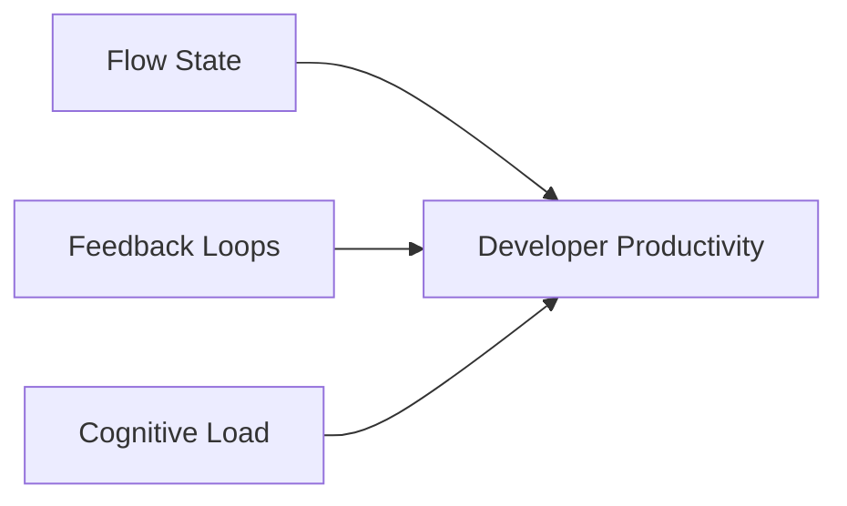
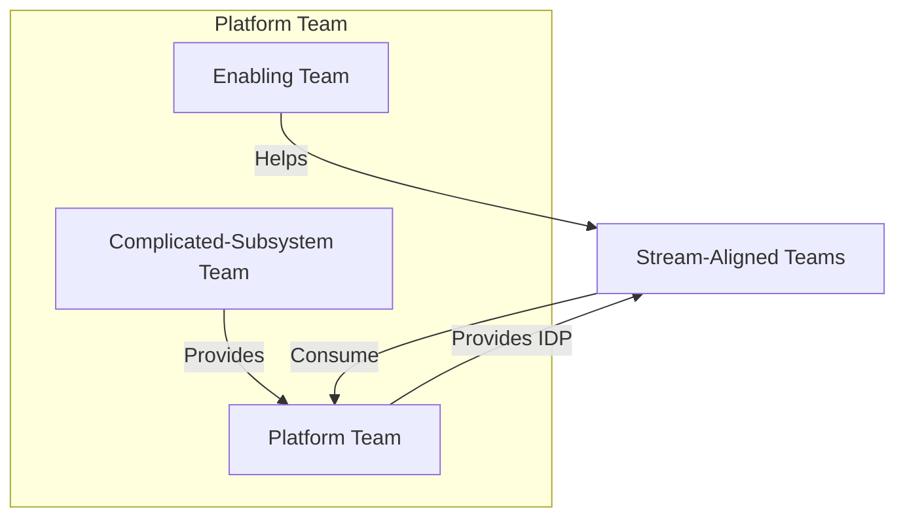
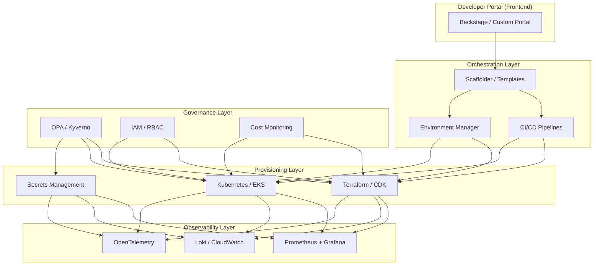
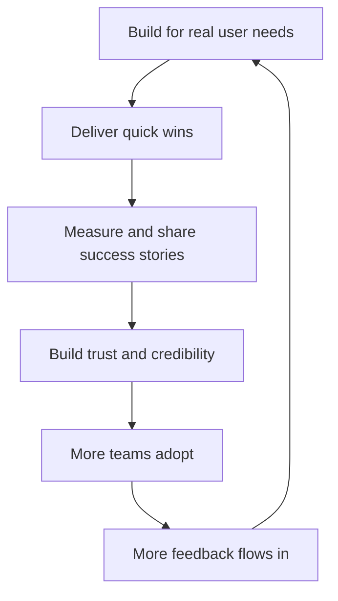
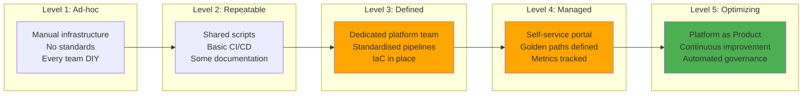

# Developer Productivity & Platform Engineering

## Purpose

This chapter provides a comprehensive deep-dive into Developer Productivity and Platform Engineering — the foundational domain for the Engineering Manager – Developer Productivity role at Helpshift. It covers core concepts, architecture patterns, implementation strategies, leadership insights, and interview preparation at Staff+ / Director depth.

---

## Key Concepts

| Concept | Definition | Why It Matters |
|---------|------------|----------------|
| **Developer Productivity (DevEx)** | The practice of optimising the developer experience to maximise flow, satisfaction, and output | Directly correlates with business velocity, engineer retention, and product quality |
| **Platform Engineering** | The discipline of building internal developer platforms (IDPs) that abstract infrastructure complexity | Enables self-service, reduces cognitive load, and standardises best practices |
| **Internal Developer Platform (IDP)** | A cohesive set of tools, services, and workflows that developers use to build, test, deploy, and operate software | The "product" that platform teams ship — should be treated with product thinking |
| **Golden Path / Paved Road** | An opinionated, well-documented, supported workflow for common development tasks | Balances standardisation with team autonomy |
| **Cognitive Load** | The mental effort required to complete a development task (intrinsic, extraneous, germane) | Platform engineering's primary job is to reduce extraneous cognitive load |
| **Team Topologies** | The organisational patterns that structure how teams interact (stream-aligned, enabling, complicated-subsystem, platform) | Determines how platform teams are structured and how they collaborate |

---

## Detailed Content

### 1. What is Developer Productivity?

Developer Productivity is not about measuring lines of code or story points. It's about **maximising the flow of value from idea to production** while minimising friction, toil, and cognitive load.

#### The Three Dimensions of DevEx (Forsgren et al.)



1. **Flow State** — Uninterrupted, focused work time. Context switches kill flow.
2. **Feedback Loops** — How quickly developers learn the impact of their changes (build → test → deploy).
3. **Cognitive Load** — How much a developer needs to know to complete a task.

> **Interview Insight:** When asked "What is Developer Productivity?", do NOT answer with "deploy frequency" or "story points." Instead, frame it as the three dimensions above. This shows depth and understanding of the research.

#### Real-World Implementation

At Helpshift, a Developer Productivity Manager would:
- Measure current developer experience through surveys (DevEx pulse) and tooling telemetry
- Identify the top 3 friction points through developer interviews and data analysis
- Build a roadmap that addresses these friction points systematically
- Partner with product engineering teams to co-design solutions
- Measure impact through DORA + SPACE metrics (covered in detail in chapter 2)

---

### 2. Platform Engineering Fundamentals

Platform Engineering is the **discipline of designing, building, and maintaining internal developer platforms** that enable development teams to deliver value faster, more reliably, and with less cognitive load.

#### The Platform Engineering Mantra

> **"Your platform succeeds when developers don't have to think about it."**

#### Key Principles

| Principle | Explanation | Trade-off |
|-----------|-------------|-----------|
| **Platform as Product** | Treat the internal platform like a SaaS product — understand users, measure adoption, iterate | Requires product management skills; hard to maintain with limited headcount |
| **Self-Service by Default** | Developers should be able to provision environments, deploy code, and access services without tickets | Security and compliance must be embedded, not bolted on |
| **Opinionated but Flexible** | Provide golden paths for common workflows, but allow escape hatches | Too opinionated = restrictive; too flexible = fragmentation |
| **Reduce Cognitive Load** | Abstract infrastructure complexity behind simple interfaces | Abstraction leaks; developers may need to understand underlying systems during incidents |
| **Measurement-First** | Track adoption, satisfaction, and business impact metrics | Vanity metrics are easy; actionable metrics are hard |

#### Team Topologies for Platform Engineering



- **Stream-Aligned Teams:** Product engineering teams aligned to a business stream (e.g., SDK team, AI team)
- **Platform Team:** Provides the internal developer platform that stream-aligned teams consume
- **Enabling Team:** Helps stream-aligned teams adopt platform capabilities
- **Complicated-Subsystem Team:** Handles complex subsystems (e.g., AI/ML infrastructure)

> **Interview Insight:** Mentioning Team Topologies (Matthew Skelton's book) shows you understand not just the technology but the **organisational design** of platform engineering. Expect follow-up questions on how you've structured teams.

---

### 3. Internal Developer Platforms (IDPs)

An IDP is the **glue** that ties together all the tools and services developers need to deliver software.

#### Reference Architecture



#### IDP Components

| Component | AWS Implementation | Open Source Alternative | Purpose |
|-----------|-------------------|------------------------|---------|
| Developer Portal | Backstage-deployed on EKS | Backstage, Port, Cortex | Service catalog, docs, self-service |
| CI/CD | CodePipeline + CodeBuild, GitHub Actions | Jenkins, GitLab CI | Build, test, deploy automation |
| GitOps | ArgoCD on EKS | ArgoCD, Flux | Declarative deployment management |
| Secret Management | AWS Secrets Manager, Parameter Store | HashiCorp Vault, SOPS | Secure credential management |
| Container Registry | Amazon ECR | Harbor, Docker Registry | Image storage and scanning |
| Observability | Managed Prometheus + Grafana, CloudWatch | Prometheus, Grafana, Loki | Metrics, logs, traces |
| Policy Engine | OPA / Kyverno | OPA, Kyverno, Sentinel | Policy as code for compliance |
| IaC | CDK + Terraform | Terraform, Pulumi, Crossplane | Infrastructure provisioning |

#### Real-World Example: NextGen CLI

As a candidate who created a **NextGen CLI using OCLIF and TypeScript**, you have direct experience building an IDP component:

```typescript
// Example: NextGen CLI architecture
// Platform CLI that wraps AWS SDK, K8s API, and internal tools

import { Command, flags } from '@oclif/command';
import { EKS } from 'aws-sdk';
import * as k8s from '@kubernetes/client-node';

export class DeployCommand extends Command {
  static flags = {
    environment: flags.string({ required: true }),
    service: flags.string({ required: true }),
    version: flags.string({ required: true }),
  };

  async run() {
    const { flags } = this.parse(DeployCommand);
    
    // 1. Validate against policy
    await this.validateDeployment(flags);
    
    // 2. Build container image
    await this.buildImage(flags);
    
    // 3. Update manifests via GitOps
    await this.updateGitOpsManifests(flags);
    
    // 4. Trigger ArgoCD sync
    await this.triggerArgoCDSync(flags);
    
    // 5. Monitor rollout
    await this.monitorDeployment(flags);
    
    this.log(`✅ ${flags.service} deployed to ${flags.environment}`);
  }
}
```

> **Interview Insight:** Your NextGen CLI experience is a powerful talking point. Frame it as: "I built the developer-facing interface to our platform — reducing deploy time from 15 minutes of manual steps to 30 seconds of CLI commands." This directly demonstrates platform engineering impact.

---

### 4. Golden Paths & Paved Roads

Golden Paths are **opinionated, supported, and documented** workflows that guide developers through common tasks — from scaffolding a new service to deploying to production.

#### Golden Path Example: New Service Onboarding


#### Implementation Strategy

1. **Start with the 80% case** — Identify the most common service type and build a golden path for it
2. **Make it discoverable** — Document in the developer portal, CLI help, and onboarding guides
3. **Measure adoption** — What percentage of new services use the golden path?
4. **Iterate** — Collect feedback and improve the path quarterly
5. **Provide escape hatches** — Not every service fits the standard pattern

#### Common Anti-Patterns

| Anti-Pattern | Why It Fails | Better Approach |
|--------------|--------------|-----------------|
| **Mandatory golden path for everything** | Teams feel constrained and will work around your platform | Make it the easiest path, not the only path |
| **Building golden paths in isolation** | Engineers don't adopt what they didn't help create | Co-design golden paths with stream-aligned teams |
| **Over-engineering the first version** | Delays value delivery; golden paths become irrelevant | Start simple, iterate based on feedback |

---

### 5. Platform Adoption & Evangelism

Building a great platform is necessary but not sufficient. **Adoption is the hardest problem** in platform engineering.

#### The Platform Adoption Flywheel



#### Adoption Strategies

| Strategy | Description | When to Use |
|----------|-------------|-------------|
| **Top-Down Mandate** | Leadership mandates platform usage | Only for security/compliance-critical paths |
| **Bottom-Up Pull** | Build something so good teams choose it | Ideal — but takes time and trust |
| **Champion Program** | Recruit advocates from each team | During initial rollout |
| **Office Hours** | Regular drop-in support sessions | During adoption ramp-up |
| **Migration Engineering** | Dedicated engineers who help teams migrate | For large-scale migrations |
| **Show, Don't Tell** | Demo success metrics from early adopters | Ongoing — build internal case studies |

#### Measuring Platform Adoption

| Metric | Definition | Target |
|--------|------------|--------|
| **Service Adoption Rate** | % of new services using golden path | >80% |
| **Platform Usage Coverage** | % of teams using at least one platform service | >90% |
| **Self-Service Ratio** | % of operations done without platform team intervention | >70% |
| **Time-to-Value** | Time from developer request to first deploy using platform | <1 hour |
| **Net Promoter Score (NPS)** | Would developers recommend the platform to peers? | >50 |

---

### 6. Developer Experience Measurements

#### The SPACE Framework (Forsgren et al.)

| Dimension | Definition | Example Metrics |
|-----------|------------|-----------------|
| **S**atisfaction & Well-being | How developers feel about their work and tools | DevEx pulse survey score (e.g., 1-10) |
| **P**erformance | Outcomes of development work | Deploy frequency, lead time, availability |
| **A**ctivity | Volume of actions developers take | PRs created, code reviews completed, commits |
| **C**ommunication & Collaboration | How teams work together | Review turnaround time, cross-team PRs |
| **E**fficiency & Flow | How smoothly work progresses | Time spent in flow vs. context switching |

#### Measuring Cognitive Load

Cognitive load has three types:
- **Intrinsic:** Complexity inherent to the problem (you can't reduce this — it's the work itself)
- **Extraneous:** Complexity added by tools, processes, and environment (**this is what platform engineering targets**)
- **Germane:** Cognitive effort that contributes to learning and growth (this is good — but limited)

> **Interview Insight:** Being able to articulate cognitive load theory shows you understand **why** platform engineering matters, not just **what** it is. This distinguishes a leader from an engineer who just builds tools.

---

## Architecture / Diagrams

### Platform Engineering Maturity Model



**Helpshift Assessment:** Likely at Level 3 (Defined), targeting Level 4 (Managed). This role is the key hire to drive this transition.

---

## Interview Questions & Answers

### Q1: "What's your definition of a successful internal developer platform?"

**Strong Answer (Staff/Leader level):**

> "A successful platform is one that developers don't think about — it just works. But more concretely, I measure success across three dimensions:
>
> **1. Adoption:** >80% of new services use the golden path, and >90% of teams use at least one platform service.
>
> **2. Developer Satisfaction:** NPS >50 and our DevEx pulse survey shows year-over-year improvement.
>
> **3. Business Impact:** We can point to DORA metrics improvements directly attributable to platform investments — faster lead time, higher deployment frequency, lower change failure rate.
>
> Most importantly, the platform team should spend more time on product improvements than break-fix. If we're constantly firefighting, the platform has failed its primary mission."

**Weak Answer:**

> "A successful platform is one that has a nice dashboard and all the tools in one place."

**Why it's weak:** Too generic. Doesn't show understanding of platform as product, adoption challenges, or business impact measurement.

---

### Q2: "How would you approach improving developer productivity at Helpshift?"

**Strong Answer:**

> "I'd follow a 4-phase approach:
>
> **Phase 1: Listen and Measure (First 30 days)**
> - Conduct developer experience surveys and interviews with 15-20 engineers across teams
> - Instrument every step of the developer workflow to identify bottlenecks (build time, test time, deploy time, PR cycle time, environment wait times)
> - Establish baseline DORA metrics
>
> **Phase 2: Identify Quick Wins (Days 31-60)**
> - Address the top 2-3 friction points that can be resolved quickly — typically CI/CD bottlenecks or environment provisioning
> - Ship a small win to build trust and momentum
>
> **Phase 3: Build the Foundation (Days 61-90)**
> - Define the platform vision and roadmap
> - Hire gaps in the platform team
> - Start building the internal developer platform components
>
> **Phase 4: Iterate and Scale (Days 91-180)**
> - Roll out golden paths for the most common service types
> - Launch the developer portal
> - Establish regular feedback loops and adoption metrics
>
> The key principle is: never build something based on assumptions alone. Every platform investment must be validated by developer feedback and data."

---

### Q3: "How do you balance standardisation with team autonomy?"

**Strong Answer:**

> "This is the central tension in platform engineering. My approach is:
>
> **1. Golden Paths, Not Gilded Cages.** We build opinionated, well-documented, and fully supported workflows for the 80% use case. Teams can deviate if they have a compelling reason, but they own the operational burden of that deviation.
>
> **2. The 'Cookie Cutter' Standard.** For new services, we provide scaffolding that includes CI/CD, monitoring, security scanning, and documentation — all configured by default. Teams can modify anything after scaffolding, but the default is opinionated.
>
> **3. Product Council for Exceptions.** For significant deviations from the golden path, teams present their case to a lightweight product council. This ensures deviations are intentional, not accidental.
>
> **4. Data-Driven Flexibility.** If multiple teams are consistently deviating in the same way, that's a signal our golden path is wrong — we fix the path, not enforce compliance.
>
> At my previous company, we went from 40% golden path adoption to 85% by shifting from 'thou shalt use the platform' to 'here's why the platform makes your life easier.' The remaining 15% had genuinely unique requirements, and that was fine."

---

### Q4: "Tell me about a platform initiative you led that didn't go well. What did you learn?"

**STAR Format:**

| Element | Example |
|---------|---------|
| **Situation** | We built a comprehensive internal developer platform over 6 months without significant developer input |
| **Task** | Drive adoption of the new platform across 8 product engineering teams |
| **Action** | We launched with a big announcement and mandatory migration deadline |
| **Result** | Adoption was <20% after 3 months. Teams actively resisted and built workarounds |
| **Learning** | We treated the platform as an infrastructure project, not a product. We should have: (1) involved developers from day one, (2) started with solving a single painful problem instead of building everything, (3) let adoption be pull-based rather than push-based. We rebuilt the platform with developer co-design and achieved 80% adoption within 6 months of the relaunch. |

---

## Common Follow-Up Questions

| Follow-Up Question | What They're Testing | Key Insight to Include |
|--------------------|---------------------|------------------------|
| "How do you handle teams that refuse to adopt your platform?" | Adoption strategy, stakeholder management | Champion program, office hours, migration engineering |
| "How do you prioritise what to build for the platform?" | Strategic thinking, trade-off awareness | OKR alignment, developer feedback, effort vs. impact matrix |
| "What's the right size for a platform team?" | Organisational design | 1 platform engineer per 8-10 product engineers (rule of thumb) |
| "How do you handle platform migrations?" | Operational maturity | Strangler pattern, feature flags, rollback plans |
| "Should platform team be separated by technology (K8s, CI/CD, observability) or by user journey?" | Architecture philosophy | By user journey (developer persona-based) is more effective |
| "How do you build a business case for platform investments?" | Executive communication | Map platform metrics to business metrics (e.g., faster lead time = faster time-to-market) |

---

## Real World Examples

### Example 1: CI/CD Pipeline Modernisation

**The Problem:** Platform team had a Jenkins monolith where all 50+ microservices shared a single pipeline. A single broken build blocked all other deployments. Average build time: 45 minutes. Deploy frequency: twice per week.

**The Solution:**
1. Migrated to GitHub Actions with per-service pipeline definitions
2. Implemented parallel step execution and caching (Docker layer caching, dependency caching)
3. Added build matrix for multi-architecture builds (amd64 + arm64 for Graviton migration)
4. Introduced pipeline templates so teams could self-serve

**The Result:**
- Build time: 45 min → 12 min
- Deploy frequency: 2x/week → 15x/week
- Change failure rate: 12% → 5%
- Platform team tickets: Reduced by 60% (self-service pipelines)

### Example 2: Graviton Migration Program

**The Problem:** AWS Graviton (ARM) instances offer 40% better price-performance than x86, but migration requires multi-architecture CI/CD, ARM-compatible dependencies, and thorough testing.

**The Approach:**
1. Created a multi-architecture CI pipeline that builds and tests on both amd64 and arm64
2. Built a dependency compatibility matrix tracking which libraries support ARM
3. Implemented Blue/Green deployment with canary analysis (5%, 25%, 50%, 100% rollout)
4. Benchmarked performance on Graviton vs. x86 before each migration wave

**The Result:**
- 40% cost reduction across migrated workloads
- No performance regressions (some workloads actually improved)
- Established a repeatable migration pattern used across the organisation

---

## Common Mistakes

| Mistake | Why It's a Problem | How to Avoid |
|---------|-------------------|--------------|
| **Building without user research** | Platform doesn't solve real problems | Always start with developer interviews and data |
| **Golden path becomes gilded cage** | Teams feel constrained, work around the platform | Build escape hatches, measure deviation patterns |
| **Treating platform as cost centre** | Leadership doesn't invest; platform stagnates | Always tie platform metrics to business outcomes |
| **Over-engineering early** | Long time-to-value; lose stakeholder trust | Start with the simplest solution that addresses the pain |
| **Ignoring adoption** | World's best platform is worthless if no one uses it | Measure adoption from day one; treat it as a product |
| **Hiring only builders, not advocates** | Great technology, terrible communication | Hire engineers who can write, present, and influence |

---

## Revision Notes

| Topic | Key Points to Remember |
|-------|----------------------|
| **DevEx Definition** | Flow state + feedback loops + cognitive load |
| **Platform Engineering** | Platform as Product; reduce cognitive load; opinionated but flexible |
| **IDP Components** | Portal + CI/CD + Provisioning + Observability + Governance |
| **Golden Paths** | Most common workflows; opinionated defaults; escape hatches |
| **Adoption Strategy** | Pull > Push; champion program; show success metrics |
| **Your Experience** | NextGen CLI (IDP), Graviton Migration (platform migration), CI/CD pipeline modernisation |
| **STAR Stories** | Platform initiative failure + rebuild; CI/CD transformation; Graviton program |

---

## Key Takeaways

1. **Platform Engineering is a product discipline**, not an infrastructure discipline. Treat your internal platform like you'd treat a SaaS product.

2. **Cognitive load is enemy #1.** Every tool, every process, every abstraction should be evaluated by whether it reduces cognitive load.

3. **Adoption is the hardest problem.** Build for real needs, co-design with users, measure everything, and iterate.

4. **"Platform as Product" requires product thinking.** That means user research, OKRs, adoption metrics, feedback loops, and continuous improvement.

5. **Your experience maps directly to Helpshift's needs.** Framing your NextGen CLI, Graviton migration, and CI/CD modernisation work in platform engineering terms will resonate strongly.

6. **The best platforms are invisible.** When developers say "I just run one command and it works," you've succeeded.