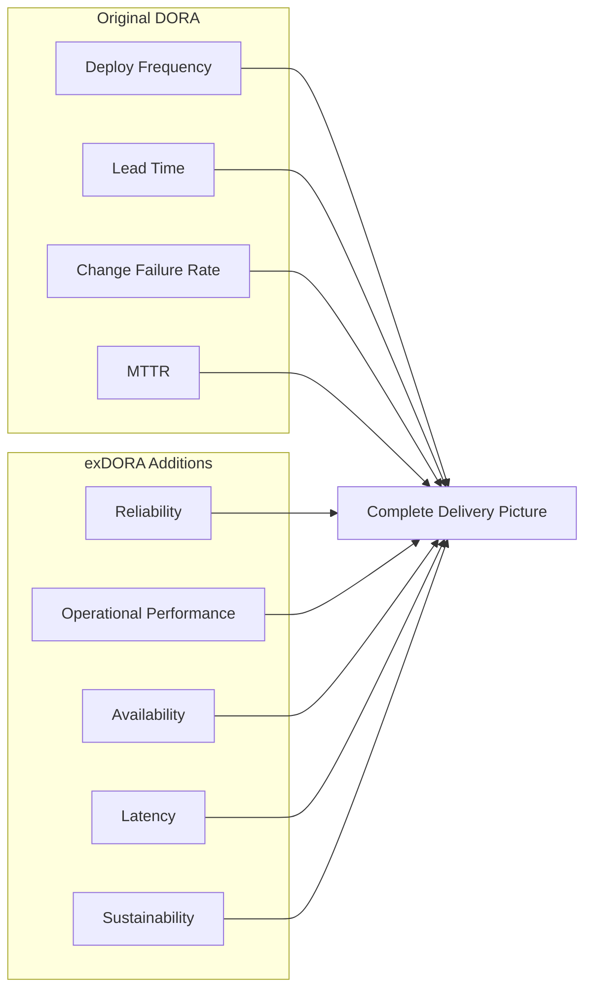
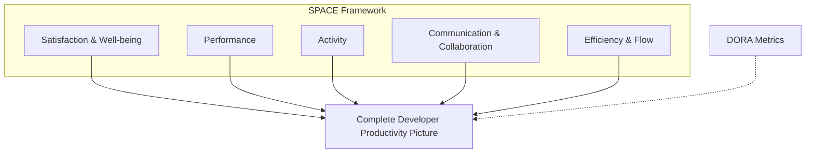
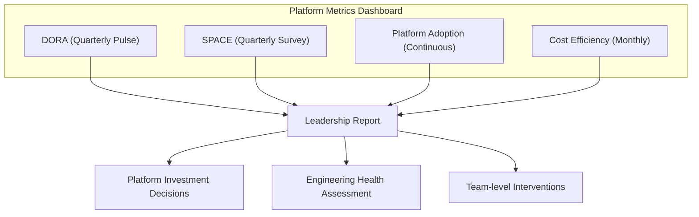

# DORA, exDORA & SPACE Metrics

## Purpose

This chapter provides a comprehensive deep-dive into the frameworks for measuring developer productivity and platform engineering success. As a Developer Productivity leader at Helpshift, you will be expected to define, track, and improve these metrics. This chapter covers concepts, implementation, trade-offs, and interview preparation at Staff+/Director depth.

---

## Key Concepts

| Concept | Definition | Why It Matters |
|---------|------------|----------------|
| **DORA Metrics** | The four key metrics identified by Google's DevOps Research and Assessment team that predict software delivery performance | Industry standard for measuring DevOps maturity and platform effectiveness |
| **exDORA** | Expanded DORA — additional metrics beyond the original four, including reliability and operational performance | Provides a more complete picture of delivery health |
| **SPACE Framework** | A multi-dimensional framework for measuring developer productivity (Satisfaction, Performance, Activity, Communication, Efficiency) | Captures the human and team aspects that DORA misses |
| **Goodhart's Law** | "When a measure becomes a target, it ceases to be a good measure" | Critical design principle — metrics must be hard to game |
| **Leading vs Lagging Indicators** | Leading indicators predict future outcomes; lagging indicators measure past outcomes | Platform teams need both to be effective |

---

## Detailed Content

### 1. DORA Metrics — The Foundation

Google's DORA (DevOps Research and Assessment) team identified **four metrics** that differentiate elite from low-performing teams:

#### The Four Key Metrics

```mermaid
graph TD
    subgraph "DORA Metrics"
        A[Deployment Frequency] --> P[Performance Classification<br/>Elite | High | Medium | Low]
        B[Lead Time for Changes] --> P
        C[Change Failure Rate] --> P
        D[Time to Restore Service<br/>(MTTR)] --> P
    end
```

| Metric | Definition | Elite | High | Medium | Low | How to Measure |
|--------|------------|-------|------|--------|-----|----------------|
| **Deployment Frequency** | How often an organisation deploys to production | On-demand (multiple deploys/day) | Between once per day and once per week | Between once per week and once per month | Between once per month and once every 6 months | CI/CD pipeline telemetry |
| **Lead Time for Changes** | The time from code commit to code successfully running in production | < 1 hour | < 1 day | < 1 week | < 6 months | Commit-to-deploy timestamp tracking |
| **Change Failure Rate** | The percentage of deployments causing a failure in production | < 5% | < 10% | < 15% | > 15% | Incident correlation with deployments |
| **Time to Restore Service (MTTR)** | The time from detecting a production failure to restoring service | < 1 hour | < 1 day | < 1 week | < 6 months | Incident resolution time tracking |

> **Interview Insight:** Memorise the four metrics AND their elite targets. Many candidates know the four metrics but stumble on the actual numbers. Being precise — "Elite means deployment frequency is on-demand, lead time under an hour, change failure rate under 5%, and MTTR under an hour" — demonstrates genuine expertise.

#### Why DORA Metrics Matter for Platform Engineering

| Metric | Platform Engineering Connection |
|--------|--------------------------------|
| **Deployment Frequency** | Platform should make it safe and easy to deploy frequently. If CI/CD pipelines are slow or unreliable, frequency drops. |
| **Lead Time for Changes** | Platform should reduce wait times — environment provisioning, code review tooling, CI/CD pipeline speed. |
| **Change Failure Rate** | Platform should prevent bad deployments through automated testing, canary analysis, and rollback capabilities. |
| **MTTR** | Platform should provide observability (logs, metrics, traces) that accelerates incident diagnosis. |

#### Common Pitfalls with DORA

| Pitfall | Why It's a Problem | How to Avoid |
|---------|-------------------|--------------|
| **Measuring at the wrong granularity** | Org-level metrics hide team-level problems | Measure per team or per service |
| **Gaming deployments** | Teams deploy trivial changes just to increase frequency | Track "meaningful deployments" — changes that deliver value |
| **Ignoring context** | Different services have different velocity requirements | Contextualise: a data pipeline and a web API should have different targets |
| **Relying on self-reported data** | Manual surveys are unreliable | Automate metric collection from CI/CD, incident management, and monitoring tools |

---

### 2. exDORA — Expanded DORA

exDORA extends the original four metrics to cover additional dimensions of software delivery and operational performance.

#### The Extended Metrics



| Additional Metric | Definition | Why It Matters for Helpshift |
|-------------------|------------|------------------------------|
| **Reliability (SLO attainment)** | % of time service meets its SLO targets | Critical for a customer-facing platform serving millions of end users |
| **Availability** | System uptime and accessibility | Directly impacts customer trust and SLA compliance |
| **Latency** | Response time for API calls and user interactions | SDK performance is a product feature at Helpshift |
| **Operational Performance** | Resource utilisation, cost efficiency | Platform cost optimisation is a key deliverable |
| **Sustainability** | Developer well-being, burnout risk | Platform teams integrated with on-call can face high toil |

> **Interview Insight:** Mentioning exDORA shows you're current on the latest research. Google's 2023 DORA report introduced these extensions. Frame it as: "The original DORA metrics are necessary but not sufficient. exDORA adds reliability and operational dimensions that are especially relevant for platform teams."

---

### 3. SPACE Framework

SPACE was introduced by Nicole Forsgren, Margaret-Anne Storey, and colleagues to address the **human and team dimensions** of developer productivity that DORA doesn't capture.

#### The Five Dimensions



| Dimension | Definition | Example Metrics | How to Collect |
|-----------|------------|-----------------|----------------|
| **Satisfaction & Well-being** | How developers feel about their work, tools, and environment | DevEx pulse survey (1-10), eNPS, burnout index | Quarterly anonymous surveys, pulse checks |
| **Performance** | Outcomes of development work | Deploy frequency, lead time, availability | Automated DORA collection |
| **Activity** | Volume of actions developers take | PRs created, code reviews completed, commits, build count | Git analytics, CI/CD telemetry |
| **Communication & Collaboration** | How teams interact and coordinate | Review turnaround time, cross-team PR ratio, documentation quality | Git analytics, survey questions |
| **Efficiency & Flow** | How smoothly work progresses | Time in flow, context switch frequency, handoff wait times | Developer diary studies, tooling telemetry (IDE activity) |

#### Why SPACE Matters for a Manager

When interviewing for an Engineering Manager role, showing you care about **Satisfaction & Well-being** and **Communication & Collaboration** distinguishes you from candidates who only focus on technical metrics.

> **Interview Insight:** Use this framework to answer: "How do you measure developer productivity?" A strong answer: "I use a combination of DORA for outcomes (Performance dimension) and SPACE for the human factors. If your DORA metrics are elite but your developers are burning out, you're not productive — you're unsustainable."

---

### 4. Combining DORA + SPACE

The most effective approach is to use **both frameworks together**.

#### The Combined Measurement Model



#### Implementation at Helpshift

| Metric | Collection Method | Cadence | Owner |
|--------|-------------------|---------|-------|
| Deploy Frequency | CI/CD pipeline telemetry (GitHub Actions / CodePipeline) | Continuous | Platform Team |
| Lead Time | Commit-to-deploy timestamp tracking | Continuous | Platform Team |
| Change Failure Rate | Incident management × deployment correlation | Continuous | SRE Team |
| MTTR | Incident resolution time from PagerDuty/Opsgenie | Continuous | SRE Team |
| Reliability (SLO) | Service-level objective attainment from monitoring | Continuous | SRE Team |
| Developer Satisfaction | DevEx pulse survey (5 questions, 1-10 scale) | Quarterly | Platform Team |
| Platform NPS | Would you recommend our platform to peers? | Quarterly | Platform Team |
| Toil Percentage | Time spent on manual operations vs. product work | Monthly | Platform Team |
| Platform Adoption | % of services using golden path, % of teams using any platform service | Monthly | Platform Team |

#### Real-World Example: Building a DORA Dashboard

Using your experience with **Prometheus, Grafana, and Loki**, you can build a DORA dashboard:

```yaml
# Example: Grafana dashboard for DORA metrics
apiVersion: 1
datasources:
  - name: DORA Metrics Dashboard
    description: Developer Productivity KPIs
    
panels:
  - title: Deployment Frequency
    type: stat
    targets:
      - expr: sum(rate(deployments_total[7d]))
    thresholds:
      - value: 1
        color: red  # Less than 1/week
      - value: 7
        color: yellow  # Between 1/week and 1/day
      - value: null
        color: green  # Elite
    
  - title: Lead Time for Changes (p95)
    type: gauge
    targets:
      - expr: histogram_quantile(0.95, sum(rate(lead_time_seconds_bucket[30d])) by (le))
    unit: seconds
    
  - title: Change Failure Rate
    type: stat
    targets:
      - expr: sum(deployments_failed_total) / sum(deployments_total) * 100
    thresholds:
      - value: 15
        color: red
      - value: 5
        color: green
```

---

### 5. Platform-Specific Metrics

Beyond DORA and SPACE, platform teams need their own success metrics.

#### Platform Adoption Metrics

| Metric | Definition | Why It Matters |
|--------|------------|----------------|
| **Golden Path Adoption Rate** | % of new services created using golden path | Measures if platform is the path of least resistance |
| **Platform Service Coverage** | % of teams using at least one platform service | Measures platform reach across the organisation |
| **Self-Service Ratio** | % of operations completed without platform team intervention | Measures platform maturity (Level 4 goal) |
| **Time-to-First-Deploy** | Time from repo creation to first production deployment | Measures onboarding friction |
| **Environment Provision Time** | Time from request to ready-to-use environment | Measures infrastructure responsiveness |
| **Build Pipeline Reliability** | % of CI pipeline runs that succeed on first attempt | Measures CI/CD health |

#### Platform Business Metrics

| Metric | Business Connection |
|--------|---------------------|
| **Cost per Deploy** | Infrastructure cost ÷ number of deployments — shows platform efficiency |
| **Engineer Time Saved** | Hours saved × blended engineer cost — builds business case |
| **Revenue per Engineer** | Revenue ÷ engineering headcount — scalable measure |
| **Onboarding Time Reduction** | Weeks to productivity — impacts hiring velocity |

---

### 6. The Goodhart's Law Problem

> "When a measure becomes a target, it ceases to be a good measure."

#### Real Examples of Gaming Metrics

| Metric | How Teams Game It | How to Prevent |
|--------|-------------------|----------------|
| **Deploy Frequency** | Deploying empty config changes | Track "value deployments" — changes that include code/feature changes |
| **Lead Time** | Merging before tests complete (CI bypass) | Enforce CI gates before merge |
| **Code Coverage** | Writing tests that assert nothing useful | Require mutation testing alongside coverage |
| **Velocity (Story Points)** | Inflating estimates | Use cycle time instead of velocity |

#### Anti-Gaming Design Principles

1. **Use balanced scorecards** — Never optimise for a single metric
2. **Automate collection** — Manual metrics are unreliable and gameable
3. **Correlate metrics** — If deploy frequency goes up but change failure rate also goes up, that's a warning
4. **Qualitative + Quantitative** — Always pair metrics with developer interviews and surveys
5. **Focus on outcomes, not outputs** — Did the metric improve developer experience or business outcomes?

---

### 7. Implementation Roadmap at Helpshift

#### Phase 1: Baseline (Days 1-30)

1. Instrument CI/CD pipelines to collect DORA metrics
2. Run first DevEx pulse survey (5 questions)
3. Identify top 3 friction points through developer interviews
4. Establish current performance benchmarks

#### Phase 2: Visibility (Days 31-60)

1. Build DORA dashboard in Grafana (connected to Prometheus)
2. Share results with engineering leadership
3. Identify teams with best practices for case studies
4. Set initial targets based on current performance

#### Phase 3: Improvement (Days 61-180)

1. Launch first platform initiative targeting the biggest friction point
2. Track metric changes weekly
3. Run second DevEx survey to measure impact
4. Publish quarterly engineering productivity report

#### Phase 4: Culture (Days 181-365)

1. Embed metric review into engineering retrospectives
2. Make DORA dashboard accessible to all engineers
3. Celebrate metric improvements publicly
4. Iterate on measurement framework based on feedback

---

## Architecture / Diagrams

### DORA Metrics Collection Architecture

```mermaid
graph TB
    subgraph "Data Sources"
        A[GitHub / GitLab] --> C[CI/CD Telemetry Collector]
        B[CI Pipelines] --> C
    end
    
    subgraph "Processing"
        C --> D[Time-Series Database<br/>Prometheus / VictoriaMetrics]
        C --> E[Event Store<br/>for lead time tracking]
    end
    
    subgraph "Visualisation"
        D --> F[Grafana Dashboard]
        E --> G["DORA Report Generator<br/>(Weekly Summary)"]
    end
    
    subgraph "Alerting"
        D --> H[Alert Manager]
        H --> I[Slack / PagerDuty]
    end
    
    subgraph "Governance"
        F --> J[Leadership Review<br/>(Monthly OKR Check)]
        G --> J
    end
```

### SPACE Survey Collection

```mermaid
graph LR
    A[Developer Portal<br/>(Backstage)] --> B[Quarterly Pulse Survey]
    B --> C[Survey Results<br/>(Anonymised)]
    C --> D[Trend Analysis Dashboard]
    D --> E[Engineering Health Report]
    E --> F[Action Items for Platform Team]
    F --> A
```

---

## Interview Questions & Answers

### Q1: "What metrics would you use to measure developer productivity at Helpshift?"

**Strong Answer (Staff/Leader level):**

> "I don't believe in a single metric for developer productivity. Instead, I use a balanced scorecard approach:
>
> **DORA Metrics (Quarterly):** Deployment frequency, lead time for changes, change failure rate, and MTTR. These tell us if our delivery pipeline is healthy.
>
> **SPACE Framework (Quarterly Survey):** Developer satisfaction, perceived productivity, collaboration effectiveness, and efficiency/flow. These tell us if our developers are thriving.
>
> **Platform Metrics (Monthly):** Golden path adoption rate, self-service ratio, environment provisioning time. These tell us if our platform is delivering value.
>
> The key is to never optimise for a single metric. If we improve deploy frequency but change failure rate goes up, we're going the wrong direction. And if DORA metrics improve but developer satisfaction declines, we're building an unsustainable system."

**Weak Answer:**

> "I'd track deployment frequency and lead time, because those are the most important metrics."

**Why it's weak:** Only focuses on two DORA metrics, ignores human factors, no mention of preventing gaming, and doesn't connect to business outcomes.

---

### Q2: "How do you ensure DORA metrics aren't gamed?"

**Strong Answer:**

> "There are four strategies I use:
>
> **1. Automate collection.** Manual reporting is gameable by definition. I instrument CI/CD pipelines to automatically collect deploy events, lead times, and failure rates.
>
> **2. Correlate metrics.** If deploy frequency suddenly spikes but there's no corresponding increase in developer activity (commits, PRs), something's wrong. I use dashboards that show metrics together, not in isolation.
>
> **3. Contextualise with qualitative data.** If DORA metrics look bad, I talk to the team. There might be a legitimate reason — a major refactor, a security audit, a team reorganisation.
>
> **4. Focus on system-level improvements, not individual blame.** Metrics should be used to identify where the platform or process is failing, not to evaluate individual performance. When teams understand that metrics are for improvement, not punishment, they stop gaming them.
>
> **5. Add 'value deployment' tracking.** Not all deployments are equal. I track whether a deployment includes a feature change, bug fix, or config change. This gives a more meaningful picture than raw deploy count."

---

### Q3: "Your DORA metrics show elite performance, but developers report low satisfaction. What do you do?"

**Strong Answer:**

> "This is a classic signal that metrics are being gamed or we're burning out our engineers. I'd investigate three possibilities:
>
> **1. Are deployments meaningless?** If deploy frequency is high but each deploy is a trivial config change or empty commit, we're optimising for the wrong thing.
>
> **2. Is there unsustainable pressure?** If developers feel pushed to deploy faster, they might be cutting corners on testing or working excessive hours.
>
> **3. Is the development experience poor despite fast deploys?** Maybe CI/CD is fast but local development is slow, code reviews are backlogged, or environment provisioning takes days.
>
> My action plan would be:
> - Audit deployment quality (are these real changes?)
> - Interview the team to understand the satisfaction dip
> - Correlate satisfaction scores with individual DORA data to find patterns
> - Adjust targets if needed — elite performance is not sustainable if it breaks the team
>
> The right approach is balanced performance: elite DORA + high satisfaction + low burnout risk."

**Weak Answer:**

> "I'd ignore satisfaction and focus on the metrics, because the metrics show we're doing well."

**Why it's weak:** Completely ignores the human element. An EM who doesn't care about developer well-being will drive attrition.

---

### Q4: "How would you measure the success of your platform team?"

**Strong Answer:**

> "I measure platform team success across three dimensions:
>
> **1. Developer Impact (North Star):** Are developers shipping faster and happier because of us? I track platform NPS, golden path adoption rate, and self-service ratio.
>
> **2. Operational Health:** Is the platform reliable and cost-effective? I track platform availability, cost per deploy, and toil percentage (time the platform team spends on manual operations vs. product work).
>
> **3. Business Value:** Can we demonstrate ROI for platform investments? I track engineer onboarding time reduction, deploy frequency improvement attributed to platform changes, and platform cost efficiency.
>
> The single most important metric: **% of engineering operations done via self-service.** If teams don't need to file tickets to provision environments, deploy code, or access systems, the platform is working."

---

## Common Follow-Up Questions

| Follow-Up Question | What They're Testing | Key Insight to Include |
|--------------------|---------------------|------------------------|
| "How do you measure MTTR accurately?" | Operational maturity | Time from alert → diagnosis → resolution; track each phase separately |
| "What's the difference between lead time and cycle time?" | Precision of understanding | Cycle time = start work → ship; Lead time = request → ship (includes wait time) |
| "How often should you run developer surveys?" | Practical experience | Quarterly major survey + monthly pulse check (2-3 questions) |
| "How do you handle teams with inherently different deployment cadences?" | Contextual awareness | Use relative targets (e.g., improve by 20% from baseline) not absolute targets |
| "Your change failure rate is low, but your deploy frequency is also low — what's the issue?" | Systems thinking | Too risk-averse; need to invest in safety (canary, feature flags, automated rollback) to increase velocity |
| "How do you calculate the business value of improving DORA metrics?" | Executive communication | Faster lead time = faster time-to-market = competitive advantage; lower failure rate = lower operational cost |

---

## Real World Examples

### Example 1: CI/CD Transformation Metrics

**The Baseline:**
- Deploy frequency: 1x/week
- Lead time: 3 days
- Change failure rate: 12%
- MTTR: 4 hours
- Developer satisfaction: 6/10

**The Intervention:**
- Automated CI/CD pipeline (GitHub Actions + ArgoCD)
- Added canary deployments and automated rollback
- Implemented comprehensive automated testing
- Built self-service environment provisioning

**The Result (6 months later):**
- Deploy frequency: 8x/day (elite)
- Lead time: 45 minutes (elite)
- Change failure rate: 5% (elite)
- MTTR: 30 minutes (elite)
- Developer satisfaction: 8/10

### Example 2: The SPACE Survey Template

```
Developer Experience Pulse Survey (Quarterly)

Satisfaction (1-10): "I am satisfied with the tools and platforms available to me."
Performance (1-10): "I can be productive and get my work done efficiently."
Activity (1-10): "I have the right amount of work — not too much, not too little."
Collaboration (1-10): "My team collaborates effectively."
Efficiency (1-10): "I can focus on my work without frequent interruptions."

NPS: "Would you recommend Helpshift as a place to do engineering work?" (0-10)

Open-ended:
"What is the single biggest thing that would improve your productivity?"
"What is one thing that's working well?"
"What is one thing that's not working well?"
```

---

## Common Mistakes

| Mistake | Why It's a Problem | How to Avoid |
|---------|-------------------|--------------|
| **Chasing elite metrics without context** | 3-day-old SaaS startup and 15-year-old company have different targets | Always benchmark against yourself (trend) not just industry |
| **Ignoring reliability metrics** | High deploy frequency but poor availability is a disaster | Always pair velocity metrics with reliability metrics |
| **Survey fatigue** | Too many surveys → developers stop responding | Keep surveys under 5 minutes; compensate with time |
| **Not correlating metrics** | Deploy frequency up, satisfaction down = problem | Always look at metrics as a system, not individually |
| **Measuring too many things** | Analysis paralysis; no action taken | Start with the DORA 4 + 3 SPACE dimensions + 3 platform metrics |
| **Using metrics for performance reviews** | Guarantees gaming and destroys trust | Metrics are for system improvement, not individual evaluation |

---

## Revision Notes

| Topic | Key Points to Remember |
|-------|----------------------|
| **DORA 4** | Deploy frequency (on-demand), Lead time (<1h elite), Change failure rate (<5%), MTTR (<1h) |
| **exDORA additions** | Reliability, Availability, Latency, Operational Performance, Sustainability |
| **SPACE 5** | Satisfaction, Performance, Activity, Communication, Efficiency |
| **Goodhart's Law** | Every metric can be gamed; use balanced scorecards |
| **Platform metrics** | Golden path adoption, self-service ratio, time-to-first-deploy |
| **Collection strategy** | Automated DORA (CI/CD) + Quarterly SPACE (survey) + Monthly platform metrics |
| **Anti-pattern** | Using metrics for performance reviews |

---

## Key Takeaways

1. **DORA metrics are necessary but not sufficient.** They measure delivery velocity but miss human factors, reliability, and platform-specific outcomes.

2. **Combine DORA + SPACE for a complete picture.** DORA tells you *what* is happening; SPACE tells you *how* it feels to the people doing the work.

3. **Platform teams need their own metrics.** Golden path adoption, self-service ratio, and NPS directly measure platform success.

4. **Design against gaming.** Automate collection, use balanced scorecards, correlate metrics, and never use them for individual performance evaluation.

5. **Start simple, iterate.** Don't try to measure everything from day one. Start with DORA + a 5-question SPACE survey, then expand.

6. **Metrics are for learning, not for judging.** The purpose of measurement is to identify where to invest next, not to evaluate team performance.