# Feature Flags: Decouple Deployment from Release

> **"Ship code dark, enable via flag."**

---

# Purpose

Feature Flags (also known as Feature Toggles) allow engineering teams to deploy code to production while keeping functionality hidden until it is ready to be released.

Feature Flags separate:

```text
Deployment
```

from

```text
Release
```

This capability is a fundamental building block of:

* Continuous Delivery
* Progressive Delivery
* A/B Testing
* Canary Releases
* Developer Productivity Platforms
* Modern Platform Engineering

---

# Key Concept

Many engineers incorrectly assume:

```text
Deploy = Release
```

Feature Flags change this model.

With Feature Flags:

```text
Deploy != Release
```

Deployment becomes a technical activity.

Release becomes a business decision.

---

# Traditional Deployment Model

Without Feature Flags:

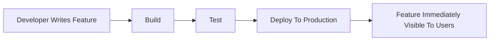

## Problem

If an issue is discovered:

* Rollback required
* Hotfix required
* Customer impact possible
* Increased release risk

---

# Feature Flag Deployment Model

With Feature Flags:

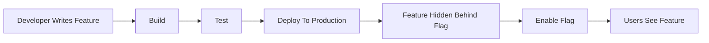

## Benefits

* Safer deployments
* Controlled releases
* Reduced risk
* Faster feedback
* Better experimentation

---

# Deployment vs Release

## Deployment

Technical activity.

Example:

```text
Code deployed to production infrastructure.
```

Users cannot access the feature yet.

---

## Release

Business activity.

Example:

```text
Enable feature for customers.
```

Users can now access functionality.

---

# Real World Example

## New AI Ticket Summarization Feature

Imagine Helpshift is launching:

```text
AI Assisted Ticket Summarization
```

---

## Without Feature Flags

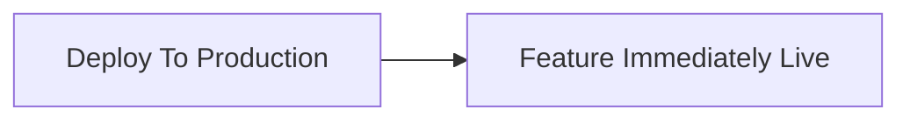

### Risk

* Bugs affect customers
* No validation period
* Hard rollback

---

## With Feature Flags

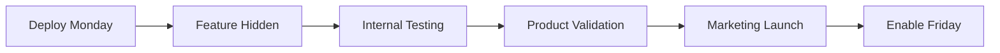

### Benefit

Engineering can deploy early.

Business can release later.

---

# How Feature Flags Work

A running application evaluates a flag before exposing functionality.

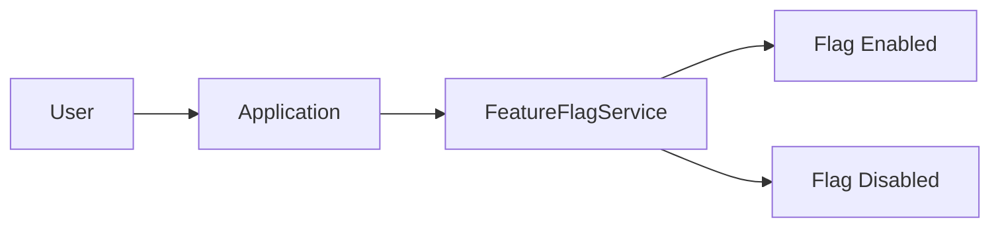

---

## Example Code

```javascript
if (featureFlagEnabled("new-chat-ui")) {
    showNewUI();
} else {
    showOldUI();
}
```

---

# What Gets Evaluated?

Feature Flag platforms evaluate:

| Attribute          | Example                                     |
| ------------------ | ------------------------------------------- |
| User ID            | user123                                     |
| Email              | [john@company.com](mailto:john@company.com) |
| Role               | Admin                                       |
| Country            | India                                       |
| Device             | Mobile                                      |
| Subscription       | Premium                                     |
| Traffic Percentage | 5% rollout                                  |
| Environment        | Production                                  |

---

# Types of Feature Flags

---

## 1. Release Flags

Used to safely release new functionality.

### Example

```text
new-dashboard
```

### Use Case

Hide feature until launch date.

---

## 2. Experiment Flags

Used for A/B Testing.

### Example

```text
checkout-flow-v2
```

### Use Case

Measure conversion improvements.

---

## 3. Operational Flags

Used to control runtime behavior.

### Example

```text
enable-new-search-engine
```

### Use Case

Enable or disable subsystems without redeployment.

---

## 4. Permission Flags

Used to control access.

### Example

```text
premium-user-access
```

### Use Case

Enable features only for paying customers.

---

# Example 1: Progressive Rollout

Instead of releasing to everyone immediately:

```text
0% → 100%
```

Use a gradual rollout strategy.

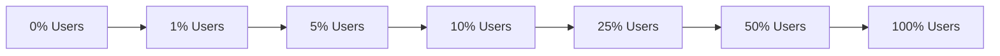

---

## Benefits

* Lower risk
* Easier monitoring
* Controlled exposure
* Faster rollback

---

# Example 2: A/B Testing

Testing two checkout experiences.

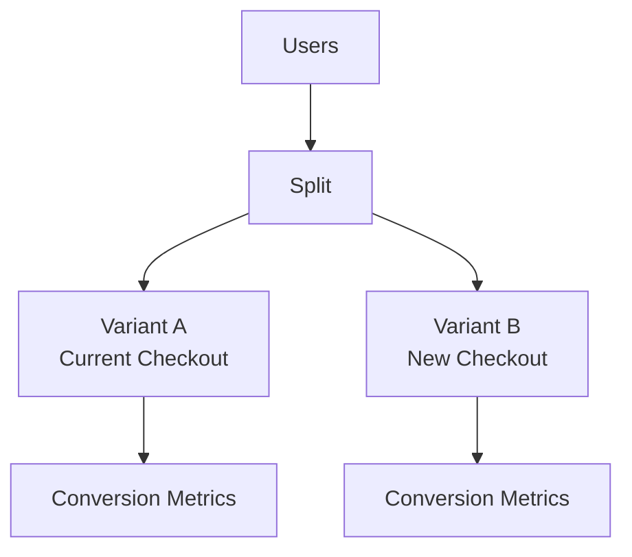

---

## Goal

Determine which experience performs better.

Typical metrics:

* Conversion Rate
* Revenue
* User Engagement
* Customer Satisfaction

---

# Example 3: Emergency Kill Switch

One of the most valuable operational uses.

Imagine a production issue occurs.

Without Feature Flags:

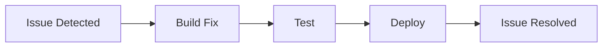

Resolution may take:

```text
20–60 Minutes
```

or longer.

---

With Feature Flags:

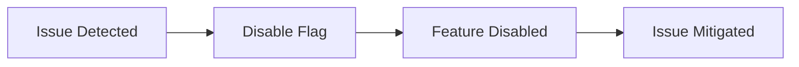

Resolution time:

```text
Seconds
```

---

## This Is Called

```text
Kill Switch Pattern
```

---

# Progressive Delivery Workflow

Modern organizations commonly use:

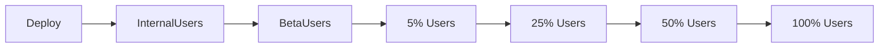

At each stage:

* Monitor telemetry
* Evaluate performance
* Check error rates
* Verify user feedback

---

# Why SRE Teams Love Feature Flags

Feature Flags improve operational resilience.

Benefits:

* Instant rollback
* Reduced MTTR
* Safer deployments
* Smaller blast radius

---

# Feature Flags and DORA Metrics

Feature Flags directly improve:

| DORA Metric          | Improvement             |
| -------------------- | ----------------------- |
| Deployment Frequency | Deploy anytime          |
| Lead Time            | Faster releases         |
| Change Failure Rate  | Smaller safer changes   |
| MTTR                 | Instant feature disable |

---

# Platform Engineering Perspective

Feature Flags are not merely a developer tool.

They are a platform capability.

They enable:

* Engineering teams to deploy independently
* Product teams to control releases
* SRE teams to reduce risk
* Business teams to coordinate launches

---

# Common Architecture

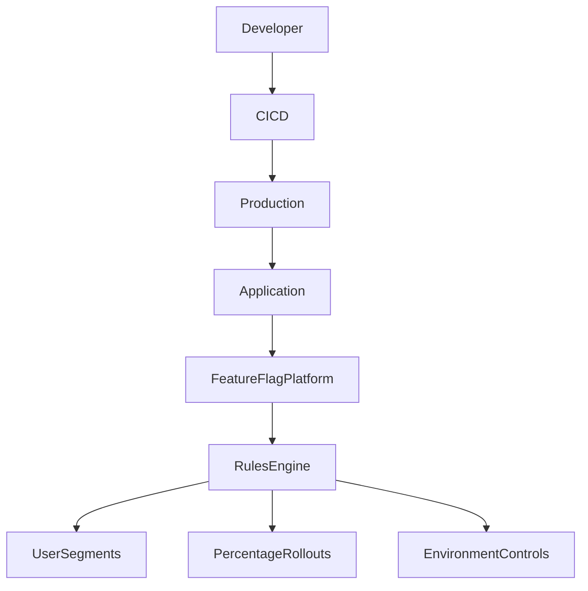

---

# Popular Feature Flag Platforms

## Commercial

* LaunchDarkly
* Split.io
* Optimizely Feature Experimentation
* ConfigCat

---

## Open Source

* Unleash
* Flagsmith
* OpenFeature
* Flipt

---

# Interview Answer

## What Are Feature Flags?

A strong answer:

> Feature Flags allow teams to decouple deployment from release by deploying code to production while keeping functionality hidden until it is ready to be exposed. They enable progressive rollouts, A/B testing, canary releases, faster incident mitigation through kill switches, and significantly reduce release risk. Feature Flags are a key capability of modern Platform Engineering and Continuous Delivery practices.

---

# Key Takeaways

1. Deployment and Release are different activities.

2. Feature Flags allow code to be deployed safely before being released.

3. Progressive rollouts reduce production risk.

4. A/B testing enables data-driven decisions.

5. Kill switches dramatically reduce MTTR.

6. Feature Flags improve DORA metrics.

7. Mature engineering organizations treat Feature Flags as a core platform capability rather than a simple application feature.
