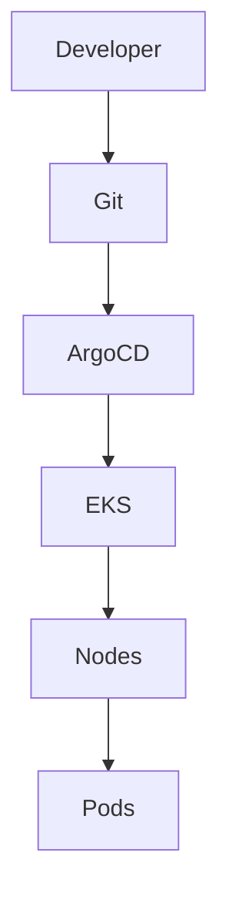
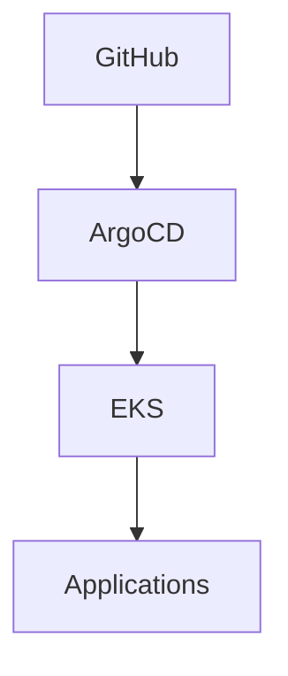
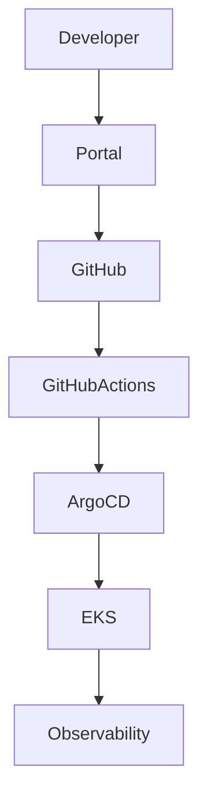

# Kubernetes, EKS & GitOps for Platform Engineering Leaders

## Purpose

This chapter provides a comprehensive understanding of Kubernetes, Amazon EKS, GitOps, and Cloud-Native Platform Engineering from an Engineering Manager and Platform Leadership perspective.

Most Kubernetes interview preparation material focuses on Pods, Deployments, Services, and kubectl commands.

That is not the focus of senior engineering leadership interviews.

At Engineering Manager level, interviewers want to understand:

* How Kubernetes enables engineering scale
* How platform teams should structure Kubernetes platforms
* How GitOps improves operational reliability
* How platform standardization accelerates developer productivity
* How to balance flexibility and governance
* How to operate Kubernetes at enterprise scale

This chapter prepares you to discuss Kubernetes as a platform product rather than a container orchestration technology.

---

# Key Concepts

| Concept              | Definition                                 | Why It Matters                           |
| -------------------- | ------------------------------------------ | ---------------------------------------- |
| Kubernetes           | Container orchestration platform           | Foundation for cloud-native applications |
| EKS                  | Amazon Elastic Kubernetes Service          | Managed Kubernetes control plane         |
| GitOps               | Git as the source of truth                 | Improves consistency and reliability     |
| Platform Engineering | Building internal platforms for developers | Reduces cognitive load                   |
| Platform Product     | Treating infrastructure as a product       | Drives adoption and satisfaction         |
| Karpenter            | Kubernetes-native autoscaling              | Improves cost efficiency                 |
| Bottlerocket         | AWS container-optimized OS                 | Improves security and operations         |
| Golden Paths         | Standardized workflows                     | Improves developer productivity          |
| Cluster Governance   | Managing platform standards                | Ensures consistency                      |

---

# Why Kubernetes Matters

Many organizations view Kubernetes as a container scheduler.

This is an incomplete view.

---

## Engineering Perspective

Kubernetes provides:

* Container Scheduling
* Service Discovery
* Autoscaling
* Self-Healing
* Resource Isolation

---

## Platform Engineering Perspective

Kubernetes provides:

* Standardized Runtime Environment
* Self-Service Infrastructure
* Operational Consistency
* Multi-Tenant Platforms
* Developer Enablement

---

## Executive Perspective

Kubernetes enables:

* Faster Delivery
* Reduced Infrastructure Complexity
* Improved Platform Reuse
* Engineering Scale

---

## Interview Insight

Weak Answer:

> Kubernetes orchestrates containers.

Strong Answer:

> Kubernetes provides a standardized application platform that enables organizations to scale engineering teams while maintaining operational consistency.

---

# Evolution of Infrastructure Platforms


---

# Kubernetes Architecture

## High-Level View



---

## Core Components

### Control Plane

Managed by AWS.

Responsibilities:

* Scheduling
* Cluster State
* API Management
* Reconciliation

---

### Worker Nodes

Run application workloads.

Responsibilities:

* Container Execution
* Networking
* Resource Management

---

### Pods

Smallest deployable unit.

Contain:

* Containers
* Networking
* Storage Configuration

---

## Interview Insight

Senior interviewers rarely care about Pod definitions.

They care about:

* Multi-tenancy
* Governance
* Scaling
* Platform Operations

---

# Amazon EKS

Amazon EKS removes operational burden associated with managing Kubernetes control planes.

---

## Benefits

### Managed Control Plane

AWS manages:

* ETCD
* API Server
* Scheduler
* Controller Manager

---

### Security Integration

Integrates with:

* IAM
* KMS
* CloudTrail
* Security Groups

---

### Scalability

Supports:

* Multi-AZ Deployments
* Large Clusters
* Enterprise Workloads

---

# My Enterprise EKS Experience

Managed:

* Multiple AWS Accounts
* Multiple Regions
* Production Clusters
* Development Clusters
* Shared Platform Services

---

## Challenges Solved

### Platform Fragmentation

Different teams using different approaches.

---

### Governance

Inconsistent deployment standards.

---

### Operational Complexity

Too many platform variations.

---

### Cost Management

Overprovisioned infrastructure.

---

# Platform Standardization

One of the biggest responsibilities of platform teams.

---

## Before Standardization

```text
Team A

Different CI/CD

Different Monitoring

Different Security
```

```text
Team B

Different Everything
```

---

## After Standardization

```text
Shared Platform

Shared Standards

Shared Tooling

Shared Governance
```

---

## Benefits

* Faster Onboarding
* Reduced Support Burden
* Improved Security
* Better Reliability

---

# Karpenter

## What is Karpenter?

Karpenter is a Kubernetes-native node provisioning system.

---

## Why We Adopted Karpenter

Traditional Cluster Autoscaler challenges:

* Slow Scaling
* Node Waste
* Poor Bin Packing

---

## Karpenter Benefits

### Faster Provisioning

Provision nodes within seconds.

---

### Better Utilization

Improves workload placement.

---

### Cost Optimization

Reduces wasted compute resources.

---

## Interview Insight

Do not say:

> Karpenter creates nodes.

Instead say:

> Karpenter enables demand-driven infrastructure provisioning, improving utilization and reducing operational costs.

---

# NodePool Strategy

Real-world platforms require workload segmentation.

---

## General Workloads

```yaml
global-dev
global-perf
```

---

## ARM Workloads

```yaml
graviton-test
```

---

## Bottlerocket Workloads

```yaml
bottlerocket-amd64

bottlerocket-arm64
```

---

## Benefits

* Isolation
* Governance
* Cost Control
* Operational Flexibility

---

# AWS Graviton Migration

One of your strongest platform stories.

---

## Business Goal

Reduce cloud spend while maintaining performance.

---

## Technical Challenges

* ARM Compatibility
* Third-Party Dependencies
* Multi-Architecture Builds
* Testing Requirements

---

## Platform Changes

Implemented:

* ARM NodePools
* Multi-Architecture Images
* CI/CD Updates
* Deployment Validation

---

## Leadership Angle

This was not merely a migration.

It was:

> An enterprise platform modernization initiative requiring cross-team coordination, architectural governance, risk management, and developer enablement.

---

# Bottlerocket

## What is Bottlerocket?

AWS-managed container operating system.

Designed specifically for Kubernetes workloads.

---

## Benefits

### Security

Reduced attack surface.

---

### Operations

Simplified patching.

---

### Governance

Immutable infrastructure model.

---

## Interview Insight

Bottlerocket adoption demonstrates:

* Platform Security Maturity
* Operational Excellence
* Infrastructure Governance

---

# GitOps

GitOps is one of the most important platform engineering concepts.

---

# Traditional Deployment Model

```text
Pipeline

↓

Cluster
```

Pipeline pushes changes.

---

# GitOps Model

```text
Git

↓

ArgoCD

↓

Cluster
```

Cluster pulls desired state.

---

## Core Principles

### Declarative

Everything defined in Git.

---

### Version Controlled

Every change tracked.

---

### Reconciliation

Desired state continuously enforced.

---

### Auditable

Full change history.

---

# ArgoCD Architecture



---

# Why Organizations Adopt GitOps

## Reliability

Reduces drift.

---

## Security

Git-based approvals.

---

## Compliance

Audit trails.

---

## Operational Consistency

Repeatable deployments.

---

# GitOps Trade-Offs

## Advantages

* Auditability
* Consistency
* Rollbacks
* Governance

---

## Challenges

* Learning Curve
* Repository Management
* Operational Complexity

---

# Multi-Cluster GitOps

Enterprise environments require:

* Development
* Performance
* Pre-Production
* Production

Clusters.

---

## Design Options

### Single ArgoCD

Pros:

* Easier Operations

Cons:

* Larger Blast Radius

---

### Environment-Specific ArgoCD

Pros:

* Better Isolation
* Improved Security

Cons:

* More Complexity

---

## Preferred Enterprise Model

Dedicated ArgoCD instances per environment boundary.

---

# Kubernetes Governance

Kubernetes success depends on governance.

---

## Areas of Governance

### Security

* RBAC
* IAM
* Secrets

---

### Cost

* Resource Quotas
* Node Management

---

### Reliability

* PDBs
* Health Checks
* Scaling Policies

---

### Compliance

* Policy Enforcement

---

# Policy as Code

Examples:

* OPA
* Kyverno
* Checkov
* cdk-nag

---

## Benefits

Governance becomes:

* Automated
* Consistent
* Scalable

---

# Internal Developer Platform Integration

Modern platforms combine:



---

# Common Interview Questions

## Why Kubernetes?

Strong Answer:

> Kubernetes provides a standardized application platform that enables engineering teams to deploy, operate, and scale services consistently while reducing operational complexity.

---

## Why GitOps?

Strong Answer:

> GitOps improves deployment reliability by making Git the source of truth, reducing configuration drift, improving auditability, and enabling automated reconciliation.

---

## Why EKS Instead of Self-Managed Kubernetes?

Strong Answer:

> EKS allows engineering teams to focus on platform capabilities and developer enablement rather than managing Kubernetes control plane operations.

---

## How Would You Standardize Kubernetes Across Multiple Teams?

Strong Answer:

1. Define platform standards
2. Establish GitOps workflows
3. Create reusable templates
4. Implement governance controls
5. Measure adoption and outcomes

---

# Real World Example

## Enterprise EKS Platform Standardization

### Problem

Teams were operating Kubernetes differently.

Result:

* Operational complexity
* Governance issues
* Security inconsistencies

---

### Solution

Implemented:

* Standardized EKS Architecture
* Shared Addons
* GitOps
* Governance Controls
* Golden Platform Patterns

---

### Results

* Faster Onboarding
* Improved Reliability
* Reduced Support Burden
* Better Security Posture

---

# Common Mistakes

| Mistake                                    | Why It Fails                        |
| ------------------------------------------ | ----------------------------------- |
| Treating Kubernetes as infrastructure only | Ignores platform engineering value  |
| No platform standards                      | Creates fragmentation               |
| No GitOps                                  | Drift and operational inconsistency |
| Too much flexibility                       | Difficult governance                |
| Excessive governance                       | Poor developer experience           |
| Ignoring adoption metrics                  | Platform becomes shelfware          |

---

# Revision Notes

| Topic                | Key Point                     |
| -------------------- | ----------------------------- |
| Kubernetes           | Application Platform          |
| EKS                  | Managed Kubernetes            |
| GitOps               | Git as Source of Truth        |
| ArgoCD               | Continuous Reconciliation     |
| Karpenter            | Dynamic Node Provisioning     |
| Bottlerocket         | Secure Immutable OS           |
| Platform Engineering | Developer Enablement          |
| Governance           | Security + Reliability + Cost |
| Standardization      | Consistency at Scale          |

---

# Key Takeaways

1. Kubernetes is an application platform, not merely a container orchestrator.

2. EKS enables platform teams to focus on developer productivity rather than control plane management.

3. GitOps improves reliability, auditability, and operational consistency.

4. Karpenter enables efficient infrastructure utilization and cloud cost optimization.

5. Bottlerocket improves security and operational simplicity through immutable infrastructure principles.

6. Platform standardization is one of the highest-leverage investments platform teams can make.

7. The ultimate goal of Kubernetes platforms is not infrastructure management—it is enabling developers to deliver value faster, safer, and more reliably.
