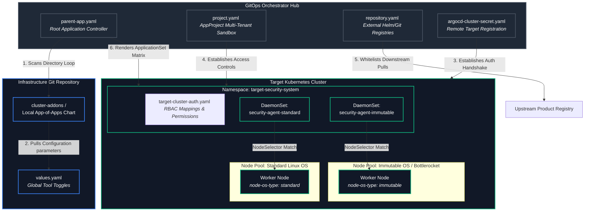

# GitOps Architecture Specification: Multi-OS Cluster Add-on Management

This specification describes the structural blueprint and automated operational engine used to bootstrap core infrastructure utilities across a multi-OS (Linux and Bottlerocket) worker node environment using Argo CD.

---

## 🗺️ Architectural Topology & Component Interaction

The infrastructure uses an administrative GitOps control plane cluster to register, authenticate, and configure core daemon sets and platform tools in a target managed Kubernetes cluster.



---

## 🗂️ Production Repository File Tree Definition

The tree follows the App-of-Apps management structure. This configuration allows teams to cleanly isolate the bootstrap authentication framework from declarative chart manifests:

```text
<TARGET_CLUSTER_ROOT_DIRECTORY>/     # Top-level entry identifier for the specific cluster
├── argo-apps/
│   └── onboarding/
│       ├── cluster-addons/          # Local Helm wrapper chart acting as the orchestration loop
│       │   ├── templates/           # Dynamically rendered cluster engines (ApplicationSets/DaemonSets)
│       │   ├── Chart.yaml           # Local Chart Engine configuration file
│       │   └── values.yaml          # Cluster Specific Toggle configuration panel
│       ├── parent-app.yaml          # The "App-of-Apps" master controller application
│       ├── project.yaml             # AppProject security sandbox definition
│       └── repository.yaml          # External platform chart registry registration
└── argocd-auth/
    ├── argocd-cluster-secret.yaml   # API endpoint and security registration keys for the target cluster
    └── target-cluster-auth.yaml     # Remote cluster ClusterRole and administrative RBAC mappings
```

---

## Detailed File-by-File Breakdown

### 1. `cluster-addons/` (The Application Engine)
Instead of hardcoding raw YAML templates, this structure packages cluster configurations into a local Helm chart template. This pattern allows operators to dynamically adjust container runtime endpoints, target image versions, and volume path mappings depending on variables defined in the cluster configuration file.

*   **`Chart.yaml`**: Houses chart structural definitions (e.g., API version metadata, naming references, and tracking semantics).
*   **`values.yaml`**: The primary operational panel. Changes here turn specific applications on or off, configure registry access keys, and assign individual resource parameters per OS type.
*   **`templates/`**: Holds the underlying engine manifests (typically `Application` or `ApplicationSet` templates) that loop through configurations and output individual operational workloads to target namespaces.

### 2. `parent-app.yaml` (The Bootstrap Point)
This manifest is applied to the GitOps hub control cluster to kick off the automation cycle. It maps directly to the onboarding sub-directory and watches the repository for subsequent changes.

### 3. `project.yaml` (The Isolation Boundary)
The `AppProject` manifest establishes logical isolation parameters for security profiles. It specifies exactly which source repositories are authorized, which destination namespaces are reachable, and which cluster-wide API groups are permitted to execute payloads.

### 4. `repository.yaml` (The Remote Authorization Layer)
Registers external vendors' primary registries directly into the GitOps instance. This configuration allows downstream template systems to map out third-party charts securely without throwing namespace access violations.

### 5. `argocd-auth/` (The Cluster Registration Domain)
*   **`argocd-cluster-secret.yaml`**: A secure container containing target API server URLs, cluster certificates, and security tokens. This provides the communication tunnel between the GitOps hub and the worker nodes.
*   **`target-cluster-auth.yaml`**: Implements cluster-level platform configurations (such as standard `ClusterRoles` and `ClusterRoleBindings`) to guarantee that the automation engine possesses the required cluster permissions to provision workloads.

---

## 📊 Core OS Metric & Runtime Comparison

Because standard Linux nodes and immutable/minimal Linux nodes (e.g., Bottlerocket) handle system isolation, filesystem write modes, and engine socket layers differently, the values file must isolate parameters by node pool:

| Feature Constraint | Standard Linux Node Pool | Immutable OS (Bottlerocket) Node Pool |
| :--- | :--- | :--- |
| **Node Label Selector** | `node-os-type: standard` | `node-os-type: immutable` |
| **Container Engine Socket** | `/run/containerd/containerd.sock` | `/run/dockershim.sock` (or customized pathing) |
| **Root Filesystem Modality**| Read-Write (`rw`) | Secure Read-Only (`ro`) Kernel |
| **Immutable Flag Toggle**  | `isImmutableOS: false` | `isImmutableOS: true` |
| **Default RAM Allocation** | **200 MiB** Requests / **300 MiB** Limits | **300 MiB** Requests / **500 MiB** Limits (SELinux Overheads) |

---

## 📝 Declarative YAML File Configurations

### 1. The Controller Bootstrapper (`parent-app.yaml`)
```yaml
apiVersion: argoproj.io/v1alpha1
kind: Application
metadata:
  name: root-cluster-bootstrap-manager
  namespace: argocd
spec:
  project: infrastructure-tools-project
  source:
    repoURL: 'https://github.com'
    targetRevision: main
    path: <TARGET_CLUSTER_ROOT_DIRECTORY>/argo-apps/onboarding/cluster-addons
  destination:
    server: 'https://default.svc'
    namespace: argocd
  syncPolicy:
    automated:
      prune: true
      selfHeal: true
```

### 2. The Isolation Sandbox Perimeter (`project.yaml`)
```yaml
apiVersion: argoproj.io/v1alpha1
kind: AppProject
metadata:
  name: infrastructure-tools-project
  namespace: argocd
spec:
  description: "Administrative boundary for core infrastructure tools and security workloads"
  destinations:
    - namespace: target-security-system
      server: https://default.svc
    - namespace: argocd
      server: https://default.svc
  sourceRepos:
    - 'https://github.com'
    - 'https://upstream-vendor-registry.com'
  clusterResourceWhitelist:
    - group: '*'
      kind: '*'
```

### 3. Centralized Cluster Toggles (`cluster-addons/values.yaml`)
```yaml
securityAgent:
  enabled: true
  version: "1.2.3"
  registrySecretName: "vendor-registry-secret"
  
  standardPool:
    nodeSelectorValue: "standard"
    memoryRequest: "200Mi"
    
  immutablePool:
    nodeSelectorValue: "immutable"
    memoryRequest: "300Mi"
```

### 4. Dynamic Generation Engine (`cluster-addons/templates/agent-appset.yaml`)
```yaml
{{- if .Values.securityAgent.enabled }}
apiVersion: argoproj.io/v1alpha1
kind: ApplicationSet
metadata:
  name: security-agent-matrix
  namespace: argocd
spec:
  generators:
    - list:
        elements:
          - osType: standard
            isImmutable: "false"
            memReq: {{ .Values.securityAgent.standardPool.memoryRequest | quote }}
            selector: {{ .Values.securityAgent.standardPool.nodeSelectorValue | quote }}
          - osType: immutable
            isImmutable: "true"
            memReq: {{ .Values.securityAgent.immutablePool.memoryRequest | quote }}
            selector: {{ .Values.securityAgent.immutablePool.nodeSelectorValue | quote }}
  template:
    metadata:
      name: 'security-agent-{{`{{osType}}`}}'
    spec:
