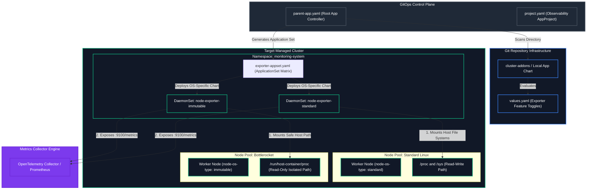

# GitOps Architecture Specification: Observability Exporters Deployment

This operational specification defines the framework for deploying and managing infrastructure observability exporters across a multi-OS worker node pool environment using an automated Argo CD configuration engine.

---

## 🗺️ Architectural Topology & Metric Scrape Flow

Observability metrics must be gathered at the OS kernel level on every node. To achieve this without cross-OS resource violations, the local application engine deploys two customized instances of the Prometheus Node Exporter targeted dynamically to their matching operating systems.



---

## 🗂️ GitOps Repository File Integration Layout

To deploy the node-exporter utility, the configuration structure hooks cleanly into your existing onboarding file framework without modifying core cluster primitives:

```text
<TARGET_CLUSTER_ROOT_DIRECTORY>/     # Top-level entry identifier for the specific cluster
├── argo-apps/
│   └── onboarding/
│       ├── cluster-addons/          
│       │   ├── templates/           
│       │   │   ├── project.yaml             # Registers 'observability-infra-project'
│       │   │   └── node-exporter-appset.yaml # NEW: Dynamic Exporter Matrix Engine
│       │   ├── Chart.yaml           
│       │   └── values.yaml                  # UPDATED: Config panel for Exporters
│       └── parent-app.yaml          
└── argocd-auth/
    ├── argocd-cluster-secret.yaml   
    └── target-cluster-auth.yaml     
```

---

## 📊 Technical Requirements: Standard Linux vs. Bottlerocket Nodes

The Node Exporter requires low-level kernel host-path mounts to capture CPU, memory, network, and disk health metrics. Because Bottlerocket uses an immutable root filesystem with strict SELinux access patterns, the deployment configuration parameters must be isolated:

| Parameter Requirement | Standard Linux Node Pool | Immutable OS (Bottlerocket) Node Pool |
| :--- | :--- | :--- |
| **Node Selector Label** | `node-os-type: standard` | `node-os-type: immutable` |
| **Host Root Paths Mount** | Standard `/proc` and `/sys` | Virtual isolated `/run/host-container/proc` |
| **Security Context Mode** | Privileged / Standard Root | Custom SELinux constraints permitted via API |
| **Collector Ports** | `9100` | `9100` |
| **Host Network Access** | `hostNetwork: true` | `hostNetwork: true` |

---

## 📝 Declarative Configurations

### 1. Centralized Cluster Values Control Panel (`cluster-addons/values.yaml`)
Append this snippet to your root cluster configuration values file. This sets your telemetry versions, toggles node-exporter system-wide, and structures target resources.

```yaml
observabilityExporters:
  nodeExporter:
    enabled: true
    chartVersion: "4.42.0" # Maps to the community prometheus-node-exporter chart version
    targetNamespace: "monitoring-system"
    
    standardPool:
      nodeSelectorValue: "standard"
      memoryLimit: "100Mi"
      cpuLimit: "100m"
      
    immutablePool:
      nodeSelectorValue: "immutable"
      memoryLimit: "150Mi"  # Extra margin for SELinux translation layers
      cpuLimit: "150m"
```

### 2. The Exporter Generation Engine (`cluster-addons/templates/node-exporter-appset.yaml`)
Drop this file into your local chart template directory. When `parent-app.yaml` fires up, Argo CD parses this file and automatically configures two discrete application resources targeted to the correct pools using **Helm inline values blocks**.

```yaml
{{- if .Values.observabilityExporters.nodeExporter.enabled }}
apiVersion: argoproj.io/v1alpha1
kind: ApplicationSet
metadata:
  name: node-exporter-matrix
  namespace: argocd
spec:
  generators:
    - list:
        elements:
          # Configuration parameters for Standard Linux Nodes
          - osType: standard
            selector: {{ .Values.observabilityExporters.nodeExporter.standardPool.nodeSelectorValue | quote }}
            cpuLim: {{ .Values.observabilityExporters.nodeExporter.standardPool.cpuLimit | quote }}
            memLim: {{ .Values.observabilityExporters.nodeExporter.standardPool.memoryLimit | quote }}
            extraValues: |
              hostRootfs: true

          # Configuration parameters for Bottlerocket (Immutable OS) Nodes
          - osType: immutable
            selector: {{ .Values.observabilityExporters.nodeExporter.immutablePool.nodeSelectorValue | quote }}
            cpuLim: {{ .Values.observabilityExporters.nodeExporter.immutablePool.cpuLimit | quote }}
            memLim: {{ .Values.observabilityExporters.nodeExporter.immutablePool.memoryLimit | quote }}
            extraValues: |
              hostRootfs: false
              extraArgs:
                - --path.procfs=/run/host-container/proc
                - --path.sysfs=/run/host-container/sys
  template:
    metadata:
      name: 'node-exporter-{{`{{osType}}`}}'
    spec:
      project: observability-infra-project
      source:
        repoURL: 'https://github.io'
        chart: prometheus-node-exporter
        targetRevision: {{ .Values.observabilityExporters.nodeExporter.chartVersion | quote }}
        helm:
          releaseName: 'node-exporter-{{`{{osType}}`}}'
          values: |
            fullnameOverride: 'node-exporter-{{`{{osType}}`}}'
            nodeSelector:
              node-os-type: {{`{{selector}}`}}
            resources:
              limits:
                cpu: {{`{{cpuLim}}`}}
                memory: {{`{{memLim}}`}}
              requests:
                cpu: 50m
                memory: 50Mi
            hostNetwork: true
            hostPID: true
            {{`{{extraValues}}`}}
      destination:
        server: 'https://default.svc'
        namespace: {{ .Values.observabilityExporters.nodeExporter.targetNamespace | quote }}
      syncPolicy:
        automated:
          prune: true
          selfHeal: true
        syncOptions:
          - CreateNamespace=true
{{- end }}
```

### 3. The Access Perimeter Policy (`cluster-addons/templates/project.yaml`)
Maintains logical isolation boundaries by whitelisting the official community Prometheus Helm chart repository.

```yaml
apiVersion: argoproj.io/v1alpha1
kind: AppProject
metadata:
  name: observability-infra-project
  namespace: argocd
spec:
  description: "Dedicated security sandbox for system telemetry exporters and agents"
  destinations:
    - namespace: monitoring-system
      server: https://default.svc
    - namespace: argocd
      server: https://default.svc
  sourceRepos:
    - 'https://github.com'
    - 'https://github.io'
  clusterResourceWhitelist:
    - group: '*'
      kind: '*'
```

---

## 🔍 Validation Checklist

1. **Verify Applications Generation:** Log into the Argo CD UI. You should see two brand new independent tiles generated dynamically: `node-exporter-standard` and `node-exporter-immutable`.
2. **Confirm Node Scheduling Alignment:** Execute the following terminal commands to confirm that the generated daemonsets have separated perfectly along node boundaries:
   ```bash
   kubectl get pods -n monitoring-system -l app.kubernetes.io/name=prometheus-node-exporter -o wide
   ```
