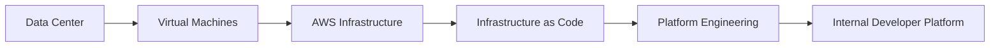
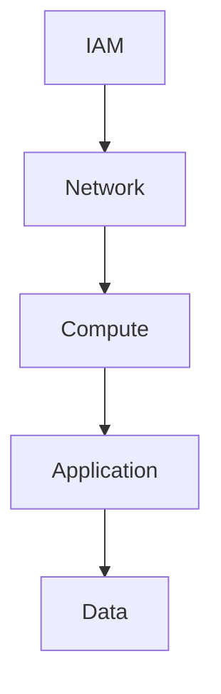
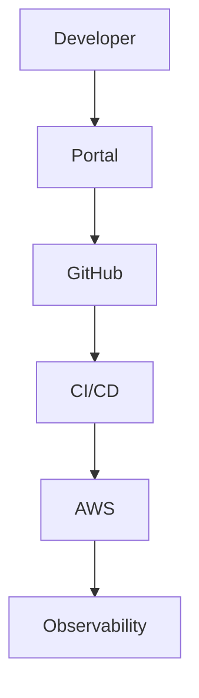

# Cloud Platform Engineering on AWS

## Purpose

This chapter provides a comprehensive guide to Cloud Platform Engineering on AWS from the perspective of an Engineering Manager, Platform Leader, and Developer Productivity organization.

The focus is not on AWS services individually.

Instead, the focus is on designing, operating, governing, and evolving cloud platforms that enable engineering organizations to deliver software safely, reliably, and efficiently.

This chapter covers:

* Cloud Platform Engineering
* AWS Architecture Principles
* Multi-Account Strategies
* Platform Governance
* Infrastructure as Code
* Cloud Security
* Cost Optimization
* Platform Reliability
* Developer Self-Service
* Internal Developer Platforms

The concepts in this chapter directly align with the responsibilities of an Engineering Manager – Developer Productivity and Platform Engineering.

---

# Key Concepts

| Concept                     | Definition                                                 | Why It Matters                   |
| --------------------------- | ---------------------------------------------------------- | -------------------------------- |
| Cloud Platform Engineering  | Building reusable cloud capabilities for engineering teams | Enables scale and consistency    |
| Internal Developer Platform | Self-service platform built on cloud foundations           | Improves developer productivity  |
| Landing Zone                | Standardized cloud account architecture                    | Governance and security          |
| Multi-Account Strategy      | Separating workloads across AWS accounts                   | Isolation and scalability        |
| Infrastructure as Code      | Managing infrastructure through code                       | Consistency and automation       |
| Platform Governance         | Policies, standards, and controls                          | Reduces operational risk         |
| FinOps                      | Cloud cost management discipline                           | Improves cloud efficiency        |
| Platform Product            | Treating infrastructure as a product                       | Drives adoption and satisfaction |

---

# What is Cloud Platform Engineering?

Many organizations think cloud engineering means:

```text
Provision AWS Resources
```

That is infrastructure management.

---

Cloud Platform Engineering means:

```text
Create reusable capabilities
that enable developers
to build and ship software
without understanding cloud complexity.
```

---

## Traditional Infrastructure Team

Responsibilities:

* Create VPCs
* Create EC2
* Create IAM Roles

---

## Platform Engineering Team

Responsibilities:

* Self-Service Infrastructure
* Golden Paths
* Platform APIs
* Governance
* Developer Experience
* Reliability

---

## Interview Insight

Weak Answer:

> Platform teams manage AWS infrastructure.

Strong Answer:

> Platform teams provide reusable cloud capabilities that abstract infrastructure complexity and enable engineering teams to focus on delivering business value.

---

# Evolution of Cloud Platforms



---

# AWS Well-Architected Framework

Every architecture discussion should reference these pillars.

---

## Operational Excellence

Focus:

* Automation
* Monitoring
* Runbooks
* Continuous Improvement

---

## Security

Focus:

* IAM
* Encryption
* Secrets Management
* Compliance

---

## Reliability

Focus:

* Resilience
* Failover
* Recovery

---

## Performance Efficiency

Focus:

* Scalability
* Resource Utilization

---

## Cost Optimization

Focus:

* Eliminate Waste
* Rightsizing
* Architecture Efficiency

---

## Sustainability

Focus:

* Efficient Resource Usage
* Optimized Architectures

---

## Interview Insight

Mentioning AWS Well-Architected Framework immediately demonstrates cloud architecture maturity.

---

# Multi-Account Strategy

Modern AWS organizations should never operate from a single account.

---

## Why Multiple Accounts?

### Security Isolation

Production separated from development.

---

### Blast Radius Reduction

Failures remain isolated.

---

### Cost Allocation

Improved visibility.

---

### Governance

Environment-specific controls.

---

# Example Enterprise Structure

```text
AWS Organization

├── Shared Services
├── Security
├── Networking
├── Development
├── Performance
├── Pre-Production
└── Production
```

---

# Landing Zone Strategy

A Landing Zone provides:

* Account Provisioning
* Guardrails
* Security Standards
* Logging
* Networking

---

## Core Components

### AWS Organizations

Account Governance

---

### IAM Identity Center

Centralized Identity

---

### CloudTrail

Audit Logging

---

### GuardDuty

Threat Detection

---

### Security Hub

Security Posture

---

### AWS Config

Compliance Monitoring

---

# Infrastructure as Code

Infrastructure must be treated as software.

---

## Why IaC?

Without IaC:

```text
Manual Changes

Configuration Drift

Operational Risk
```

---

With IaC:

```text
Version Control

Repeatability

Automation
```

---

# Infrastructure as Code Options

| Tool           | Strengths                              |
| -------------- | -------------------------------------- |
| AWS CDK        | Developer-friendly, TypeScript support |
| Terraform      | Multi-cloud ecosystem                  |
| CloudFormation | Native AWS integration                 |
| Pulumi         | Programming language support           |

---

# My Preferred Approach

For AWS-native platforms:

```text
AWS CDK
```

For enterprise multi-cloud:

```text
Terraform
```

---

# Real World Example

## CDK Platform Constructs

Challenge:

Every application team was creating infrastructure differently.

---

Solution:

Built reusable CDK constructs.

Examples:

* EKS
* CI/CD Pipelines
* IAM Standards
* Networking

---

Benefits:

* Consistency
* Faster Delivery
* Governance
* Reduced Errors

---

# Cloud Security

Cloud security should be embedded into the platform.

Not bolted on later.

---

# Security Layers



---

## Identity

Examples:

* IAM Roles
* IAM Identity Center
* Federation

---

## Secrets

Examples:

* AWS Secrets Manager
* Parameter Store

---

## Encryption

Examples:

* KMS
* S3 Encryption
* EBS Encryption

---

# Security by Design

Platform teams should automate:

* Security Scanning
* Compliance Validation
* Policy Enforcement

---

## Tools

* Checkov
* OPA
* cdk-nag
* Kyverno

---

# Platform Governance

Governance exists to balance:

```text
Developer Freedom

and

Operational Safety
```

---

# Governance Areas

## Security

Who can do what?

---

## Reliability

How should workloads operate?

---

## Cost

How are resources controlled?

---

## Compliance

How are standards enforced?

---

## Ownership

Who owns services?

---

# Policy as Code

Modern governance should be automated.

---

## Benefits

* Consistency
* Repeatability
* Auditability
* Scalability

---

# FinOps & Cloud Cost Optimization

Cloud cost optimization is a platform responsibility.

---

# Cost Optimization Framework

## Visibility

Understand spending.

---

## Optimization

Remove waste.

---

## Governance

Establish controls.

---

## Accountability

Assign ownership.

---

# Real World Example

## AWS Graviton Migration

Business Goal:

Reduce infrastructure cost.

---

Technical Goal:

Adopt ARM64 architecture.

---

Activities:

* Compatibility Validation
* CI/CD Updates
* Platform Standards
* Deployment Governance

---

Results:

* Better price-performance ratio
* Improved infrastructure efficiency

---

# Reliability Engineering in AWS

Cloud platforms must be resilient.

---

# Reliability Principles

## Design for Failure

Failures are inevitable.

---

## Automation

Reduce manual operations.

---

## Observability

Monitor everything.

---

## Recovery

Recover quickly.

---

# Common AWS Reliability Services

| Service      | Purpose             |
| ------------ | ------------------- |
| Route53      | DNS & Failover      |
| ELB          | Load Balancing      |
| Auto Scaling | Capacity Management |
| CloudWatch   | Monitoring          |
| Backup       | Recovery            |
| Multi-AZ     | Availability        |

---

# Internal Developer Platforms

Cloud platforms are evolving into developer platforms.

---

# Traditional Cloud Team

```text
Ticket

↓

Platform Team

↓

Infrastructure
```

---

# Modern Platform Team

```text
Developer

↓

Self-Service Platform

↓

Infrastructure
```

---

# Platform Components



---

# Platform Product Mindset

The platform is a product.

Developers are customers.

---

## Measure Success Through

### Adoption

How many teams use it?

---

### Satisfaction

Do developers like it?

---

### Productivity

Does it reduce friction?

---

### Reliability

Does it improve outcomes?

---

# Common Interview Questions

## What is Cloud Platform Engineering?

Strong Answer:

> Cloud Platform Engineering is the discipline of building reusable cloud capabilities, self-service workflows, governance mechanisms, and operational standards that enable engineering teams to deliver software faster while reducing complexity and risk.

---

## Why Multi-Account AWS?

Strong Answer:

> Multi-account architectures improve security isolation, reduce blast radius, enable governance, and provide better cost visibility across environments and business units.

---

## Why Infrastructure as Code?

Strong Answer:

> Infrastructure as Code improves consistency, repeatability, governance, auditability, and automation while reducing configuration drift and operational risk.

---

## How Would You Improve Developer Productivity on AWS?

Strong Answer:

1. Build self-service workflows
2. Standardize infrastructure patterns
3. Automate CI/CD
4. Implement GitOps
5. Improve observability
6. Reduce cognitive load

---

# Common Mistakes

| Mistake                    | Why It Fails              |
| -------------------------- | ------------------------- |
| Single AWS Account         | Poor isolation            |
| Manual Infrastructure      | Configuration drift       |
| No Governance              | Operational risk          |
| No Cost Controls           | Cloud waste               |
| Excessive Governance       | Poor developer experience |
| Platform as Infrastructure | Low adoption              |

---

# Revision Notes

| Topic                | Key Point                     |
| -------------------- | ----------------------------- |
| Platform Engineering | Enable developers             |
| AWS Well-Architected | Six pillars                   |
| Landing Zone         | Foundation                    |
| Multi-Account        | Isolation                     |
| IaC                  | Automation                    |
| Governance           | Security + Reliability + Cost |
| FinOps               | Cloud efficiency              |
| Platform Product     | Developers are customers      |
| Self-Service         | Reduce friction               |

---

# Key Takeaways

1. Cloud Platform Engineering is about enabling developers, not provisioning infrastructure.

2. AWS platforms should be designed around self-service, automation, and governance.

3. Infrastructure as Code is the foundation of scalable cloud operations.

4. Multi-account strategies improve security, governance, and operational resilience.

5. Platform teams should think like product teams and treat developers as customers.

6. FinOps, Security, Reliability, and Developer Experience must be designed into the platform from day one.

7. The highest-performing engineering organizations abstract cloud complexity and allow developers to focus on delivering business value.
