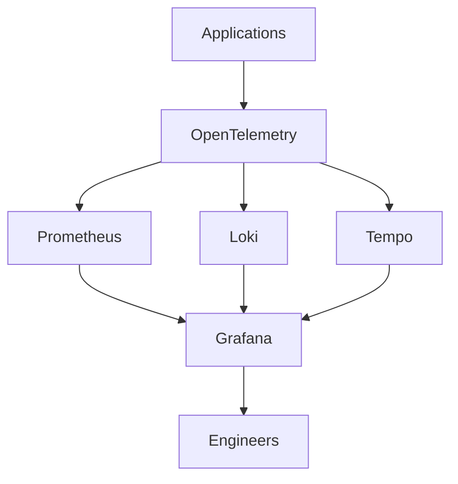
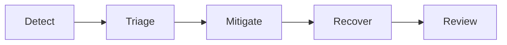

# Observability, SRE & Reliability Engineering

## Purpose

This chapter provides a comprehensive guide to Observability, Site Reliability Engineering (SRE), Reliability Engineering, Incident Management, and Operational Excellence.

For modern platform organizations, reliability is no longer the responsibility of operations teams alone.

Reliability is a platform capability.

The objective of this chapter is to prepare for Engineering Manager and Platform Leadership interviews by understanding:

* Reliability Engineering Principles
* Site Reliability Engineering (SRE)
* Observability Architecture
* Incident Response
* Error Budgets
* Service Level Objectives (SLOs)
* Operational Excellence
* Enterprise Monitoring Platforms

The examples are based on real-world experience managing Kubernetes platforms, enterprise observability systems, GitOps environments, AWS infrastructure, and production operations.

---

# Key Concepts

| Concept       | Definition                                                             | Why It Matters                             |
| ------------- | ---------------------------------------------------------------------- | ------------------------------------------ |
| Reliability   | Ability of a system to consistently perform its intended function      | Directly impacts customer trust            |
| Availability  | Percentage of time a system is operational                             | Availability is a component of reliability |
| Observability | Ability to understand system behavior through outputs                  | Enables faster troubleshooting             |
| SRE           | Engineering discipline that applies software engineering to operations | Improves scalability and reliability       |
| SLI           | Service Level Indicator                                                | Measures service performance               |
| SLO           | Service Level Objective                                                | Reliability target                         |
| SLA           | Service Level Agreement                                                | Customer commitment                        |
| Error Budget  | Acceptable level of unreliability                                      | Balances innovation and stability          |
| MTTR          | Mean Time To Recovery                                                  | Measures incident recovery effectiveness   |
| Toil          | Manual repetitive operational work                                     | SRE aims to eliminate toil                 |

---

# Reliability Engineering Philosophy

Many organizations confuse availability with reliability.

They are not the same thing.

---

## Availability

Example:

```text
99.95% Uptime
```

System is available.

---

## Reliability

Example:

```text
Service responds correctly
Within expected latency
Without excessive errors
Consistently
```

A service can be available but unreliable.

---

### Example

Application responds:

```text
HTTP 500
```

to every request.

Availability:

```text
100%
```

Reliability:

```text
0%
```

---

## Reliability Formula

```text
Reliability =
Expected Outcomes
------------------------
Total Outcomes
```

---

## Interview Insight

Strong Engineering Managers talk about:

* Reliability
* User Experience
* Error Budgets
* Operational Risk

Not just uptime percentages.

---

# Evolution of Operations


---

## Monitoring

Answers:

> Is something broken?

---

## Observability

Answers:

> Why is something broken?

---

## Reliability Engineering

Answers:

> How do we prevent it from happening again?

---

# The Three Pillars of Observability

Observability is built on three primary signals.

---

## Metrics

Numerical measurements over time.

Examples:

```text
CPU Usage

Memory Usage

Latency

Request Rate

Error Rate
```

---

### Prometheus Example

```promql
rate(http_requests_total[5m])
```

---

### Strengths

* Fast
* Aggregated
* Ideal for alerting

---

### Weaknesses

* Limited context

---

## Logs

Event records.

Examples:

```json
{
  "service":"checkout",
  "status":"500",
  "message":"database timeout"
}
```

---

### Strengths

* Rich context

---

### Weaknesses

* Expensive at scale

---

## Traces

Track requests across services.

Example:

```text
API Gateway

↓

Service A

↓

Service B

↓

Database
```

---

### Strengths

* Dependency visibility

---

### Weaknesses

* Storage overhead

---

# The Fourth Pillar: Events

Modern observability platforms increasingly include events.

Examples:

* Deployments
* Node Failures
* AWS Health Events
* Security Events

---

## Real World Example

AWS Health Platform

Event:

```text
RDS Maintenance
```

Triggers:

```text
Slack Notification

Service Owner Alert

Runbook
```

---

# Enterprise Observability Architecture



---

# My Observability Stack

## Metrics

* Prometheus
* Managed Prometheus

---

## Visualization

* Grafana
* Dynatrace

---

## Logs

* Loki
* CloudWatch

---

## Infrastructure Monitoring

* Dynatrace
* CloudWatch

---

## Alerting

* Slack
* Email
* PagerDuty

---

# Service Level Indicators (SLIs)

SLIs measure service behavior.

---

## Examples

### Availability

```text
Successful Requests
-------------------
Total Requests
```

---

### Latency

```text
95th Percentile Response Time
```

---

### Error Rate

```text
Failed Requests
---------------
Total Requests
```

---

# Service Level Objectives (SLOs)

SLOs define reliability targets.

---

## Example

```text
Availability

99.9%
```

---

### Monthly Downtime

| SLO    | Downtime    |
| ------ | ----------- |
| 99%    | 7.2 Hours   |
| 99.9%  | 43 Minutes  |
| 99.95% | 21 Minutes  |
| 99.99% | 4.3 Minutes |

---

## Interview Insight

Many organizations choose unrealistic SLOs.

99.99% sounds impressive.

But achieving it requires significant investment.

Always discuss trade-offs.

---

# Error Budgets

Google SRE introduced Error Budgets.

---

## Formula

```text
100% - SLO
```

Example:

```text
SLO = 99.9%

Error Budget = 0.1%
```

---

## Why Error Budgets Matter

Without error budgets:

```text
Operations wants stability

Engineering wants speed
```

Conflict occurs.

---

With error budgets:

```text
Shared objective
```

---

## Leadership Discussion

Error budgets create alignment between:

* Product Teams
* Engineering Teams
* Operations Teams

---

# Incident Management

Incident lifecycle:



---

# Severity Levels

| Severity | Impact            |
| -------- | ----------------- |
| Sev1     | Critical outage   |
| Sev2     | Major degradation |
| Sev3     | Minor impact      |
| Sev4     | Informational     |

---

# MTTR Reduction Strategy

## People

* Runbooks
* Training
* Incident Drills

---

## Process

* Clear escalation paths
* Defined ownership

---

## Technology

* Better alerting
* Better observability
* Automation

---

# Common Incident Anti-Patterns

## Alert Fatigue

Problem:

Too many alerts.

Result:

Engineers ignore alerts.

---

## Dashboard Sprawl

Problem:

Hundreds of dashboards.

Nobody knows which one matters.

---

## Missing Ownership

Problem:

Everyone owns it.

Result:

Nobody owns it.

---

# Reliability Leadership

Engineering Managers should focus on:

## Reliability Culture

Create:

* Blameless Postmortems
* Learning Culture
* Continuous Improvement

---

## Not

```text
Who caused this?
```

Instead ask:

```text
Why was the system allowed to fail?
```

---

# Common Interview Questions

## What is Observability?

Strong Answer:

> Observability is the ability to understand internal system behavior through external outputs such as metrics, logs, traces, and events. It enables teams to detect, diagnose, and resolve issues quickly while improving overall system reliability.

---

## How would you improve reliability?

Strong Answer:

1. Define SLIs and SLOs
2. Implement observability
3. Improve alert quality
4. Reduce toil
5. Automate recovery
6. Establish blameless postmortems
7. Track error budgets

---

## What is the difference between Monitoring and Observability?

Monitoring:

> Detecting known failures.

Observability:

> Understanding unknown failures.

---

# Real World Example

## Centralized Observability Platform

### Challenge

Multiple teams had:

* Different dashboards
* Different alerts
* Different metrics

Troubleshooting was difficult.

---

### Solution

Implemented:

* Prometheus
* Grafana
* Loki
* Standardized telemetry

---

### Results

* Improved visibility
* Faster troubleshooting
* Reduced MTTR
* Better operational awareness

---

# Revision Notes

| Topic         | Key Point                        |
| ------------- | -------------------------------- |
| Reliability   | Consistent outcomes              |
| Availability  | Uptime only                      |
| Observability | Metrics + Logs + Traces + Events |
| SLI           | Measurement                      |
| SLO           | Target                           |
| SLA           | Customer commitment              |
| Error Budget  | Innovation vs Stability          |
| MTTR          | Recovery speed                   |
| Toil          | Manual operational work          |
| SRE Goal      | Reliability through engineering  |

---

# Key Takeaways

1. Reliability is more important than uptime.

2. Observability exists to explain system behavior, not just collect data.

3. SLOs and Error Budgets align product and engineering priorities.

4. Incident management should focus on learning, not blame.

5. The best reliability organizations automate repetitive operational work.

6. Engineering Managers should think about reliability as a product capability, not an operational activity.

7. Observability is one of the foundational pillars of Developer Productivity because developers move faster when systems provide rapid, actionable feedback.
