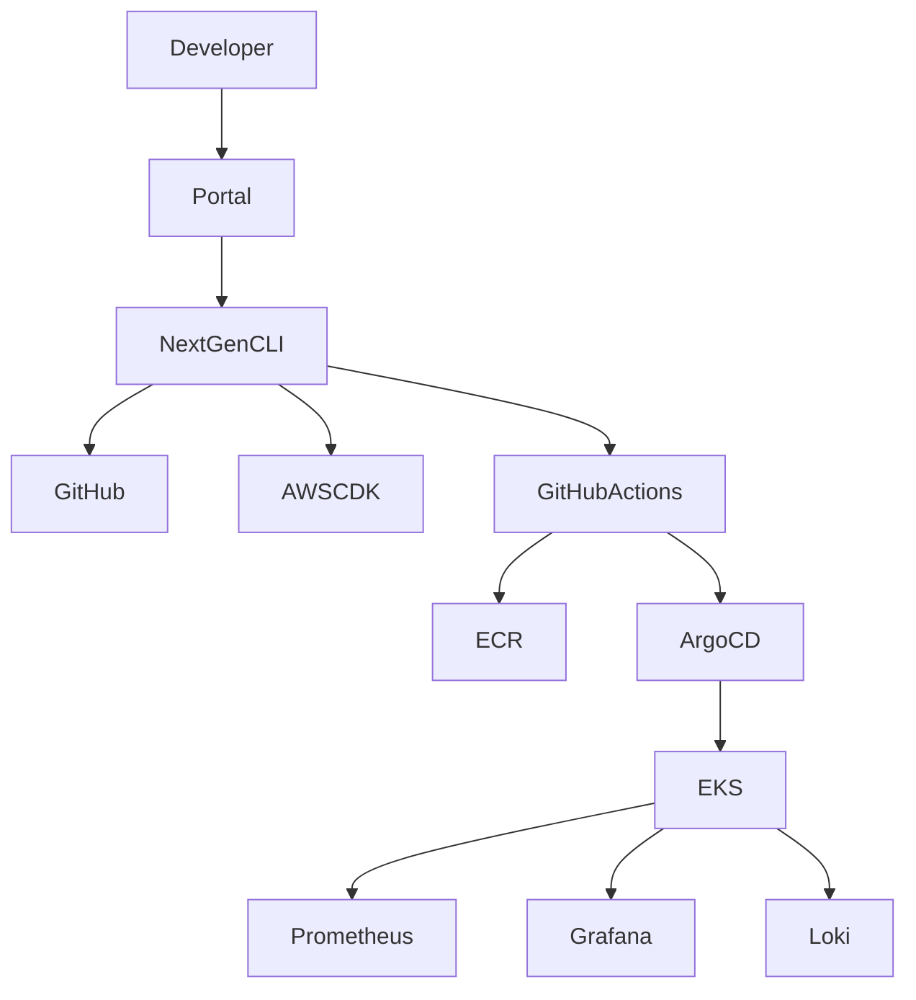
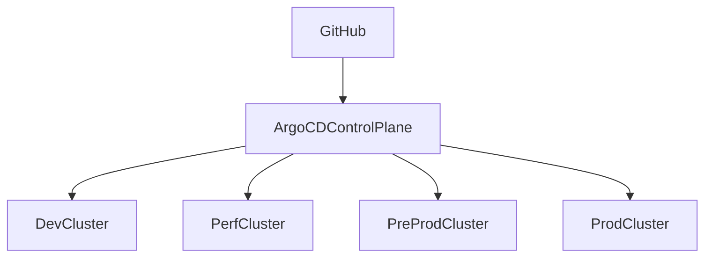

# System Design Scenarios for Engineering Managers

## Purpose

This chapter prepares Engineering Managers and Platform Leaders for system design discussions commonly encountered in senior engineering leadership interviews.

Unlike traditional software engineering system design interviews that focus on products such as Netflix, Uber, or WhatsApp, this chapter focuses on platform engineering, developer productivity, cloud infrastructure, reliability engineering, and internal developer platforms.

The examples are based on real-world initiatives including:

* Internal Developer Platforms (IDP)
* NextGen CLI
* Multi-Cluster GitOps
* Enterprise Kubernetes Platforms
* AWS Graviton Migration
* Platform Governance
* Enterprise Observability
* AWS Health Event Platform

The objective is not merely to design systems but to demonstrate:

* Strategic thinking
* Trade-off analysis
* Platform architecture expertise
* Engineering leadership
* Reliability mindset
* Developer experience thinking

---

# What Interviewers Are Actually Evaluating

Most candidates believe system design interviews evaluate architecture skills.

At Engineering Manager level, that is only partially true.

Interviewers are evaluating how you think.

---

## Evaluation Framework

| Area                   | What Interviewers Look For                      |
| ---------------------- | ----------------------------------------------- |
| Requirements Gathering | Ability to clarify ambiguous requirements       |
| Architecture Design    | Ability to design scalable systems              |
| Trade-Off Analysis     | Understanding pros and cons of design decisions |
| Reliability            | Failure handling and resilience                 |
| Scalability            | Horizontal and vertical scaling strategies      |
| Security               | Security-by-design thinking                     |
| Operational Excellence | Monitoring, alerting, observability             |
| Cost Awareness         | Understanding cloud economics                   |
| Leadership             | Ability to influence organizational adoption    |

---

## Common Mistake

Many candidates immediately start drawing architecture diagrams.

Strong candidates first ask questions.

---

### Weak Approach

> I would use Kubernetes, Kafka, Redis, and PostgreSQL.

---

### Strong Approach

> Before discussing technology choices, I would like to clarify functional requirements, expected scale, reliability objectives, operational constraints, and organizational ownership boundaries.

---

# Engineering Manager System Design Framework

Use this framework for every architecture discussion.

## Step 1 – Requirements

Understand:

### Functional Requirements

What should the system do?

Examples:

* Create repositories
* Provision infrastructure
* Deploy applications
* Generate alerts

### Non-Functional Requirements

Examples:

* Scalability
* Availability
* Security
* Cost
* Compliance
* Latency

---

## Step 2 – Scale Estimation

Determine:

| Question    | Example            |
| ----------- | ------------------ |
| Users       | 500 Developers     |
| Services    | 1000 Microservices |
| Deployments | 500 Per Day        |
| Clusters    | 25 EKS Clusters    |
| Regions     | 5 AWS Regions      |

---

## Step 3 – High-Level Architecture

Identify:

* Entry Points
* APIs
* Data Stores
* Event Streams
* Integrations

---

## Step 4 – Reliability

Ask:

* What happens if this component fails?
* Is there a backup strategy?
* Can the system self-heal?

---

## Step 5 – Observability

Design:

* Metrics
* Logs
* Traces
* Dashboards
* Alerting

---

## Step 6 – Security

Design:

* Authentication
* Authorization
* Secrets Management
* Audit Trails

---

## Step 7 – Cost

Always discuss:

* Compute
* Storage
* Network
* Licensing
* Operational Overhead

---

# Scenario 1: Design an Internal Developer Platform

---

## Business Context

Engineering teams spend excessive time:

* Creating repositories
* Building CI/CD pipelines
* Managing infrastructure
* Configuring monitoring
* Troubleshooting deployments

This creates friction and slows delivery.

---

## Goal

Provide a self-service platform experience that enables engineers to move from idea to production quickly and safely.

---

## Functional Requirements

Developers should be able to:

* Create new services
* Provision infrastructure
* Configure CI/CD
* Deploy applications
* Access observability tools

Without platform team intervention.

---

## Non-Functional Requirements

| Requirement           | Target       |
| --------------------- | ------------ |
| Availability          | 99.9%        |
| Onboarding Time       | < 30 Minutes |
| Deployment Time       | < 10 Minutes |
| Security Compliance   | 100%         |
| Self-Service Coverage | > 80%        |

---

## High Level Architecture

---

## Core Components

### Developer Portal

Purpose:

Single entry point for developers.

Examples:

* Backstage
* Custom Portal

Responsibilities:

* Service Catalog
* Documentation
* Templates
* Ownership

---

### NextGen CLI

Purpose:

Developer Interface Layer

Responsibilities:

* Bootstrap applications
* Generate repositories
* Create pipelines
* Create deployment manifests

---

### GitHub

Purpose:

Source of Truth

Stores:

* Application Code
* Infrastructure Code
* GitOps Manifests

---

### GitHub Actions

Purpose:

Continuous Integration

Responsibilities:

* Build
* Test
* Security Scan
* Publish

---

### ArgoCD

Purpose:

Continuous Delivery

Responsibilities:

* Reconciliation
* Drift Detection
* Automated Deployments

---

### EKS

Purpose:

Application Runtime

Responsibilities:

* Scheduling
* Scaling
* Self-Healing

---

# Architecture Trade-Offs

## Portal vs CLI

### Portal Advantages

* Easier adoption
* Better discoverability

### Portal Disadvantages

* More engineering effort

---

### CLI Advantages

* Faster implementation
* Preferred by power users

### CLI Disadvantages

* Learning curve

---

## Interview Insight

A strong answer is:

> I would support both interfaces because different developer personas prefer different interaction models.

This demonstrates platform product thinking.

---

# Scenario 2: Design a Multi-Cluster GitOps Platform

## Business Context

An organization operates:

* 20+ Kubernetes Clusters
* Multiple AWS Accounts
* Multiple Regions
* Hundreds of Microservices

Deployment consistency becomes challenging.

---

## Objective

Create a GitOps platform capable of managing deployments across all clusters.

---

## Architecture

---

## Key Design Decisions

### Single ArgoCD

Advantages:

* Easier Management

Disadvantages:

* Larger blast radius

---

### Multi-ArgoCD

Advantages:

* Better isolation
* Improved security

Disadvantages:

* Higher operational complexity

---

## My Preferred Approach

For enterprise scale:

> Use a dedicated ArgoCD control plane per environment boundary and maintain centralized governance through Git repositories and platform standards.

This balances operational isolation and governance.

---

# Scenario 3: Design an Enterprise Observability Platform

(To be continued in Part 2)

Topics:

* Prometheus Architecture
* Grafana
* Loki
* OpenTelemetry
* Dynatrace
* SLI/SLO Design
* Alerting Strategy
* Multi-Cluster Telemetry
* Cost Optimization
* Incident Management
