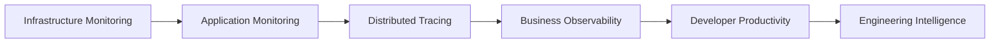
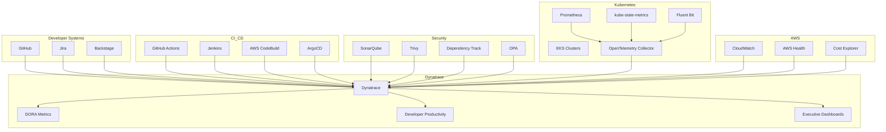
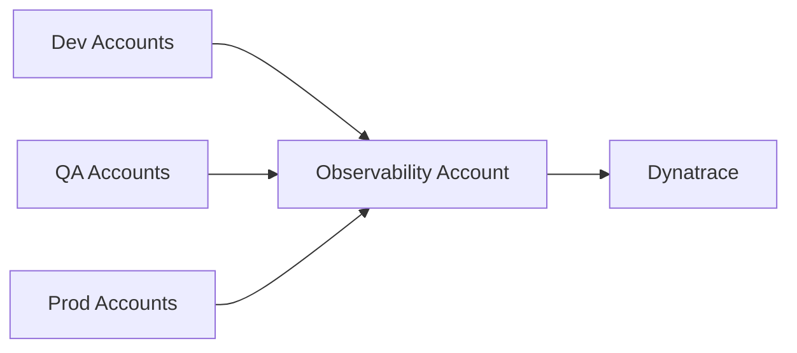

# 12 - Observability, Developer Productivity & Engineering Intelligence Platform

> Engineering Manager Interview Preparation
>
> Topics:
> - Dynatrace
> - Observability
> - DORA Metrics
> - Developer Experience (DevEx)
> - Platform Engineering
> - Executive Dashboards
> - Production Grade Architecture
> - Engineering Intelligence

---

# Table of Contents

1. Vision
2. Observability Maturity Model
3. Production Architecture
4. Data Sources
5. Connectors & Exporters
6. DORA Metrics Design
7. Developer Productivity Metrics
8. Dynatrace Dashboard Design
9. Executive Dashboard
10. Engineering Manager Dashboard
11. Team Dashboard
12. Cost Optimization Dashboard
13. Security Dashboard
14. Production Considerations
15. Interview Questions & Answers
16. Example Leadership Story
17. Image Generation Prompts

---

# Vision

Traditional observability focuses on:

- CPU
- Memory
- Disk
- Logs
- Errors

Modern Platform Engineering focuses on:

- Engineering Productivity
- Developer Experience
- Reliability
- Cost Optimization
- Platform Adoption
- Security Posture
- Business Outcomes

The goal is to create an Engineering Intelligence Platform that provides visibility from:

```text
Developer Commit
      ↓
Build & Test
      ↓
Deployment
      ↓
Production Health
      ↓
Business Outcomes
```

---

# Observability Maturity Model



---

# Production Grade Architecture

## High-Level Architecture



---

# Architecture Components

## Developer Systems

### GitHub

Collect:

- Commits
- Pull Requests
- Reviews
- Merge Time
- Contributors

### Jira

Collect:

- Story Cycle Time
- Sprint Velocity
- Defect Metrics

### Backstage

Collect:

- Service Ownership
- Team Ownership
- Platform Adoption

---

## CI/CD Systems

### GitHub Actions

Collect:

- Build Duration
- Build Success Rate
- Deployment Events

### Jenkins

Collect:

- Build Success Rate
- Build Duration
- Failure Trends

### AWS CodeBuild

Collect:

- Build Time
- Queue Time
- Success Rate

### ArgoCD

Collect:

- Deployments
- Sync Events
- Rollbacks
- Failed Deployments

---

## Security Systems

### SonarQube

Collect:

- Code Smells
- Technical Debt
- Quality Gates

### Dependency Track

Collect:

- Vulnerabilities
- SBOM Data
- Component Risk

### Trivy

Collect:

- Container Vulnerabilities
- Critical Findings

### OPA

Collect:

- Policy Violations
- Compliance Metrics

---

## Platform Systems

### Kubernetes

Collect:

- Node Health
- Pod Health
- Resource Utilization
- Restarts

### Prometheus

Collect:

- Application Metrics
- Service Metrics
- SLO Metrics

### Fluent Bit

Collect:

- Application Logs
- Audit Logs
- Kubernetes Logs

### OpenTelemetry

Collect:

- Traces
- Metrics
- Logs

---

# Connectors & Exporters

## GitHub

### Options

- GitHub REST API
- GitHub GraphQL API
- GitHub Webhooks

### Data

- Commit Time
- Merge Time
- Review Time
- Deployment References

### Export

```text
GitHub
    ↓
Lambda / ETL
    ↓
Dynatrace Metrics API
```

---

## Jira

### Collection

```text
Jira REST API
```

### Metrics

- Lead Time
- Cycle Time
- Sprint Metrics

---

## ArgoCD

### Collection Options

- ArgoCD API
- ArgoCD Notifications
- ArgoCD Metrics Endpoint

### Metrics

- Deployments
- Rollbacks
- Deployment Failures

---

## Kubernetes

### Collectors

- Dynatrace OneAgent
- OpenTelemetry Collector
- kube-state-metrics

---

## Prometheus

### Integration

- Remote Write
- Prometheus Scraping

### Export

```text
Prometheus
      ↓
OTEL Collector
      ↓
Dynatrace
```

---

## Logs

### Collectors

- Fluent Bit
- Fluentd
- Vector

### Destination

```text
Dynatrace Logs
```

---

## Traces

### Collection

- OpenTelemetry SDK
- OpenTelemetry Collector

### Destination

```text
Dynatrace Distributed Tracing
```

---

# DORA Metrics Design

---

## 1. Deployment Frequency

### Definition

How often software is deployed.

### Sources

- ArgoCD
- GitHub Actions
- Jenkins
- CodeBuild

### Example

| Month | Deployments |
|---------|---------|
| Jan | 25 |
| Feb | 38 |
| Mar | 52 |
| Apr | 67 |

---

## 2. Lead Time For Changes

### Formula

```text
Production Deployment Timestamp
-
Commit Timestamp
```

### Sources

- GitHub
- ArgoCD

### Example

```text
Before: 4 Days

After: 1.5 Days
```

---

## 3. Change Failure Rate

### Formula

```text
Failed Deployments
/
Total Deployments
```

### Sources

- ArgoCD
- Incident System
- Rollback Events

### Example

```text
Before: 12%

After: 4%
```

---

## 4. MTTR

### Formula

```text
Recovery Time
-
Incident Start
```

### Sources

- Dynatrace Problems
- PagerDuty
- Incident Management Platform

### Example

```text
Before: 75 Minutes

After: 22 Minutes
```

---

# Developer Productivity Metrics

---

## Onboarding Time

```text
Laptop Ready
      ↓
First Commit
      ↓
First Deployment
```

### Example

```text
Before: 10 Days

After: 3 Days
```

---

## Build Duration

### Example

```text
Before: 22 Minutes

After: 11 Minutes
```

---

## Self-Service Adoption

### Formula

```text
Automated Requests
/
Total Requests
```

### Example

```text
85%
```

---

## Platform Adoption

### Formula

```text
Services Using Platform Standards
/
Total Services
```

### Example

```text
95 / 120 Services
```

---

## Golden Path Adoption

Track adoption of:

- Standard Pipeline
- Standard Helm Chart
- Standard CDK Templates
- Standard Monitoring
- Standard Security Controls

---

# Dynatrace Dashboard Design

---

# Executive Dashboard

## Audience

- CTO
- VP Engineering
- Directors

## Metrics

| Category | Metrics |
|-----------|-----------|
| Delivery | Deploy Frequency |
| Delivery | Lead Time |
| Reliability | MTTR |
| Reliability | Availability |
| Cost | Cloud Spend |
| Cost | Savings |
| DevEx | Onboarding Time |
| Adoption | Platform Adoption |

### Example

```text
Deployment Frequency  +40%

Lead Time            -60%

Cloud Spend          -25%

MTTR                 -70%
```

---

# Engineering Manager Dashboard

## Audience

Engineering Managers

### Metrics

- Team Delivery
- Build Duration
- PR Review Time
- Sprint Completion
- Deployment Success Rate
- MTTR
- Team Adoption

---

# Team Dashboard

## Audience

Developers

### Metrics

- Service Health
- Error Rate
- Latency
- Logs
- Traces
- Deployment Status
- SLO Compliance

---

# Cost Optimization Dashboard

Useful for Graviton Migration.

### Metrics

| Metric | Example |
|----------|----------|
| Cloud Spend | $120K/month |
| Savings | $30K/month |
| Annualized Savings | $400K/year |
| ARM Adoption | 65% |
| AMD Adoption | 35% |

---

# Security Dashboard

### Metrics

| Metric | Example |
|----------|----------|
| Critical Vulnerabilities | 120 → 35 |
| Compliance | 98% |
| Patch Time | 45 Days → 12 Days |
| Policy Violations | Trending Down |

---

# Production Design Considerations

---

## High Availability

Deploy multiple collectors.

```text
OTEL Collector
Replicas = 3+
```

Avoid single points of failure.

---

## Scalability

Support:

- Multiple AWS Accounts
- Multiple EKS Clusters
- Thousands of Services

---

## Security

Use:

- TLS
- IAM Roles
- RBAC
- Secret Manager
- Audit Logging

---

## Multi-Account Strategy



---

## Multi-Cluster Strategy

Tag everything:

```text
Environment=DEV
Environment=QA
Environment=UAT
Environment=PROD

Team=Payments
Team=Platform
Team=CustomerSupport
```

---

# Interview Questions & Answers

---

## Q: How would you measure Developer Productivity?

Measure:

- DORA Metrics
- Onboarding Time
- Build Duration
- Self-Service Adoption
- Platform Adoption
- PR Review Time

Avoid measuring only lines of code.

---

## Q: How would you implement DORA metrics?

Collect deployment data from ArgoCD and CI/CD systems.

Collect commit data from GitHub.

Calculate:

- Deployment Frequency
- Lead Time
- Change Failure Rate
- MTTR

Visualize through Dynatrace dashboards.

---

## Q: How would you show platform value to leadership?

Create executive dashboards focused on:

- Cost Savings
- Reliability Improvements
- Productivity Improvements
- Platform Adoption
- Engineering Velocity

Translate technical outcomes into business outcomes.

---

# Leadership Story

## Situation

Platform team was perceived as a cost center.

Leadership only saw platform teams during incidents.

---

## Action

Built an Engineering Intelligence Dashboard in Dynatrace showing:

- DORA Metrics
- Cloud Savings
- Reliability Improvements
- Platform Adoption
- Developer Productivity

Created monthly executive reviews.

---

## Result

- Increased platform visibility
- Stronger executive sponsorship
- Improved funding approval
- Better platform adoption

---

# Gemini Image Prompts

## Architecture Diagram

```text
Create a professional enterprise platform engineering observability architecture diagram.

Include:

GitHub
GitHub Actions
Jenkins
AWS CodeBuild
ArgoCD
Jira
Backstage
SonarQube
Dependency Track
Trivy
OPA

Data flows into:

OpenTelemetry Collectors
Fluent Bit
Prometheus

Then into:

Dynatrace SaaS Platform

Show:

DORA Metrics
Executive Dashboards
Engineering Manager Dashboards
Developer Dashboards

Use AWS EKS clusters.

Production-grade architecture.

Enterprise cloud design.

White background.

Blue enterprise theme.

Presentation-ready.
```

---

## DORA Metrics Dashboard

```text
Create a realistic Dynatrace-style executive dashboard.

Show:

Deployment Frequency
Lead Time For Changes
Change Failure Rate
MTTR

Include:

KPI cards
Trend charts
Team comparison widgets
Executive summary panel

Modern enterprise SaaS dashboard.
```

---

## Developer Productivity Dashboard

```text
Create a modern engineering productivity dashboard.

Show:

Onboarding Time
Build Duration
PR Review Time
Golden Path Adoption
Self-Service Adoption
Platform Adoption

Styled similar to Dynatrace or Grafana.

Executive reporting quality.
```

---

# Key Interview Takeaway

A mature observability platform should answer:

1. Are engineers delivering faster?
2. Are systems becoming more reliable?
3. Are developers becoming more productive?
4. Is platform adoption increasing?
5. Are we reducing cloud costs?
6. Are we improving security posture?
7. Can leadership clearly see engineering impact?

If the answer is yes, the platform has evolved from monitoring to Engineering Intelligence.