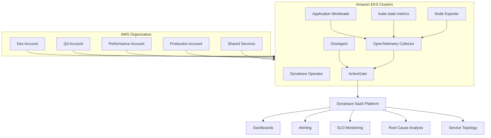
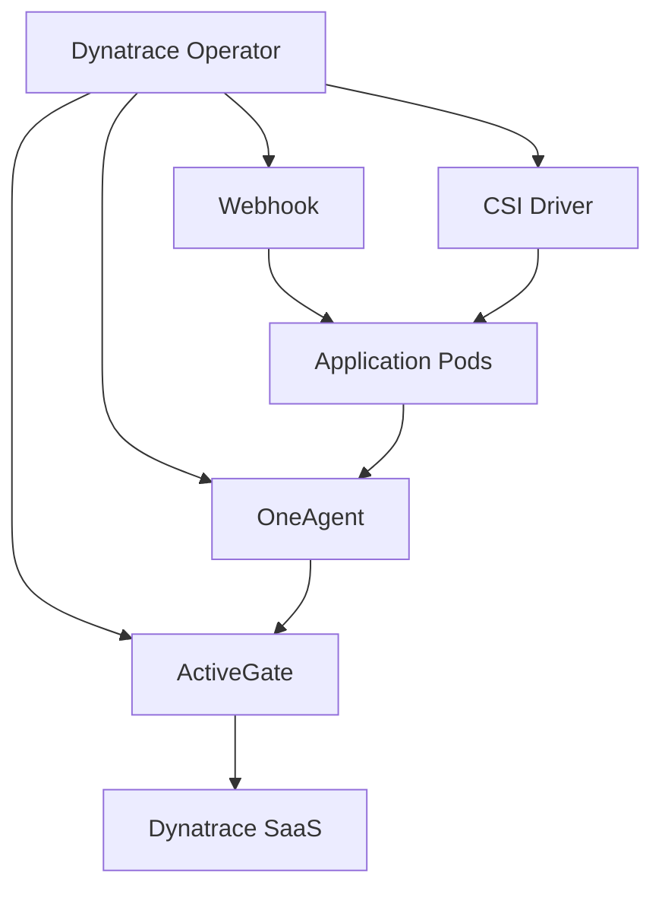
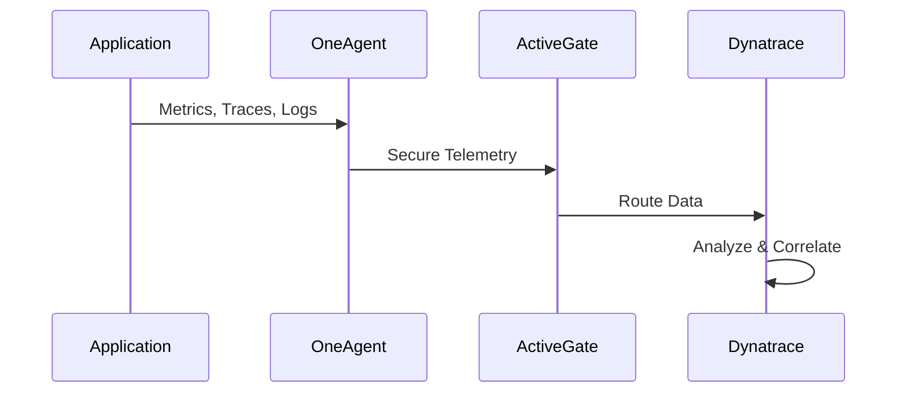
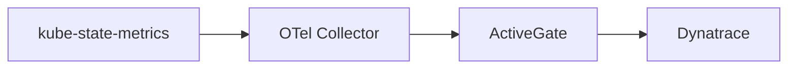
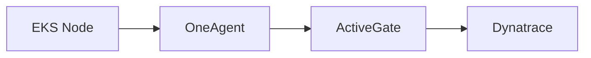

# Enterprise Multi-Account Observability Platform
## Dynatrace-Centric End-to-End Architecture

---

# Overview

This document describes the enterprise observability platform architecture used across multiple AWS accounts and EKS clusters.

The platform provides:

- Infrastructure Monitoring
- Kubernetes Monitoring
- Application Performance Monitoring (APM)
- Distributed Tracing
- Custom Metrics Collection
- Centralized Alerting
- SLO Monitoring
- Service Dependency Mapping
- AI-Assisted Root Cause Analysis

The observability platform is built around:

- Dynatrace Operator
- Dynatrace OneAgent
- Dynatrace ActiveGate
- OpenTelemetry Collector
- kube-state-metrics
- Prometheus Node Exporter
- Amazon EKS
- Dynatrace SaaS Platform

Dynatrace serves as the primary visualization and analytics platform.

---

# High-Level Architecture



---

# Observability Layers

## Layer 1 – Infrastructure Monitoring

### Sources

- EC2 Instances
- EKS Worker Nodes
- Network Interfaces
- Storage Volumes
- Operating Systems

### Collector

Dynatrace OneAgent

### Metrics

- CPU
- Memory
- Disk
- Filesystem
- Network
- Processes
- Containers

---

## Layer 2 – Kubernetes Monitoring

### Sources

- Kubernetes API Server
- Nodes
- Namespaces
- Deployments
- StatefulSets
- Pods
- Services

### Collectors

- Dynatrace Kubernetes Monitoring
- kube-state-metrics

### Metrics

- Pod Status
- Deployment Availability
- Restart Counts
- Node Conditions
- Namespace Inventory

---

## Layer 3 – Application Monitoring

### Sources

- Java Applications
- Spring Boot
- NodeJS
- Python
- .NET
- Go Services

### Collector

Dynatrace OneAgent

### Data Collected

- Requests
- Transactions
- Traces
- Errors
- Response Times
- Service Dependencies

---

## Layer 4 – Custom Metrics

### Sources

- Business KPIs
- Application Metrics
- Internal Exporters

### Collector

OpenTelemetry Collector

### Examples

- Orders Processed
- Checkout Success Rate
- Customer Registrations
- Inventory Updates

---

# Dynatrace Kubernetes Architecture



---

# Application Monitoring Flow



---

# Kubernetes Metrics Flow



---

# Infrastructure Monitoring Flow



---

# Multi-Account Monitoring Strategy

Each AWS account contains:

- Dynatrace Operator
- OneAgent
- ActiveGate
- OTel Collector
- kube-state-metrics

All telemetry is centralized into:

Dynatrace SaaS Tenant

Benefits:

- Single Pane of Glass
- Cross-Account Visibility
- Environment Comparison
- Centralized Alerting
- Enterprise SLOs
- Cost Optimization Visibility

---

# Recommended Namespace Layout

```text
dynatrace
observability
monitoring
```

Example:

dynatrace

- operator
- activegate
- oneagent

observability

- otel-collector

monitoring

- kube-state-metrics
- node-exporter

---

# Enterprise Observability Principles

1. OpenTelemetry as telemetry standard
2. Dynatrace as observability platform
3. ActiveGate for secure routing
4. Automated instrumentation
5. Namespace-based onboarding
6. Multi-account centralized visibility
7. Minimal operational overhead

---

# Final Architecture Vision

Applications
→ OpenTelemetry
→ OneAgent
→ ActiveGate
→ Dynatrace SaaS

Dynatrace becomes the single platform for:

- Metrics
- Traces
- Logs
- Dashboards
- SLOs
- Alerting
- AI Root Cause Analysis
- Kubernetes Visibility
- Infrastructure Monitoring
