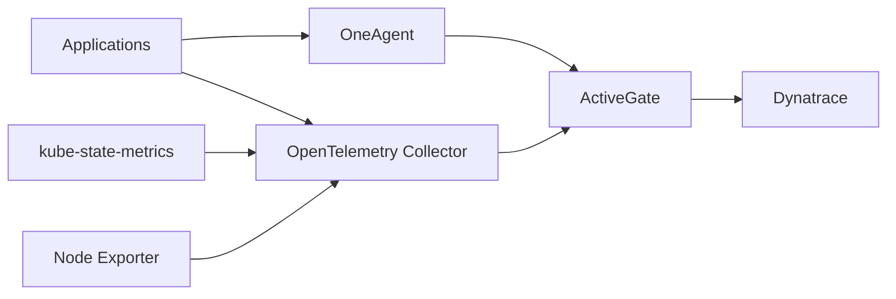
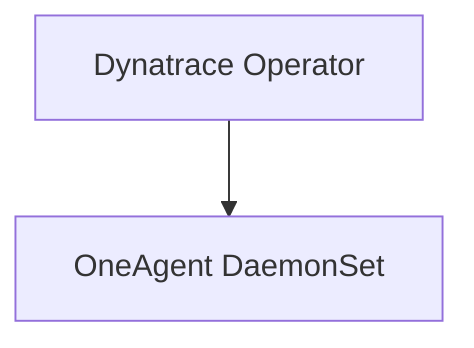
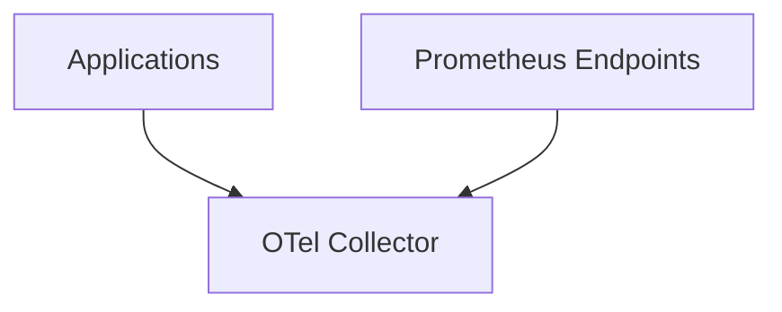
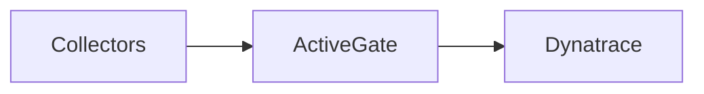
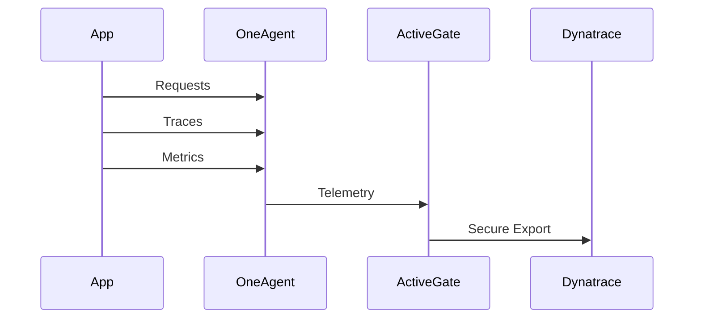
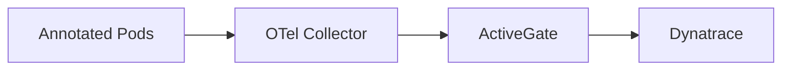
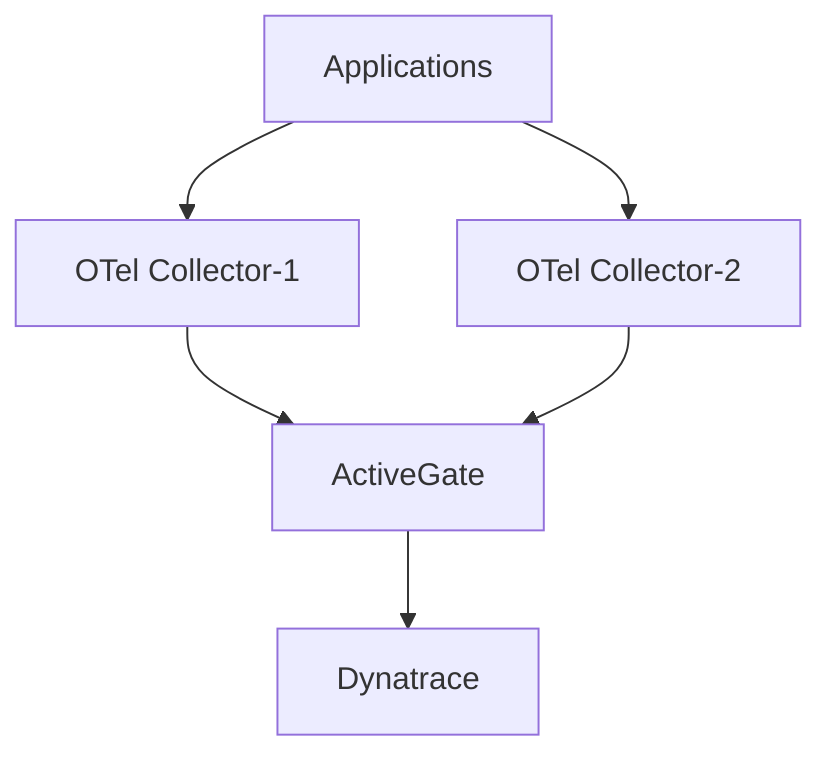

# Observability Collectors & Exporters
## Detailed Design and Implementation

---

# Purpose

This document explains:

- Collectors
- Exporters
- Telemetry Flow
- Deployment Design
- Configuration Examples

for the enterprise observability platform.

---

# Telemetry Pipeline Architecture



---

# Collector Components

## 1. Dynatrace OneAgent

### Purpose

Automatic full-stack observability.

### Collects

- Infrastructure Metrics
- Application Metrics
- Distributed Traces
- Logs
- Container Metadata
- Process Metadata

### Deployment



---

### Namespace Onboarding

```yaml
apiVersion: v1
kind: Namespace
metadata:
  name: production
  labels:
    dynatrace-monitor: "true"
```

---

# 2. OpenTelemetry Collector

## Purpose

Central telemetry collection layer.

Responsibilities:

- Discovery
- Scraping
- Enrichment
- Processing
- Exporting

---

## Deployment Model



---

# OTel Receivers

## OTLP Receiver

```yaml
receivers:

  otlp:
    protocols:
      grpc:
      http:
```

---

## Prometheus Receiver

```yaml
receivers:

  prometheus:
    config:
      scrape_configs:

      - job_name: kubernetes-pods

        kubernetes_sd_configs:
        - role: pod

        relabel_configs:

        - source_labels:
          - __meta_kubernetes_pod_annotation_prometheus_io_scrape

          action: keep
          regex: true
```

---

# OTel Processors

## Memory Limiter

```yaml
processors:
  memory_limiter:
    limit_mib: 512
```

---

## Batch Processor

```yaml
processors:
  batch:
```

---

## Kubernetes Attributes

```yaml
processors:

  k8sattributes:
    auth_type: serviceAccount
```

Adds:

- Namespace
- Pod
- Node
- Deployment
- Cluster Metadata

---

## Resource Processor

```yaml
processors:

  resource:
    attributes:
      - key: cluster.name
        value: global-prod
        action: insert
```

---

# Exporters

## Dynatrace OTLP Exporter

```yaml
exporters:

  otlphttp/dynatrace:

    endpoint: https://activegate.company.com/e/<tenant>/api/v2/otlp

    headers:
      Authorization: Api-Token ${DT_API_TOKEN}
```

---

# Full OTel Pipeline

```yaml
service:

  pipelines:

    metrics:

      receivers:
        - prometheus
        - otlp

      processors:
        - memory_limiter
        - k8sattributes
        - batch

      exporters:
        - otlphttp/dynatrace

    traces:

      receivers:
        - otlp

      processors:
        - batch

      exporters:
        - otlphttp/dynatrace
```

---

# kube-state-metrics

## Purpose

Expose Kubernetes object state.

Not resource consumption.

---

## Examples

```text
kube_pod_status_phase

kube_deployment_status_replicas_available

kube_node_status_condition
```

---

## Dynatrace Integration

```yaml
metadata:
  annotations:
    metrics.dynatrace.com/scrape: "true"
    metrics.dynatrace.com/port: "8080"
```

---

# Node Exporter

## Purpose

Operating system metrics.

---

## Examples

```text
node_cpu_seconds_total

node_memory_MemAvailable_bytes

node_filesystem_avail_bytes
```

---

## Use Cases

- Existing Prometheus compatibility
- Migration workloads
- Supplemental metrics

---

# ActiveGate Design

## Purpose

Secure routing layer.

---

## Responsibilities

- Traffic Routing
- Buffering
- Compression
- Kubernetes API Monitoring
- Secure SaaS Connectivity

---

## Data Flow



---

# Application Monitoring Flow



---

# Prometheus Metrics Flow



---

# Recommended Resource Sizing

## OTel Collector

Small Cluster

```text
CPU: 500m
Memory: 1Gi
Replicas: 2
```

Medium Cluster

```text
CPU: 1
Memory: 2Gi
Replicas: 2
```

Large Cluster

```text
CPU: 2
Memory: 4Gi
Replicas: 3
```

---

# High Availability Design



---

# Best Practices

## Dynatrace

- Use Cloud Native Full Stack
- Enable CSI Driver
- Use Namespace Labeling
- Monitor Operator Health

## OpenTelemetry

- Use batch processor
- Use memory limiter
- Enrich telemetry with k8s metadata
- Standardize resource attributes

## Kubernetes

- Deploy kube-state-metrics
- Use node exporter only if required
- Keep telemetry collection centralized

---

# Final Data Flow

Applications
→ OneAgent / OTel Collector
→ ActiveGate
→ Dynatrace SaaS

Kubernetes
→ kube-state-metrics
→ OTel Collector
→ ActiveGate
→ Dynatrace SaaS

Infrastructure
→ OneAgent
→ ActiveGate
→ Dynatrace SaaS

This architecture provides complete observability for infrastructure, Kubernetes, applications, and business telemetry while maintaining a vendor-neutral collection layer through OpenTelemetry.