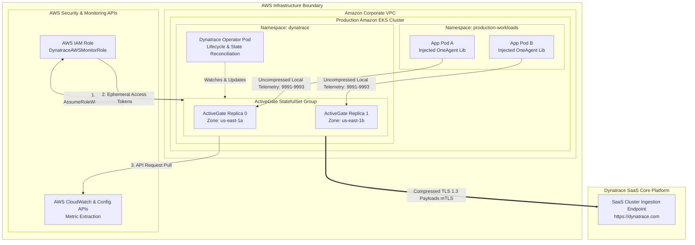
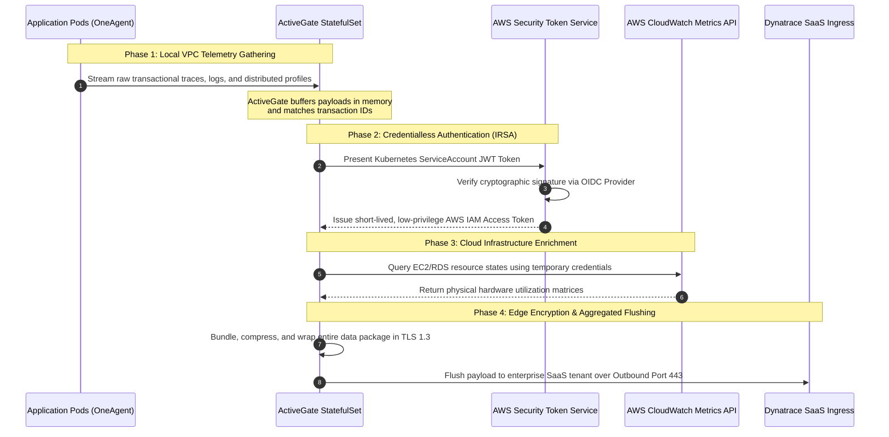

# Comprehensive Engineering Study Guide: Dynatrace Enterprise Architecture

This document serves as an advanced technical study guide for Senior DevOps, SRE, and Cloud Architecture interviews. It covers the core mechanics, deep internals, failure scenarios, and production-tested mitigation strategies for deploying Dynatrace monitoring in enterprise-scale environments (AWS/EKS/SaaS).

---

## 1. Deep Core Architecture

This structural topology diagram details exactly how telemetry traffic routes out of an enterprise cloud infrastructure into Dynatrace SaaS, highlighting the security boundaries, data aggregation layers, and zero-trust credential handshake patterns.



---

## 2. Technical Component Breakdown

### A. Dynatrace OneAgent (The Collector)
*   **Operating Mechanics:** Operates as a containerized `DaemonSet` on each EKS worker node. It functions via a combination of user-space hooks, kernel module interventions (eBPF and runtime hooks), and automated byte-code injection.
*   **Injection Lifecycle:** When an application container drops into the EKS scheduler, the injected hooks dynamically locate web/app frameworks (Java, .NET, Node.js, Go) and overlay instrumentation code directly into memory without modifying the underlying artifact container image.
*   **Network Footprint:** Constantly streams system, network, trace, and process telemetry to the designated local cluster ActiveGate over ports `9991` (OneAgent HTTP traffic) or `9993` (secured internal routing channel).

### B. Dynatrace ActiveGate (The Aggregator & Gateway)
*   **Primary Roles:** Acts as a secure local proxy, network traffic condenser, architecture firewall, and external metric polling point.
*   **The Containerized Pattern (EKS Deployment):** Provisions via the cloud-native `Dynatrace Operator`. It sits directly inside the Kubernetes network namespace as a `StatefulSet`. It decouples individual application pods from needing raw, unthrottled internet paths out of the system.
*   **The Enterprise Advantage:** By consolidating connection states, an organization only needs to open **one single outbound path** to the Dynatrace SaaS internet endpoint from a dedicated, secure proxy location.

---

## 3. High-Throughput Handshake & Protocol Flow

This structural sequence details the precise execution path of operational workloads, network consolidation, and cross-account IAM authorization handshakes.



---

## 4. Production Architectural Failure Modes & Mitigations

An expert candidate must be ready to discuss what happens when infrastructure encounters unexpected strain. The table below covers common failure modes and production mitigation strategies:

| Failure Scenario | Immediate Operational Impact | Deep System Root Cause | Architected Mitigation Strategy |
| :--- | :--- | :--- | :--- |
| **ActiveGate Memory Exhaustion (OOMKilled)** | Local collection drops; application pods enter buffer states; potential gaps in traces. | Spikes in log volumes, network tracing payload anomalies, or deep transaction loops over-allocating heap space. | **1.** Apply explicit Kubernetes resource constraints (`limits` and `requests`).<br>**2.** Configure `topologySpreadConstraints` to split ActiveGate instances evenly across distinct physical hardware zones.<br>**3.** Implement Horizontal Pod Autoscaling (HPA) using custom Prometheus metrics tracking network traffic volume. |
| **AWS API Throttling Errors (`RateExceeded`)** | Stale or missing infrastructure monitoring panels (EC2 instances, ELB health pools, RDS IOPS). | Polling too many cloud metadata endpoints simultaneously, exceeding standard cloud vendor rate boundaries. | **1.** Adjust configuration values to shift polling cycles from the standard 5-minute intervals to 10 or 15 minutes.<br>**2.** Implement strict tagging filters within the configuration manifests to scan only business-critical target resources.<br>**3.** Switch from polling-based extraction to streaming cloud metrics via Amazon Data Firehose straight to the data ingest endpoint. |
| **Cluster Edge Network Partitioning** | Inability to transmit tracing details or logs outward; localized node reporting failures. | Upstream corporate firewall dropouts, public DNS query faults, or unexpected cloud routing failures. | **1.** Allocate persistent volume storage allocations to the ActiveGate container stack to safely store metrics on local disk storage pools for up to 24 hours during outages.<br>**2.** Ensure that cluster deployment configurations incorporate an alternative secondary transit egress proxy path. |

---

## 5. Enterprise Configuration Blueprints

### AWS IAM Least-Privilege Trust Blueprint
Save this manifest as `trust-policy.json`. This configures your corporate AWS Account to trust the identity tokens coming out of your Amazon EKS cluster, eliminating the need to rotate static API user keys.

```json
{
  "Version": "2012-10-17",
  "Statement": [
    {
      "Effect": "Allow",
      "Principal": {
        "Federated": "arn:aws:iam::112233445566:oidc-provider/://amazonaws.com"
      },
      "Action": "sts:AssumeRoleWithWebIdentity",
      "Condition": {
        "StringEquals": {
          "://amazonaws.com:sub": "system:serviceaccount:dynatrace:dynatrace-kubernetes-monitoring"
        }
      }
    }
  ]
}
```

### Production Multi-Replica `DynaKube` Architecture Blueprint
Save this configuration as `dynakube-prod.yaml`. This definitive resource configuration handles automated agent deployment, injects AWS IAM identification annotations, sets strict memory guardrails, and enforces cross-zone anti-affinity.

```yaml
apiVersion: ://dynatrace.com
kind: DynaKube
metadata:
  name: enterprise-production-monitoring
  namespace: dynatrace
spec:
  # Base API URL point matching your dedicated enterprise SaaS platform tenant
  apiUrl: https://dynatrace.com

  # Automated OneAgent Injection Matrix across Kubernetes Node Workers
  oneAgent:
    cloudNativeFullStack:
      nodeSelector:
        environment: production
  
  # Enterprise Hardened ActiveGate Infrastructure Definition
  activeGate:
    capabilities:
      - routing
      - kubernetes-monitoring
      - metrics-ingest
    
    # Scale instances across separate physical zones for high availability
    replicas: 2
    
    # Cryptographic link binding the container runtime to the AWS security plane via IRSA
    annotations:
      ://amazonaws.com: "arn:aws:iam::112233445566:role/DynatraceAWSMonitorRole"
    
    # Strict resource boundary guarantees to protect surrounding apps
    resources:
      requests:
        cpu: "1"
