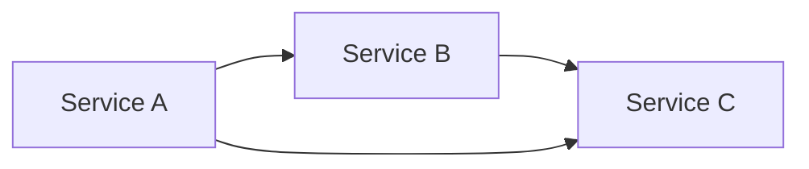
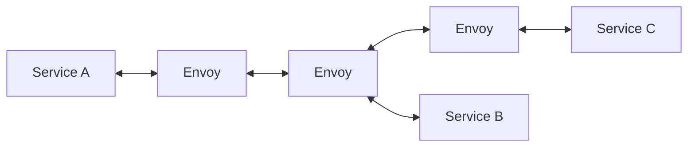
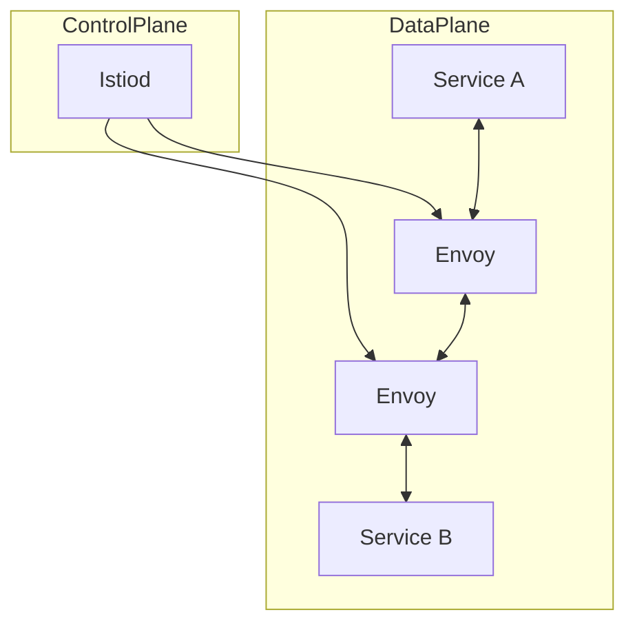
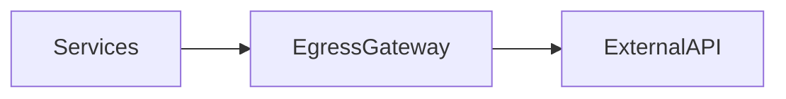
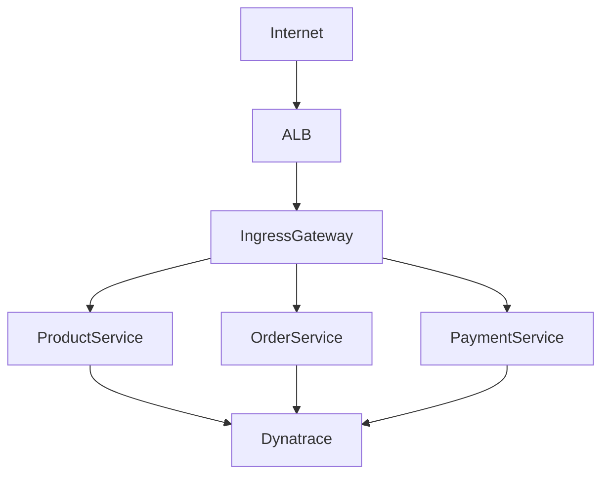
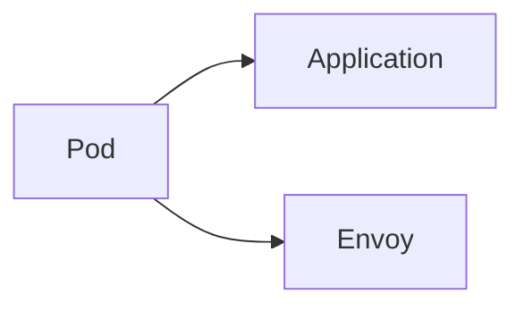
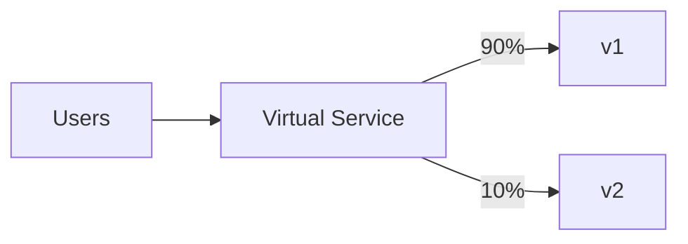
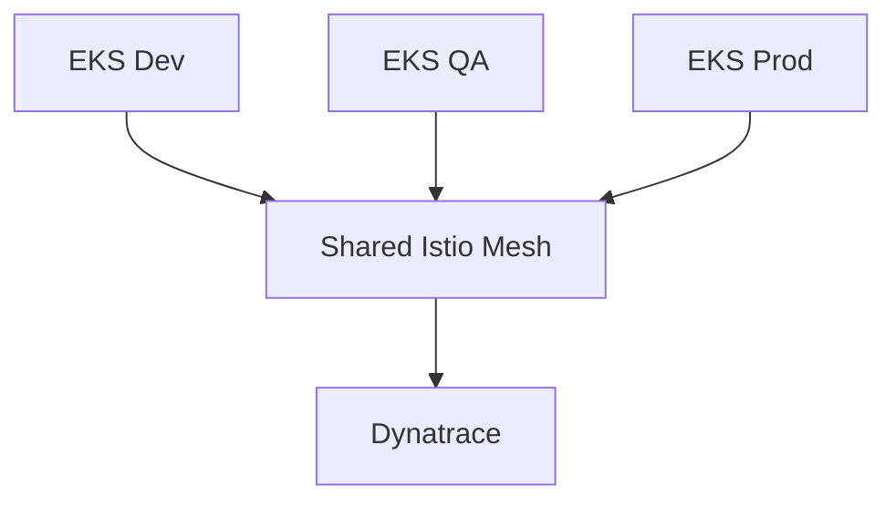
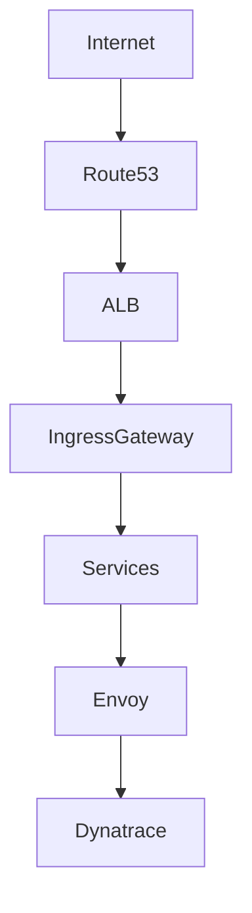

# Istio Service Mesh on AWS EKS
## Complete Technical Guide for Platform Engineering & Leadership Interviews

---

# Table of Contents

1. What is a Service Mesh?
2. Why Kubernetes Alone is Not Enough
3. What is Istio?
4. Istio Architecture
5. Istio Components
6. Istio on AWS EKS
7. Sidecar Injection Deep Dive
8. Traffic Management
9. Security (mTLS)
10. Observability with Dynatrace
11. Canary Deployments
12. Circuit Breakers & Resilience
13. Egress Traffic Control
14. Multi-Cluster EKS Architecture
15. Production Deployment Model
16. Interview Questions & Answers
17. Real World Use Cases
18. Best Practices

---

# 1. What is a Service Mesh?

A Service Mesh is a dedicated infrastructure layer responsible for handling service-to-service communication inside a distributed microservices platform.

Traditionally, every application team implements:

- Retries
- Timeouts
- TLS
- Load Balancing
- Metrics
- Tracing
- Circuit Breaking

inside application code.

As the number of services grows, this becomes difficult to maintain.

A Service Mesh moves these networking responsibilities out of the application and into the platform layer.

---

## Without Service Mesh



Each application implements:

- Security
- Retries
- Metrics
- Tracing
- Load Balancing

independently.

---

## With Service Mesh



All communication flows through proxies.

The proxies handle:

- Routing
- Security
- Telemetry
- Resilience

without changing application code. :contentReference[oaicite:0]{index=0}

---

# 2. Why Kubernetes Alone Is Not Enough

Kubernetes solves:

- Scheduling
- Scaling
- Service Discovery
- Self-Healing

But Kubernetes does NOT natively provide:

| Capability | Kubernetes |
|------------|------------|
| Canary Releases | Limited |
| Traffic Splitting | No |
| Distributed Tracing | No |
| Service-Level Encryption | No |
| Retry Policies | No |
| Circuit Breakers | No |
| Service Dependency Mapping | No |
| mTLS Everywhere | No |

This is where Istio extends Kubernetes. :contentReference[oaicite:1]{index=1}

---

# 3. What is Istio?

Istio is the most widely adopted CNCF Service Mesh.

It provides:

- Traffic Management
- Security
- Observability
- Service Governance

without modifying application code. :contentReference[oaicite:2]{index=2}

---

# 4. Istio Architecture

Istio consists of two major planes:

## Control Plane

Responsible for:

- Configuration
- Policy
- Certificate Distribution
- Service Discovery

## Data Plane

Responsible for:

- Actual Traffic Flow

Implemented using Envoy sidecars.

---



---

# 5. Core Components

## Istiod

The brain of Istio.

Responsibilities:

- Service Discovery
- Configuration Distribution
- Certificate Management
- Sidecar Configuration

---

## Envoy Proxy

Runs beside every application pod.

Handles:

- Traffic Routing
- TLS
- Metrics
- Tracing
- Retries
- Circuit Breaking

---

## Ingress Gateway

Controls inbound traffic.


---

## Egress Gateway

Controls outbound traffic.



---

# 6. Istio on AWS EKS

A typical production deployment:



---

## AWS Components

- Amazon EKS
- AWS Load Balancer Controller
- ALB
- Route53
- ACM Certificates
- Istio
- Dynatrace

---

# 7. Sidecar Injection Deep Dive

One of the most important interview topics.

---

## Before Injection


---

## After Injection



---

Enable automatic injection:

```bash
kubectl label namespace production istio-injection=enabled
```

Whenever a pod starts:

1. Admission Controller intercepts request
2. Envoy container injected
3. Traffic redirected through Envoy

:contentReference[oaicite:3]{index=3}

---

# 8. Traffic Management

Istio enables advanced routing.

---

## Canary Deployment

Example:

- v1 receives 90%
- v2 receives 10%



---

Virtual Service

```yaml
apiVersion: networking.istio.io/v1beta1
kind: VirtualService
metadata:
  name: product
spec:
  hosts:
  - product

  http:
  - route:
    - destination:
        host: product
        subset: v1
      weight: 90

    - destination:
        host: product
        subset: v2
      weight: 10
```

---

# 9. Security with mTLS

One of the biggest reasons enterprises adopt Istio.

---

Without mTLS

```text
Service A --> Service B
Plain Traffic
```

---

With mTLS

```text
Service A --> Encrypted Traffic --> Service B
```

---

Benefits:

- Encryption
- Authentication
- Identity Verification
- Zero Trust Networking

:contentReference[oaicite:4]{index=4}

---

# 10. Observability with Dynatrace

This is where Istio becomes extremely valuable.

Every request passes through Envoy.

Envoy generates:

- Metrics
- Traces
- Logs
- Traffic Metadata

---


---

Dynatrace provides:

- Service Flow
- Dependency Mapping
- Latency Analysis
- Error Analysis
- Root Cause Detection
- Distributed Tracing

---

# 11. Circuit Breakers

Prevents cascading failures.

Without Circuit Breaker:

```text
Service B Slow
↓
Service A Waits
↓
Threads Exhausted
↓
Outage
```

---

With Circuit Breaker:

```text
Service B Slow
↓
Fail Fast
↓
Fallback Response
```

---

Destination Rule

```yaml
trafficPolicy:
  connectionPool:
    tcp:
      maxConnections: 100

  outlierDetection:
    consecutive5xxErrors: 5
```

---

# 12. Retry Policies

Instead of application developers implementing retries:

Istio handles retries.

```yaml
retries:
  attempts: 3
  perTryTimeout: 2s
```

---

# 13. Egress Traffic Control

Control access to external systems.

Example:

```text
Microservices
      ↓
Egress Gateway
      ↓
Stripe API
      ↓
Salesforce
      ↓
External Vendors
```

Benefits:

- Centralized Security
- Auditing
- Monitoring

---

# 14. Multi-Cluster EKS Architecture

Enterprise deployment pattern.



Benefits:

- Cross-cluster visibility
- Shared governance
- Global traffic policies

---

# 15. Production Architecture

Recommended setup for enterprise workloads.



---

# 16. Real World Use Cases

## Blue-Green Deployments

Shift traffic between versions.

---

## Canary Releases

Release to 5%.

Validate.

Increase gradually.

---

## A/B Testing

Route users based on headers.

Example:

```yaml
headers:
  user-type:
    exact: premium
```

---

## Multi-Region Failover

Route traffic to another EKS cluster automatically.

---

# 17. Interview Questions & Answers

## What problem does Istio solve?

Istio solves service-to-service communication challenges in microservice architectures by providing traffic management, security, observability, and resilience capabilities without requiring changes to application code.

---

## Why use Istio if Kubernetes already has Services?

Kubernetes Services provide service discovery and load balancing.

Istio adds:

- Canary Deployments
- Traffic Splitting
- mTLS
- Distributed Tracing
- Circuit Breakers
- Retry Policies
- Service Visibility

---

## What is a Sidecar Proxy?

An Envoy container running alongside an application container.

All inbound and outbound traffic flows through Envoy.

---

## Difference Between Control Plane and Data Plane?

Control Plane:

- Istiod
- Configuration
- Certificates

Data Plane:

- Envoy Sidecars
- Actual Traffic

---

## How does Istio help with Observability?

Envoy captures:

- Request Metrics
- Latency
- Error Rates
- Distributed Traces

and exports them to monitoring platforms such as Dynatrace.

---

# 18. Best Practices

### Platform Engineering

- Install Istio via Helm
- Use dedicated ingress gateways
- Enable mTLS by default
- Standardize sidecar injection
- Integrate with Dynatrace

### Security

- Use STRICT mTLS
- Use Authorization Policies
- Restrict Egress Traffic

### Observability

- Export traces to Dynatrace
- Monitor Envoy metrics
- Create SLO dashboards

### Operations

- Use Canary Deployments
- Enable Circuit Breakers
- Enable Retry Policies
- Use Progressive Delivery

---

# Key Takeaway

For modern AWS EKS microservices platforms:

Kubernetes provides orchestration.

Istio provides networking.

Dynatrace provides observability.

Together they create a secure, observable, resilient, and scalable cloud-native platform suitable for enterprise-scale workloads.