# Istio Ingress, Egress & TLS on AWS EKS
## Complete Interview Preparation Guide for Platform Engineers, SREs, Staff Engineers & Engineering Managers

---

# Table of Contents

1. What Problem Does Istio Solve?
2. Traditional Kubernetes Networking
3. Service Mesh Architecture
4. Istio Core Components
5. AWS EKS + Istio Architecture
6. Ingress Traffic Management
7. Gateway Resource
8. Virtual Services
9. Destination Rules
10. TLS & mTLS
11. Egress Traffic Management
12. ServiceEntry
13. Complete Enterprise Architecture
14. Traffic Flow Walkthrough
15. Observability with Dynatrace
16. Canary Deployments
17. Circuit Breakers & Retries
18. Production Best Practices
19. Troubleshooting
20. Interview Questions & Answers
21. Executive Summary

---

# What Problem Does Istio Solve?

Kubernetes provides:

- Service Discovery
- Load Balancing
- Scheduling
- Auto Scaling
- Self Healing

However, Kubernetes does not provide:

- Traffic Splitting
- Canary Releases
- mTLS
- Service-to-Service Encryption
- Distributed Tracing
- Circuit Breaking
- Retry Policies
- Service Dependency Mapping
- Advanced Traffic Routing

These capabilities are provided by a Service Mesh.

---

# Traditional Kubernetes Networking

Without Istio:

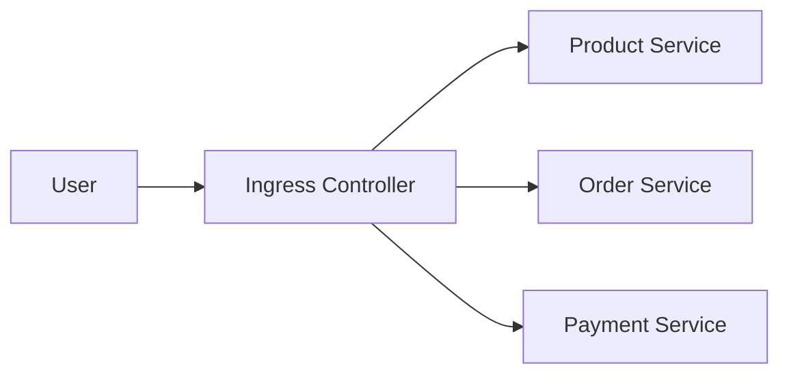

Problems:

- Limited visibility
- No traffic policies
- No service mesh
- No built-in security
- No canary deployments

---

# Service Mesh Architecture

With Istio:

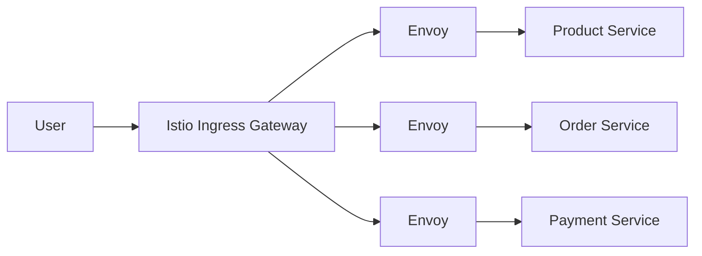

Every request passes through Envoy proxies.

Benefits:

- Security
- Routing
- Observability
- Traffic Management
- Resilience

---

# Istio Core Components

## Control Plane

Responsible for:

- Service Discovery
- Configuration
- Certificate Distribution
- Policy Management

Component:

```text
Istiod
```

---

## Data Plane

Responsible for:

- Request Routing
- TLS
- Telemetry
- Traffic Policies

Component:

```text
Envoy Proxy
```

---

# Istio Architecture

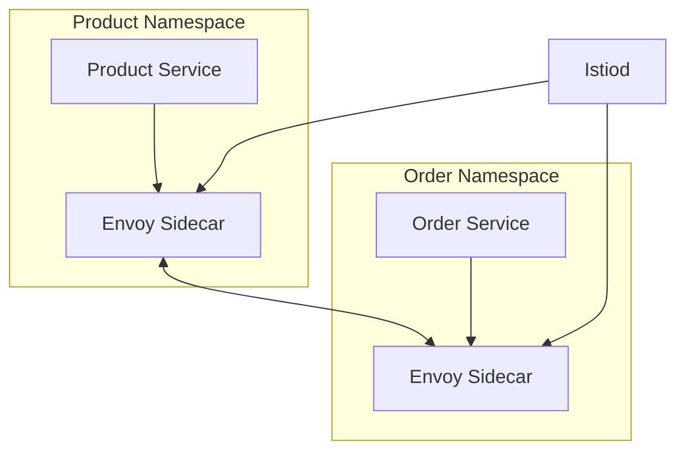

---

# AWS EKS + Istio Architecture

Typical Production Deployment:

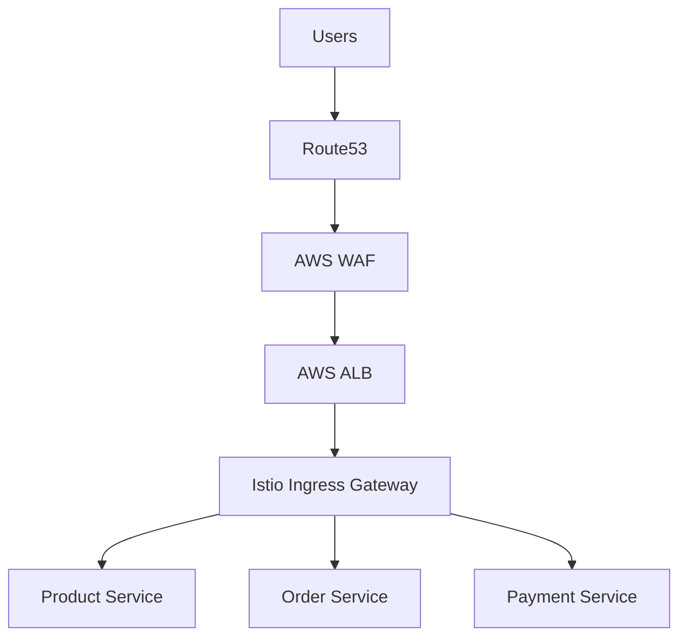

---

# Ingress Traffic Management

Ingress controls:

```text
External Traffic
       ↓
Kubernetes Cluster
```

Responsibilities:

- TLS Termination
- URL Routing
- Header Routing
- Traffic Splitting
- Security Policies

---

# Gateway Resource

Gateway defines how traffic enters the mesh.

Example:

```yaml
apiVersion: networking.istio.io/v1beta1

kind: Gateway

metadata:
  name: public-gateway

spec:
  selector:
    istio: ingressgateway

  servers:
  - port:
      number: 443
      name: https
      protocol: HTTPS

    tls:
      mode: SIMPLE
      credentialName: company-cert

    hosts:
    - api.company.com
```

---

# Ingress Request Flow

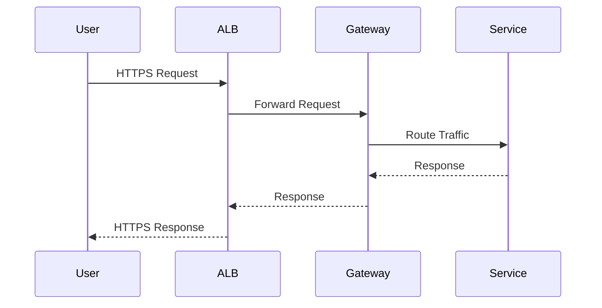

---

# Virtual Services

Virtual Service defines routing logic.

Example:

```yaml
apiVersion: networking.istio.io/v1beta1

kind: VirtualService

metadata:
  name: product-routing

spec:

  hosts:
  - api.company.com

  gateways:
  - public-gateway

  http:

  - match:
    - uri:
        prefix: /products

    route:

    - destination:
        host: product-service
```

---

# Request Routing Example

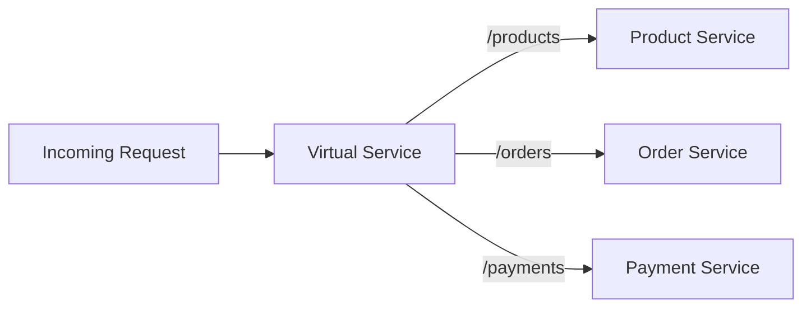

---

# Destination Rules

Destination Rules define how traffic behaves after routing.

Examples:

- Load Balancing
- Circuit Breaking
- Connection Pools
- Service Versions

```yaml
apiVersion: networking.istio.io/v1beta1

kind: DestinationRule

metadata:
  name: product

spec:

  host: product-service

  subsets:

  - name: v1
    labels:
      version: v1

  - name: v2
    labels:
      version: v2
```

---

# TLS & mTLS

One of the most important interview topics.

---

## TLS

Protects traffic between client and gateway.

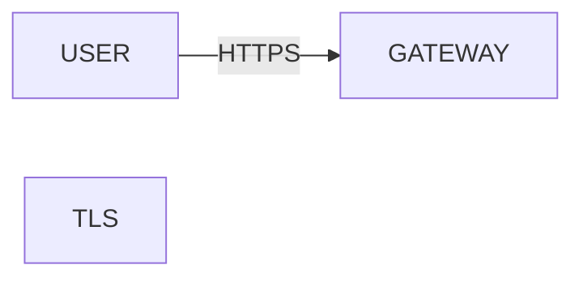

Benefits:

- Encryption
- Authentication
- Integrity

---

## mTLS

Protects traffic between services.

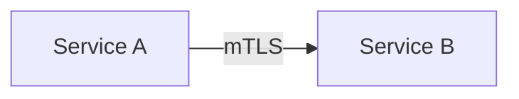

Benefits:

- Service Authentication
- Encryption
- Zero Trust Security

---

# TLS Termination Models

## Model 1 - TLS at ALB

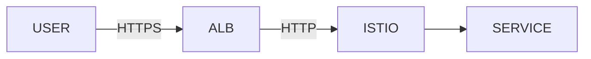

Simple but not ideal.

---

## Model 2 - TLS Passthrough

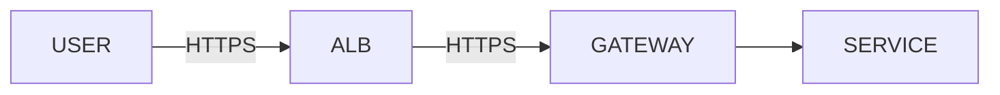

Recommended.

---

## Model 3 - End-to-End Encryption

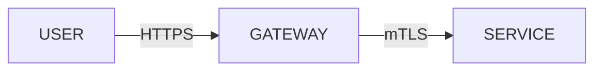

Enterprise Best Practice.

---

# Egress Traffic Management

Egress controls:

```text
Cluster
    ↓
External Systems
```

Examples:

- Salesforce
- SAP
- Stripe
- ServiceNow
- AWS APIs
- External Vendors

---

# Without Egress Gateway

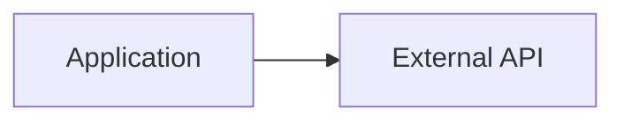

Problems:

- No Governance
- No Auditing
- No Visibility
- Security Risks

---

# With Egress Gateway

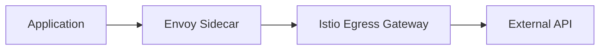

Benefits:

- Centralized Security
- Observability
- Governance
- Compliance

---

# ServiceEntry

Allows Istio to recognize external services.

Example:

```yaml
apiVersion: networking.istio.io/v1beta1

kind: ServiceEntry

metadata:
  name: salesforce

spec:

  hosts:
  - login.salesforce.com

  ports:
  - number: 443
    name: https
    protocol: HTTPS

  location: MESH_EXTERNAL

  resolution: DNS
```

---

# Egress Request Flow

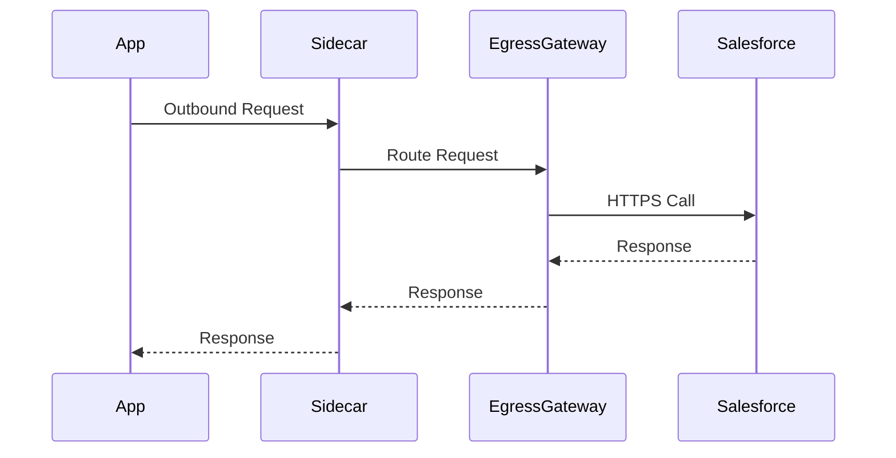

---

# Complete Enterprise Architecture

This is the architecture you should remember for interviews.

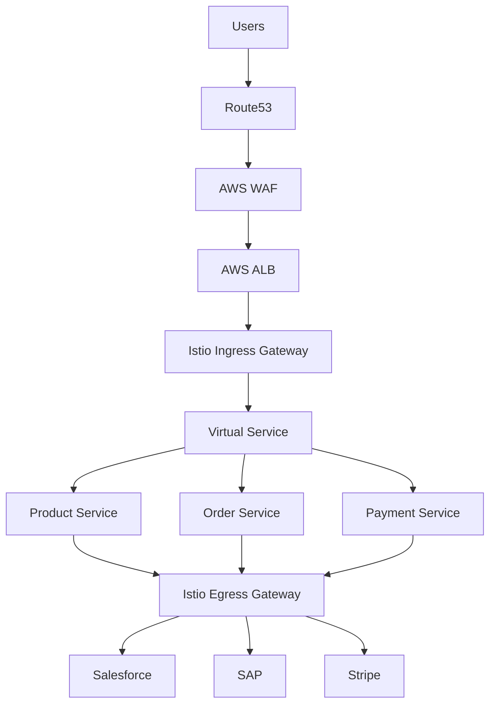

---

# Complete Traffic Flow

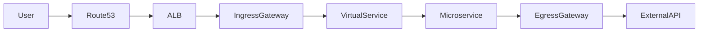

---

# Observability with Dynatrace

Dynatrace provides complete visibility.

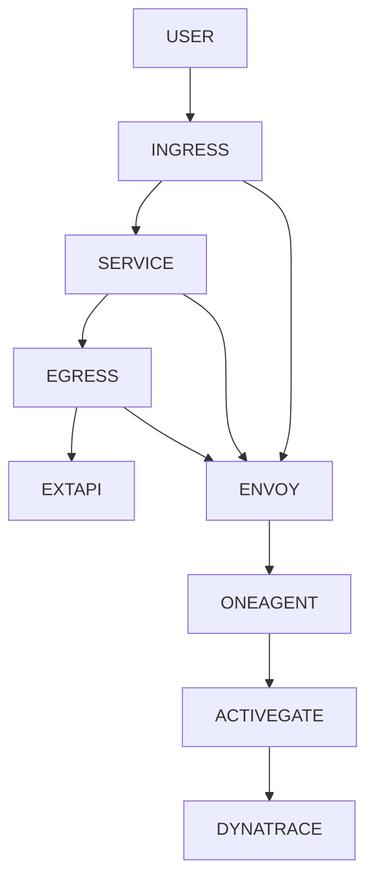

---

# What Dynatrace Shows

Infrastructure:

- Nodes
- Containers
- CPU
- Memory

Kubernetes:

- Namespaces
- Deployments
- Pods

Applications:

- Transactions
- Errors
- Response Times

Service Mesh:

- Ingress Traffic
- Egress Traffic
- Service Dependencies
- Distributed Traces

---

# Canary Deployments

Traffic can be split between versions.

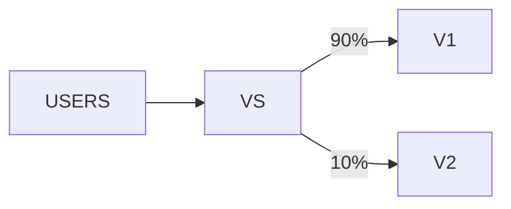

Virtual Service:

```yaml
http:

- route:

  - destination:
      host: product-service
      subset: v1
    weight: 90

  - destination:
      host: product-service
      subset: v2
    weight: 10
```

---

# Circuit Breakers

Prevent cascading failures.

```yaml
trafficPolicy:

  connectionPool:
    tcp:
      maxConnections: 100

  outlierDetection:
    consecutive5xxErrors: 5
```

---

# Retry Policies

```yaml
retries:
  attempts: 3
  perTryTimeout: 2s
```

---

# Production Best Practices

## Security

- Enable STRICT mTLS
- Use Authorization Policies
- Restrict Egress Access

## Networking

- Use Dedicated Gateways
- Use ServiceEntry for External Services

## Observability

- Integrate Dynatrace
- Monitor Envoy Metrics
- Monitor Gateway Health

## Operations

- Use Canary Deployments
- Use Circuit Breakers
- Use Retry Policies

---

# Troubleshooting

Check Gateways

```bash
kubectl get gateway -A
```

Check Virtual Services

```bash
kubectl get virtualservice -A
```

Check Destination Rules

```bash
kubectl get destinationrule -A
```

Check Proxy Config

```bash
istioctl proxy-config routes <pod>
```

Analyze Configuration

```bash
istioctl analyze
```

---

# Interview Questions & Answers

## What is the difference between Ingress and Egress?

Ingress:

```text
Outside → Cluster
```

Examples:

- Browser Requests
- Mobile Apps
- APIs

Egress:

```text
Cluster → Outside
```

Examples:

- Salesforce
- SAP
- Stripe
- AWS APIs

---

## What is a Virtual Service?

Defines routing rules for incoming traffic.

Examples:

- URL Routing
- Header Routing
- Canary Releases

---

## What is a Destination Rule?

Defines traffic policies after routing.

Examples:

- Load Balancing
- Circuit Breaking
- Service Subsets

---

## What is ServiceEntry?

Registers external services with Istio.

Examples:

- Salesforce
- Stripe
- SAP

---

## Why use Egress Gateway?

Provides:

- Security
- Governance
- Auditing
- Compliance
- Observability

for outbound traffic.

---

## How does Dynatrace monitor Istio?

Dynatrace observes:

- Envoy Sidecars
- Ingress Gateways
- Egress Gateways
- Service Dependencies
- Distributed Traces
- External API Calls

---

# Executive Summary

```text
User
 ↓
Route53
 ↓
AWS WAF
 ↓
AWS ALB
 ↓
Istio Ingress Gateway
 ↓
Virtual Service
 ↓
Microservices
 ↓
Istio Egress Gateway
 ↓
External Systems

Salesforce
SAP
Stripe

Observability Everywhere
        ↓
Dynatrace
```

## Interview Answer (2-Minute Version)

"In our AWS EKS platform, external traffic enters through Route53, AWS WAF, and ALB before reaching the Istio Ingress Gateway. Gateway and Virtual Services handle routing decisions, while Destination Rules manage traffic policies such as load balancing and circuit breaking. Each workload runs with an Envoy sidecar providing service mesh capabilities like mTLS, retries, and observability. Outbound communication is controlled through Istio Egress Gateway and ServiceEntries, allowing secure and auditable access to systems such as Salesforce, SAP, and Stripe. Dynatrace provides end-to-end observability by monitoring ingress traffic, service-to-service communication, egress traffic, and external dependencies through OneAgent and ActiveGate."