# Istio Ingress Gateway & TLS on AWS EKS
## Complete Interview Preparation Guide

---

# Table of Contents

1. Why Istio Gateway?
2. Traditional Kubernetes Ingress vs Istio Gateway
3. AWS EKS Traffic Flow
4. Istio Ingress Gateway Architecture
5. TLS Termination Models
6. Gateway Resource
7. Virtual Service
8. Destination Rules
9. End-to-End Request Flow
10. Production Architecture
11. Security Patterns
12. Interview Questions & Answers
13. Real World Examples
14. Troubleshooting Guide

---

# Why Istio Gateway?

In a microservices architecture, dozens or hundreds of services exist inside Kubernetes.

Examples:

- Product Service
- Order Service
- Inventory Service
- Payment Service
- Customer Service

External traffic must enter the cluster through a controlled entry point.

Istio Gateway provides:

- TLS Termination
- Traffic Routing
- Canary Releases
- Security Policies
- Observability
- Rate Limiting
- Header Based Routing

---

# Traditional Kubernetes Ingress

Without Istio

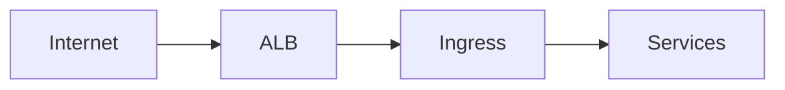

Limitations:

- Basic routing
- Limited traffic control
- No service mesh awareness
- No advanced traffic policies

---

# Istio Gateway Architecture

With Istio

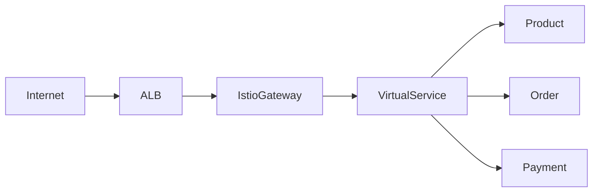

Benefits:

- Layer 7 routing
- Traffic splitting
- Canary deployments
- mTLS integration
- Service mesh visibility

---

# AWS EKS Traffic Flow

Production pattern:

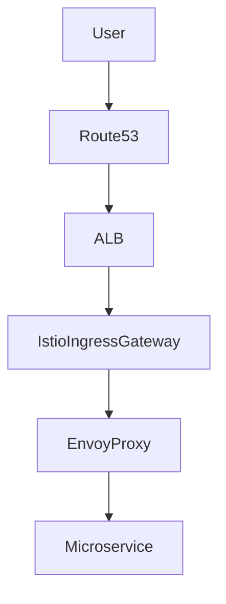

---

# Components Explained

## Route53

Provides DNS.

Example:

```text
api.company.com
```

---

## AWS ALB

Provides:

- Public Entry Point
- SSL Support
- WAF Integration
- Load Balancing

---

## Istio Ingress Gateway

Runs Envoy.

Responsibilities:

- Accept Traffic
- TLS Handling
- Forward Requests
- Enforce Policies

---

## Virtual Service

Controls:

- Routing
- URL Matching
- Header Matching
- Canary Routing

---

## Destination Rule

Controls:

- Load Balancing
- Connection Pools
- Circuit Breaking
- Subsets

---

# Gateway Resource

Gateway defines how traffic enters the mesh.

Example:

```yaml
apiVersion: networking.istio.io/v1beta1

kind: Gateway

metadata:
  name: public-gateway

spec:
  selector:
    istio: ingressgateway

  servers:
  - port:
      number: 443
      name: https
      protocol: HTTPS

    tls:
      mode: SIMPLE
      credentialName: company-cert

    hosts:
    - api.company.com
```

---

# How Gateway Works

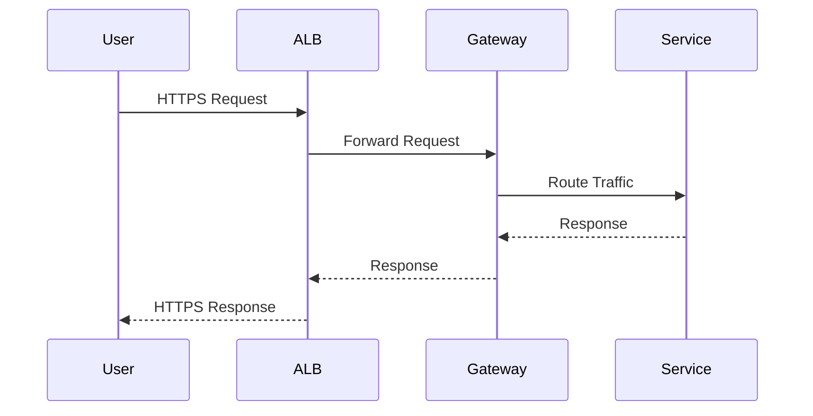

---

# Virtual Service

The most important Istio object.

It defines:

- Which request goes where.

Example:

```yaml
apiVersion: networking.istio.io/v1beta1

kind: VirtualService

metadata:
  name: api-routing

spec:

  hosts:
  - api.company.com

  gateways:
  - public-gateway

  http:

  - match:
    - uri:
        prefix: /products

    route:

    - destination:
        host: product-service
```

---

# Request Routing Example

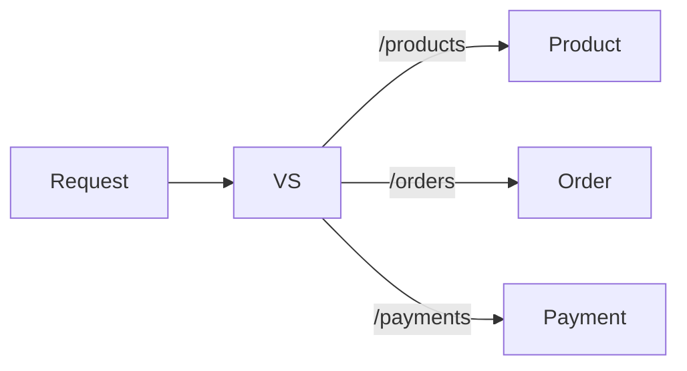

---

# TLS Architecture

This is one of the most common interview questions.

---

# Why TLS?

Without TLS

```text
Client
   |
   | Plain Text
   |
Service
```

Risk:

- Packet Sniffing
- MITM Attacks
- Data Exposure

---

# With TLS

```text
Client
   |
Encrypted
   |
Gateway
```

Benefits:

- Confidentiality
- Integrity
- Authentication

```
HTTPS
HTTP + TLS
```

TLS encryption protects traffic in transit. :contentReference[oaicite:2]{index=2}

---

# TLS Termination Models

## Model 1

Terminate at ALB

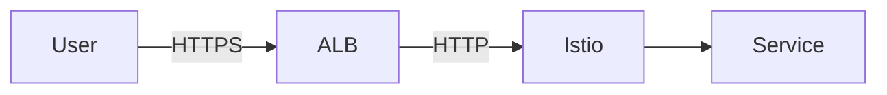

Simple but less secure.

---

## Model 2

TLS Passthrough

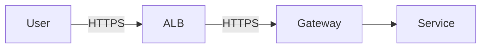

Recommended.

---

## Model 3

End-to-End Encryption

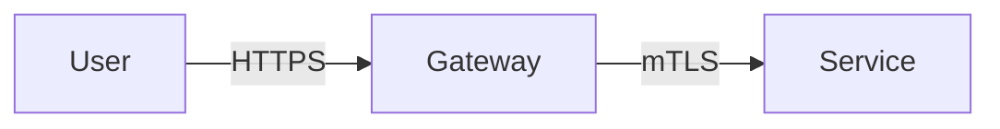

Enterprise best practice.

---

# Canary Deployments

One of Istio's killer features.

---

# Traffic Split

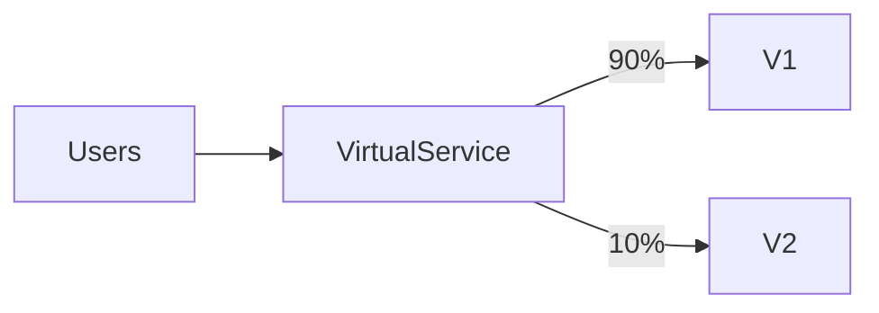

---

Virtual Service

```yaml
http:

- route:

  - destination:
      host: product-service
      subset: v1
    weight: 90

  - destination:
      host: product-service
      subset: v2
    weight: 10
```

---

# Destination Rules

Define service subsets.

```yaml
apiVersion: networking.istio.io/v1beta1

kind: DestinationRule

metadata:
  name: product

spec:

  host: product-service

  subsets:

  - name: v1
    labels:
      version: v1

  - name: v2
    labels:
      version: v2
```

---

# Complete Production Architecture

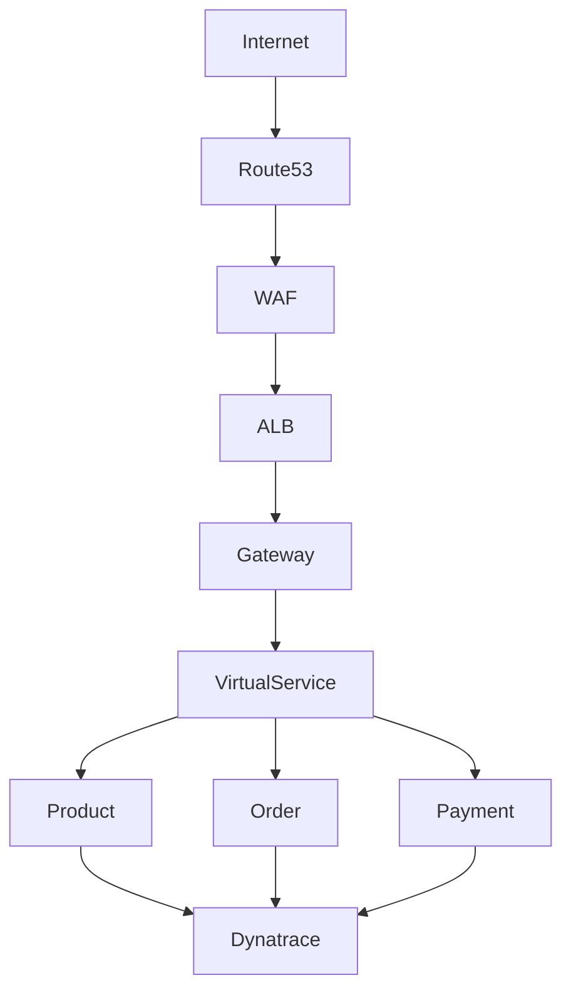

---

# Istio + Dynatrace Observability

Every request passes through Envoy.

Envoy generates:

- Request Count
- Latency
- Error Rate
- Trace Metadata

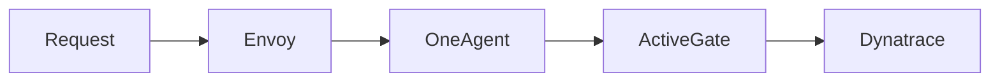

Dynatrace provides:

- Service Flow
- Distributed Tracing
- Error Analytics
- Root Cause Analysis

---

# Interview Questions

## What is the difference between Ingress and Gateway?

Ingress:

- Basic Kubernetes routing

Gateway:

- Advanced Layer 7 routing
- TLS policies
- Service mesh aware
- Traffic management

---

## Why use Virtual Services?

Virtual Services separate routing logic from services.

They enable:

- Canary releases
- Header routing
- URL routing
- Traffic shifting

---

## What is Destination Rule?

Defines how traffic is handled after routing.

Examples:

- Subsets
- Load balancing
- Circuit breaking

---

## Explain TLS Termination.

TLS can terminate at:

- ALB
- Istio Gateway
- Service

Most enterprises prefer:

Gateway termination + mTLS inside mesh.

---

## How does Istio help EKS?

Provides:

- Traffic Management
- Security
- Observability
- Resilience
- Progressive Delivery

without modifying application code.

---

# Troubleshooting

## Check Gateway

```bash
kubectl get gateway -A
```

---

## Check Virtual Services

```bash
kubectl get virtualservice -A
```

---

## Check Destination Rules

```bash
kubectl get destinationrule -A
```

---

## Check Envoy Config

```bash
istioctl proxy-config routes POD_NAME
```

---

## Analyze Configuration

```bash
istioctl analyze
```

---

# Executive Summary

A production AWS EKS ingress architecture typically follows:

Internet
→ Route53
→ AWS WAF
→ ALB
→ Istio Ingress Gateway
→ Virtual Service
→ Microservices

Istio provides:

- TLS
- Routing
- Canary Releases
- Security
- Observability
- Traffic Control

Combined with Dynatrace, it creates a secure, observable, enterprise-grade microservices platform.