# Enterprise Infrastructure as Code Platform
## AWS CDK + TypeScript + Projen + Enterprise Construct Libraries

---

# Table of Contents

1. Executive Overview
2. Why We Built Our Own Platform
3. Enterprise IaC Philosophy
4. High Level Architecture
5. NextGen Platform Components
6. Repository Structure
7. Projen Templates
8. CDK Construct Libraries
9. Application Infrastructure Pattern
10. CI/CD Pipeline Pattern
11. Deployment Workflow
12. Compliance & Guardrails
13. Multi-Account Deployment Strategy
14. Security Architecture
15. Example Service Onboarding
16. End-to-End Provisioning Flow
17. Platform Benefits
18. Interview Questions & Answers
19. Executive Summary

---

# Executive Overview

Our platform standardizes cloud infrastructure provisioning across hundreds of applications using:

- AWS CDK (TypeScript)
- Enterprise CDK Construct Libraries
- Projen Templates
- GitOps Deployment Model
- AWS Organizations
- Amazon EKS
- ArgoCD
- Enterprise Security Guardrails

Instead of allowing every application team to write infrastructure from scratch, the platform engineering team provides reusable, opinionated constructs and templates.

This ensures:

- Standardization
- Security
- Compliance
- Faster Onboarding
- Reduced Operational Risk

---

# Why We Built Our Own Platform

## Traditional Model

Every team builds infrastructure differently.

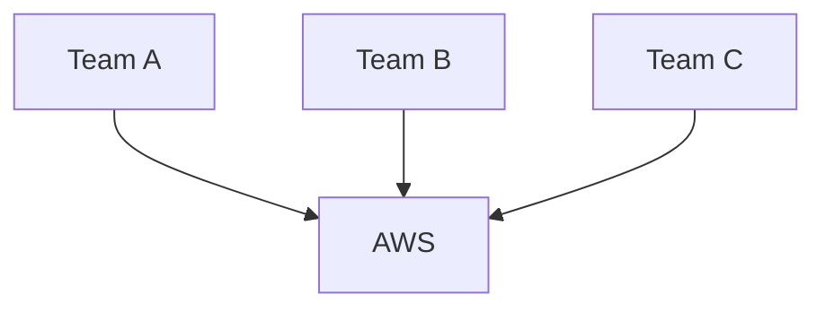

Problems:

- Inconsistent Security
- Different Patterns
- Compliance Violations
- Operational Complexity
- Knowledge Silos

---

## Platform Engineering Model

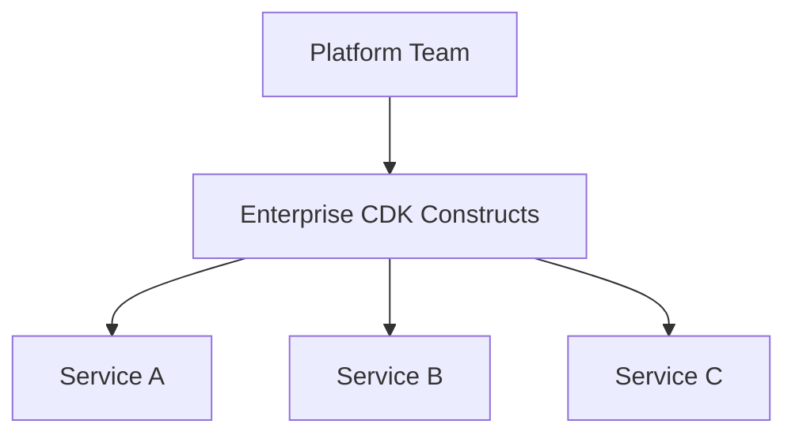

Benefits:

- Standardized Architecture
- Reusable Infrastructure
- Built-in Security
- Built-in Compliance
- Faster Delivery

---

# Enterprise IaC Philosophy

Application teams should focus on:

```text
Business Logic
```

Platform team should own:

```text
Infrastructure Patterns
Security Controls
Compliance Requirements
Deployment Standards
```

---

# High Level Architecture

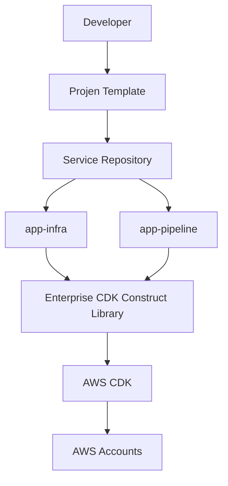

---

# NextGen Platform Components

## Projen

Used to generate and maintain project structure.

---

## AWS CDK

Infrastructure definition framework.

Language:

```text
TypeScript
```

---

## Enterprise Construct Library

Reusable building blocks.

Examples:

- EKS Constructs
- Pipeline Constructs
- Security Constructs
- Networking Constructs
- Monitoring Constructs

---

## GitOps

Deployment through:

```text
Git
↓
ArgoCD
↓
Kubernetes
```

---

# Repository Structure

Every application repository follows a standardized layout.

```text
service-repository/

├── src/
├── tests/
├── helm/
│
├── infra-as-code/
│   └── cdk/
│       ├── app-infra/
│       └── app-pipeline/
│
├── .projenrc.ts
├── package.json
└── README.md
```

---

# Infrastructure Folder Structure

```text
infra-as-code/

└── cdk/

    ├── app-infra/

    │   ├── bin/
    │   ├── lib/
    │   ├── config/
    │   └── cdk.json

    └── app-pipeline/

        ├── bin/
        ├── lib/
        ├── config/
        └── cdk.json
```

---

# Purpose of app-infra

Responsible for:

- Infrastructure Resources
- EKS Components
- Databases
- Secrets
- IAM
- Networking

---

# Purpose of app-pipeline

Responsible for:

- CI/CD Pipelines
- CodeBuild
- CodePipeline
- Artifact Publishing
- Deployment Automation

---

# Projen Templates

Developers never start from scratch.

---

## New Service Creation

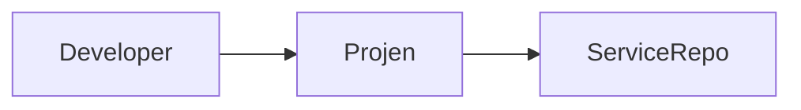

---

Example:

```bash
npx projen new nextgen-service
```

---

Generated automatically:

```text
Source Structure
Pipeline Structure
CDK Structure
Build Files
GitHub Actions
Helm Charts
Documentation
```

---

# Enterprise Construct Libraries

Most important interview topic.

Application teams never directly create AWS resources.

Instead:

```text
Application
      ↓
Enterprise Constructs
      ↓
AWS Resources
```

---

# Construct Library Architecture

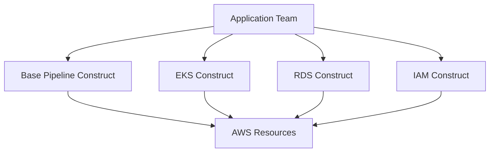

---

# Example Construct Library

```typescript
export interface ApplicationProps {
  readonly applicationName: string;
  readonly environment: string;
}

export class ApplicationConstruct extends Construct {

  constructor(
    scope: Construct,
    id: string,
    props: ApplicationProps
  ) {
    super(scope, id);

    // enterprise defaults
  }
}
```

---

# Application Infrastructure Pattern

Example:

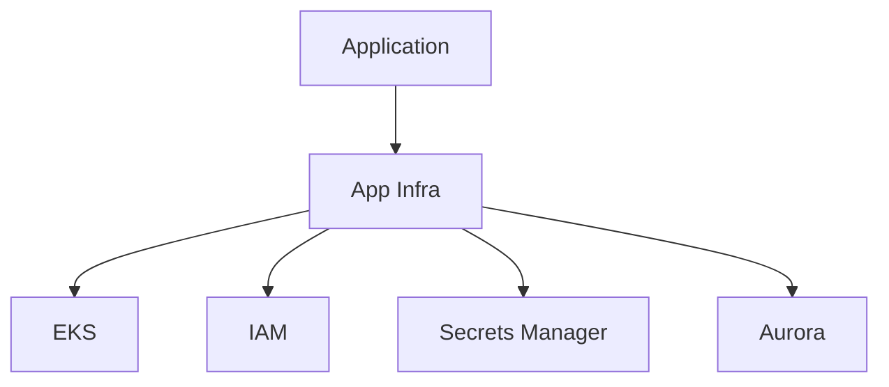

---

# Example App Infrastructure Stack

```typescript
export class ApplicationInfraStack extends Stack {

  constructor(scope: Construct, id: string) {

    super(scope, id);

    new EnterpriseEksAddon(this, "eks-addon");

    new EnterpriseIamRole(this, "app-role");

    new EnterpriseSecrets(this, "secrets");
  }
}
```

---

# Pipeline Architecture

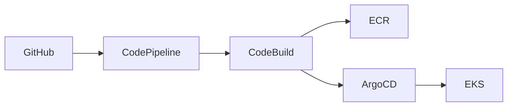

---

# Example Pipeline Stack

```typescript
new EnterprisePipeline(this, "pipeline", {

 applicationName: "orders",

 environments: [
   "dev",
   "qa",
   "perf",
   "prod"
 ]
});
```

---

# Deployment Workflow

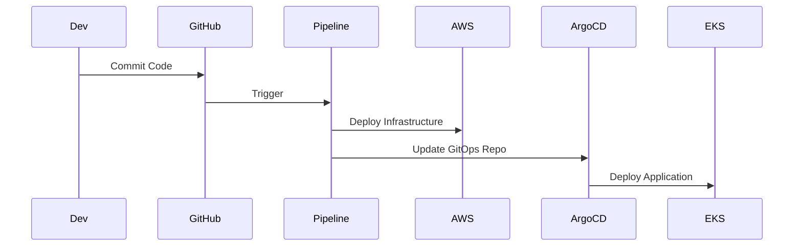

---

# Compliance & Guardrails

One of the strongest platform engineering stories.

---

# Why Guardrails?

Without guardrails:

```text
Developer Freedom
      ↓
Security Risks
      ↓
Compliance Violations
```

---

With Guardrails:

```text
Developer Self Service
      ↓
Safe Infrastructure
      ↓
Compliant Deployments
```

---

# Examples

## Mandatory Tags

```typescript
Tags.of(resource).add(
  "Application",
  appName
);

Tags.of(resource).add(
  "Owner",
  teamName
);
```

---

## Encryption Enforcement

```typescript
bucket.encryption =
BucketEncryption.KMS;
```

---

## IAM Restrictions

```typescript
No AdministratorAccess
```

Enforced by construct library.

---

## Logging Enforcement

```typescript
CloudWatch Logs Enabled
```

By default.

---

# Multi-Account Strategy

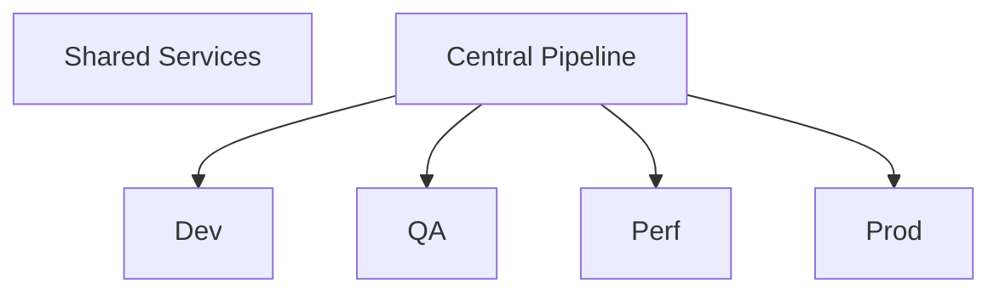

---

# Account Separation

Dev

- Development workloads

QA

- Testing

Perf

- Performance Validation

Prod

- Production workloads

Shared

- ECR
- Monitoring
- Security Services

---

# Security Architecture

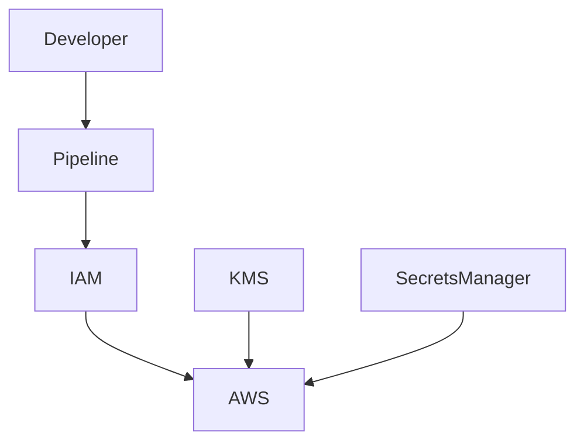

---

# Platform Controls

Security built into constructs:

- KMS Encryption
- IAM Least Privilege
- Secret Rotation
- Mandatory Logging
- Mandatory Tagging
- Private Networking
- Security Scanning

---

# Service Onboarding Workflow

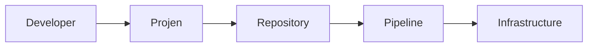

---

# End-to-End Provisioning Flow

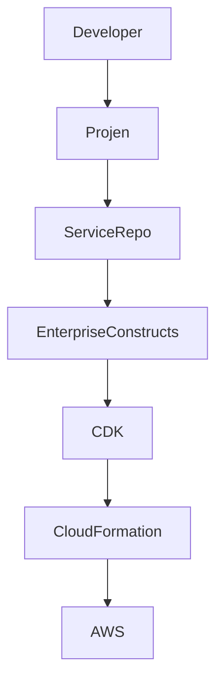

---

# Why This Scales

Without Platform Engineering:

```text
100 Teams
100 Different Implementations
```

With Platform Engineering:

```text
100 Teams
1 Platform Standard
```

---

# Interview Questions

## Why CDK Instead of CloudFormation?

Benefits:

- Type Safety
- Reusable Components
- Object-Oriented Design
- Better Testing
- Better Developer Experience

---

## Why Create Custom Construct Libraries?

To enforce:

- Security
- Compliance
- Standardization
- Reuse

across all applications.

---

## Why Use Projen?

Projen automates repository creation and maintenance.

Benefits:

- Consistent Structure
- Reduced Boilerplate
- Faster Onboarding

---

## What Guardrails Are Enforced?

Examples:

- Mandatory Tags
- Encryption
- IAM Restrictions
- Logging
- Monitoring

---

## How Does Multi-Account Deployment Work?

Single pipeline deploys to:

- Dev
- QA
- Perf
- Prod

using cross-account roles.

---

## How Do Teams Consume the Platform?

Developers:

- Create Service
- Use Generated Templates
- Reference Enterprise Constructs

Platform Team:

- Maintains Standards
- Maintains Construct Libraries
- Maintains Compliance Controls

---

# Executive Summary

```text
Developer
    ↓
Projen Template
    ↓
Service Repository
    ↓
app-infra
app-pipeline
    ↓
Enterprise CDK Constructs
    ↓
AWS CDK
    ↓
CloudFormation
    ↓
AWS
```

## Interview Answer (2-Minute Version)

"Our NextGen platform uses AWS CDK with TypeScript as the Infrastructure-as-Code framework. Instead of allowing every team to provision resources directly, we built enterprise CDK construct libraries that encapsulate security controls, compliance requirements, tagging standards, encryption policies, IAM guardrails, monitoring, and deployment patterns. New services are bootstrapped using Projen templates, which generate a standardized repository structure including app-infra and app-pipeline modules. The app-infra stack provisions application infrastructure, while app-pipeline provisions CI/CD capabilities. Developers consume reusable constructs, while the platform team centrally governs architecture standards. This enables self-service infrastructure with enterprise-grade controls, consistency, and scalability across hundreds of services and multiple AWS accounts."