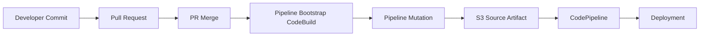
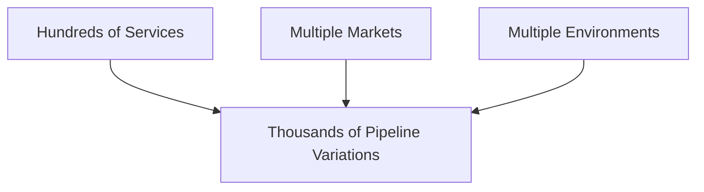
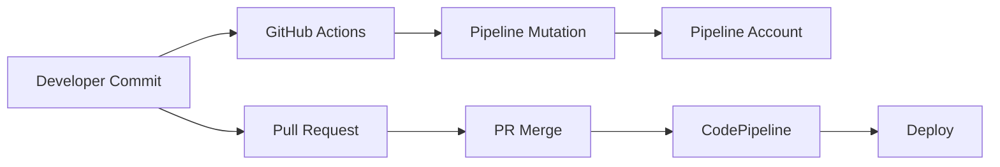
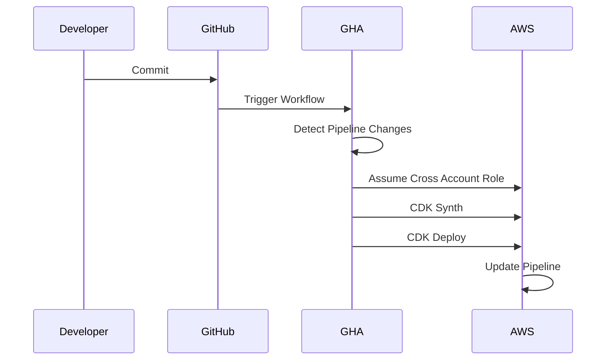
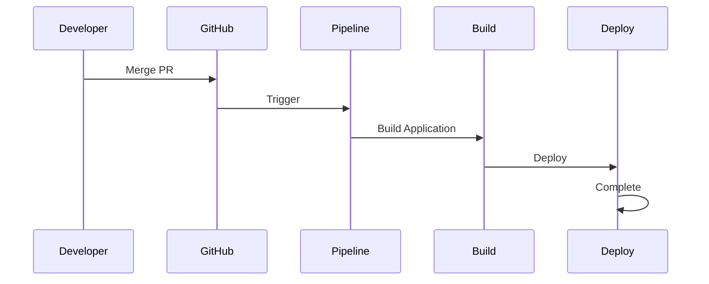
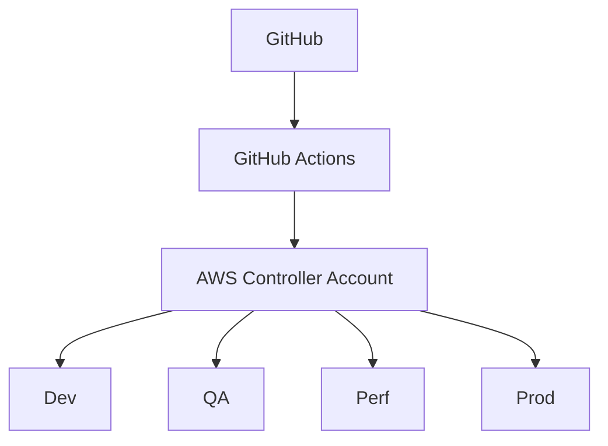
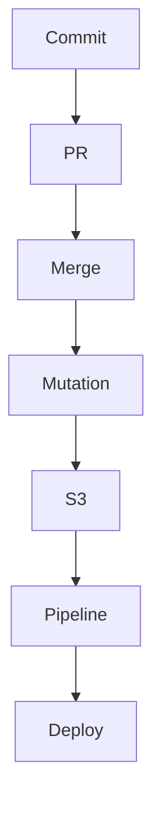
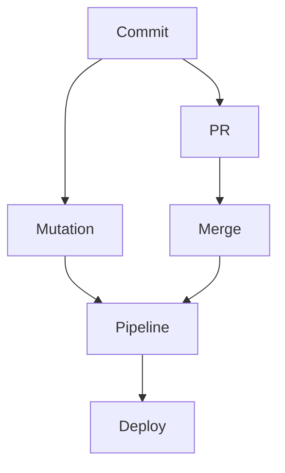

# Pipeline Evolution: From S3-Based Pipeline Mutation to GitHub Actions Driven Continuous Pipeline Management

## Table of Contents

1. Background
2. Legacy Architecture
3. Problems with the Legacy Design
4. Scaling Challenges
5. Design Goals
6. New Architecture
7. Pipeline Mutation Shift Left
8. GitHub Actions Integration
9. New Deployment Workflow
10. Architecture Diagrams
11. Technical Implementation
12. Benefits Achieved
13. Lessons Learned
14. Interview Discussion Points
15. Executive Summary

---

# Background

As our platform expanded across multiple markets, environments, and application teams, we encountered scalability limitations in our CI/CD platform architecture.

The original design relied heavily on:

- S3 as the source artifact
- AWS CodePipeline
- Pipeline mutation performed during pipeline execution
- CodeBuild bootstrap stage

While this worked initially, the model introduced significant operational complexity as the platform scaled.

This document explains:

- Why the original design became problematic
- How we redesigned the platform
- Why GitHub Actions became the control plane for pipeline mutation
- The benefits achieved through the redesign

---

# Legacy Architecture

## Original Workflow



---

# How It Worked

When a developer merged a PR:

1. CodeBuild was triggered.
2. Pipeline definitions were evaluated.
3. Pipeline mutation logic executed.
4. Pipeline structure was updated.
5. S2 (Source-to-Source) artifact ZIP was generated.
6. ZIP was uploaded to S3.
7. Pipeline execution started.
8. Application deployment occurred.

---

# Why This Design Initially Worked

At small scale:

- Few applications
- Limited environments
- Few markets
- Low deployment frequency

The additional mutation step was acceptable.

---

# Problems with the Legacy Design

## Problem 1: Pipeline Mutation Coupled with Deployment

The deployment pipeline was responsible for:

### Infrastructure Mutation

AND

### Application Deployment

simultaneously.

```text
Pipeline Execution
      |
      +---- Update Pipeline Definition
      |
      +---- Build Application
      |
      +---- Deploy Application
```

This violated separation of concerns.

---

## Problem 2: Mutation Happened Too Late

Pipeline updates only occurred after:

```text
Developer Commit
      ↓
Pull Request
      ↓
Approval
      ↓
Merge
      ↓
Pipeline Mutation
```

Issues discovered only after merge.

This increased deployment risk.

---

## Problem 3: S3 Dependency

The entire system depended on:

```text
CodeBuild
    ↓
Generate ZIP
    ↓
Upload to S3
    ↓
Pipeline Source
```

Additional moving parts:

- Artifact creation
- Artifact versioning
- S3 synchronization
- Bootstrap failures

---

## Problem 4: Scaling Bottlenecks

As we expanded globally:

```text
Markets
-------
US
LATAM
THA
KOR
IND
AUS
EU

Environments
------------
DEV
QA
UAT
PERF
PROD
```

Pipeline mutation frequency increased dramatically.

---

## Problem 5: Deployment Delays

Every deployment waited for:

```text
Mutation
     ↓
Artifact Creation
     ↓
Pipeline Start
```

Even if no mutation was required.

---

# Scaling Challenges

As platform adoption increased:



The architecture became increasingly difficult to maintain.

---

# Design Goals

The platform engineering team defined several objectives:

## Goal 1

Decouple pipeline mutation from deployment execution.

---

## Goal 2

Detect pipeline changes immediately.

---

## Goal 3

Reduce deployment latency.

---

## Goal 4

Eliminate unnecessary S3 source artifacts.

---

## Goal 5

Improve developer feedback cycle.

---

## Goal 6

Support large-scale multi-market expansion.

---

# New Architecture

## Core Principle

Move pipeline mutation left.

Pipeline definitions should be updated when code changes occur.

Not when deployments start.

---

# New Workflow



---

# Key Architectural Change

Pipeline mutation became:

```text
Continuous
```

instead of

```text
Deployment Driven
```

---

# Pipeline Mutation Shift Left

## Old Model

```text
Commit
 ↓
PR
 ↓
Merge
 ↓
Mutation
 ↓
Deploy
```

---

## New Model

```text
Commit
 ↓
Mutation
 ↓
PR
 ↓
Merge
 ↓
Deploy
```

This is a classic Shift Left pattern.

---

# GitHub Actions as Control Plane

GitHub Actions now performs:

- Pipeline synthesis
- Pipeline validation
- Pipeline mutation
- Pipeline updates

before deployment occurs.

---

# GitHub Actions Workflow



---

# Deployment Workflow

Once the pipeline is already updated:



No mutation step required.

---

# Source Management Evolution

## Old

```text
GitHub
   ↓
CodeBuild
   ↓
S3 Artifact
   ↓
Pipeline
```

---

## New

```text
GitHub
   ↓
Pipeline
```

Direct source integration.

---

# Multi-Account Architecture



---

# Branch-Based Mutation

Pipeline updates occur on:

```text
feature/*
bugfix/*
release/*
main
```

Every commit can update pipeline definitions.

This provides immediate feedback.

---

# Technical Flow

## Commit to Service Repository

Developer changes:

```text
app-pipeline
```

or

```text
app-infra
```

---

## GitHub Actions Detects Changes

```yaml
on:
  push:
    paths:
      - 'infra-as-code/cdk/**'
```

---

## Pipeline Mutation Job

```yaml
jobs:

  pipeline-mutate:

    runs-on: ubuntu-latest

    steps:

      - uses: actions/checkout@v4

      - run: npm ci

      - run: npx cdk synth

      - run: npx cdk deploy
```

---

# Benefits Achieved

## Faster Deployments

Deployment pipelines no longer wait for mutation.

---

## Earlier Feedback

Pipeline issues found immediately.

Not after merge.

---

## Reduced Operational Complexity

Removed:

- S3 artifact generation
- Bootstrap dependency
- Mutation stages inside pipelines

---

## Better Scalability

Supports:

- Hundreds of services
- Multiple markets
- Multiple environments

---

## Better Separation of Concerns

GitHub Actions owns:

```text
Pipeline Lifecycle
```

CodePipeline owns:

```text
Application Delivery
```

---

# Before vs After

## Before



---

## After



---

# Lessons Learned

## Pipeline Mutation Is Platform Management

Not Application Deployment.

---

## Shift Left Improves Reliability

Validate infrastructure changes as early as possible.

---

## GitHub Actions Is an Excellent Control Plane

Benefits:

- Immediate execution
- Native Git integration
- Branch awareness
- PR awareness
- Easy AWS federation

---

## Decoupling Improves Scale

Separate:

```text
Pipeline Management
```

from

```text
Application Delivery
```

---

# Interview Questions

## Why was the original design problematic?

Pipeline mutation happened during deployment execution, creating unnecessary coupling and deployment delays.

---

## Why move mutation to GitHub Actions?

GitHub Actions provides immediate feedback on commits, supports branch-aware workflows, and allows pipeline updates before deployment starts.

---

## What architectural principle did this change introduce?

Shift Left Infrastructure Validation.

Pipeline definitions are validated and updated closer to the developer commit.

---

## What scalability issue did it solve?

As services, markets, and environments increased, pipeline mutation became a bottleneck. Moving mutation outside deployment pipelines removed this bottleneck.

---

## What was the biggest operational improvement?

Decoupling pipeline lifecycle management from application delivery.

---

# Executive Summary

The original NextGen platform relied on S3-based source artifacts and deployment-time pipeline mutation. While effective initially, this design became a scalability bottleneck as the platform expanded across markets and environments.

The platform engineering team redesigned the architecture by moving pipeline mutation into GitHub Actions. Every infrastructure change now triggers immediate pipeline synthesis and mutation directly from GitHub, using cross-account access into the AWS Controller account.

This shift-left model provides:

- Faster deployments
- Earlier validation
- Better scalability
- Reduced operational complexity
- Clear separation between pipeline management and application delivery

The resulting architecture transformed pipeline mutation from a deployment-time activity into a continuous platform management capability, significantly improving reliability and developer experience.