# Kubernetes Autoscaling in Enterprise Platforms
## HPA, VPA, KEDA and Enterprise EKS Design

---

# Table of Contents

1. Introduction
2. Why Autoscaling Matters
3. Kubernetes Autoscaling Landscape
4. Horizontal Pod Autoscaler (HPA)
5. Vertical Pod Autoscaler (VPA)
6. Cluster Autoscaler vs Karpenter
7. What is KEDA?
8. Why We Chose KEDA
9. Enterprise Autoscaling Architecture
10. Cluster Add-on Model
11. KEDA Internal Architecture
12. Autoscaling Flow
13. Enterprise Deployment Architecture
14. AWS CDK Add-on Pattern
15. KEDA Installation
16. Scaling Scenarios
17. Production Best Practices
18. Common Pitfalls
19. Interview Questions
20. Executive Summary

---

# Introduction

Modern cloud-native applications experience dynamic workloads.

Examples:

- Black Friday
- Flash Sales
- Marketing Campaigns
- Batch Processing
- Event Processing
- Kafka Consumer Surges
- API Traffic Spikes

Provisioning infrastructure for peak load results in:

- Increased costs
- Underutilized resources

Provisioning for average load results in:

- Performance degradation
- Service instability

Autoscaling solves this problem.

---

# Why Autoscaling Matters

Without Autoscaling

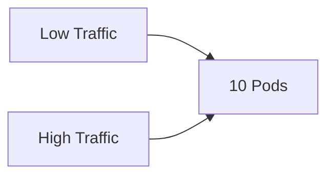

Problems:

- Wasted compute during low traffic
- Resource starvation during spikes

---

With Autoscaling

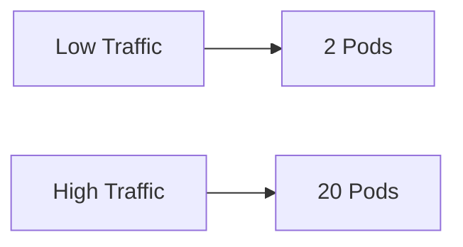

Benefits:

- Cost Optimization
- Better Availability
- Improved Performance
- Efficient Resource Utilization

---

# Kubernetes Autoscaling Landscape

There are three independent scaling layers.

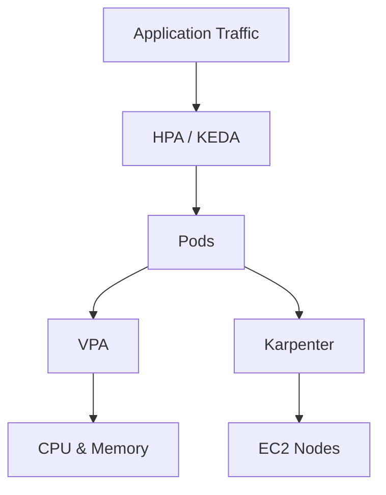

---

# Horizontal Pod Autoscaler (HPA)

## What HPA Does

HPA scales:

```text
Number of Pods
```

Example:

```text
2 Pods
↓
10 Pods
↓
20 Pods
```

---

# HPA Metrics

Traditional HPA can scale using:

- CPU
- Memory
- Custom Metrics

Example:

```yaml
targetCPUUtilizationPercentage: 70
```

Meaning:

```text
If CPU > 70%
Increase Pods
```

---

# HPA Example

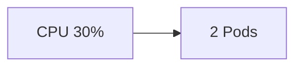

---

Traffic Spike

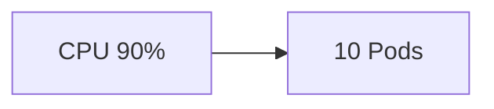

---

# HPA Limitations

Traditional HPA works well for:

- APIs
- Web Applications

Not ideal for:

- Kafka
- SQS
- RabbitMQ
- Event Processing

Why?

Because CPU is not always correlated to workload.

---

# Vertical Pod Autoscaler (VPA)

## What VPA Does

VPA changes:

```text
CPU Requests
Memory Requests
```

Instead of Pod Count.

---

Example

Before

```yaml
resources:
  requests:
    cpu: 500m
    memory: 512Mi
```

After

```yaml
resources:
  requests:
    cpu: 2000m
    memory: 2Gi
```

---

# VPA Architecture

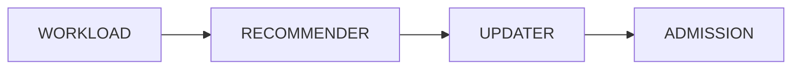

---

# VPA Components

## Recommender

Analyzes resource consumption.

---

## Updater

Evicts Pods when updates required.

---

## Admission Controller

Injects recommendations into Pods.

---

# HPA vs VPA

| Feature | HPA | VPA |
|----------|----------|----------|
| Scale Pods | Yes | No |
| Scale CPU | No | Yes |
| Scale Memory | No | Yes |
| Restart Pods | No | Sometimes |
| Stateless Apps | Excellent | Good |
| Stateful Apps | Good | Excellent |

---

# Why HPA and VPA Together Can Be Dangerous

Example:

HPA says:

```text
Add Pods
```

VPA says:

```text
Increase CPU
```

Both can fight each other.

This is called:

```text
Scaling Oscillation
```

---

Enterprise recommendation:

```text
HPA/KEDA for APIs

VPA Recommendations Only

Do not auto-apply VPA
```

---

# Cluster Scaling Layer

Pods need nodes.

If HPA creates:

```text
100 Pods
```

But cluster only has:

```text
2 Nodes
```

Pods remain Pending.

---

# Karpenter Solves This

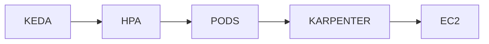

---

# What is KEDA?

KEDA stands for:

```text
Kubernetes Event Driven Autoscaling
```

Open Source CNCF Project.

Purpose:

Scale workloads using events instead of CPU.

---

# Why KEDA Exists

Traditional HPA:

```text
CPU
Memory
```

KEDA:

```text
Kafka Lag
SQS Messages
RabbitMQ Queue
Prometheus Metrics
CloudWatch Metrics
Datadog Metrics
Dynatrace Metrics
Azure Service Bus
Redis Queue
```

---

# Why We Chose KEDA

Our platform contains:

- Microservices
- Event Consumers
- Kafka Connectors
- Background Workers
- Batch Jobs

CPU is not always meaningful.

Example:

Kafka Consumer

```text
CPU = 10%
Lag = 500000 Messages
```

Traditional HPA sees:

```text
No scaling required
```

KEDA sees:

```text
Huge backlog
Scale immediately
```

---

# Enterprise Autoscaling Architecture

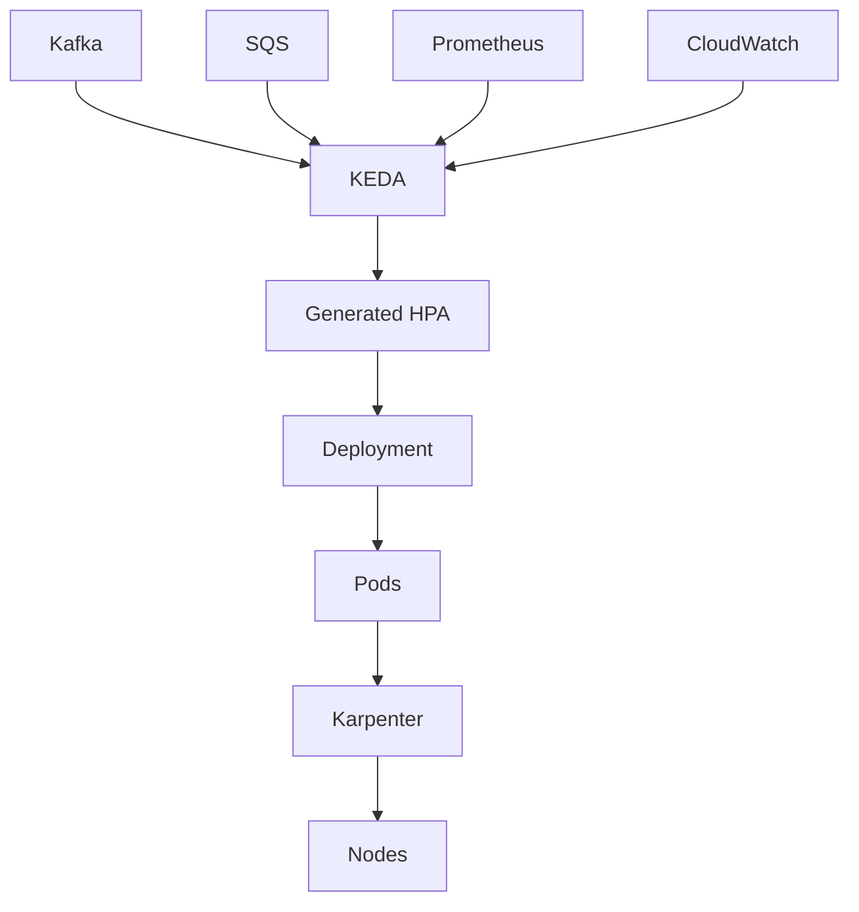

---

# KEDA Internal Architecture

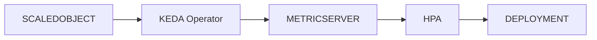

---

# Important Concept

KEDA does NOT replace HPA.

KEDA creates and manages HPA.

Flow:

```text
ScaledObject
↓
KEDA
↓
HPA
↓
Pods
```

---

# Cluster Add-on Model

In our platform:

KEDA is deployed as:

```text
Cluster Add-on
```

Managed by Platform Team.

Not by Application Teams.

---

# Enterprise Cluster Add-on Architecture

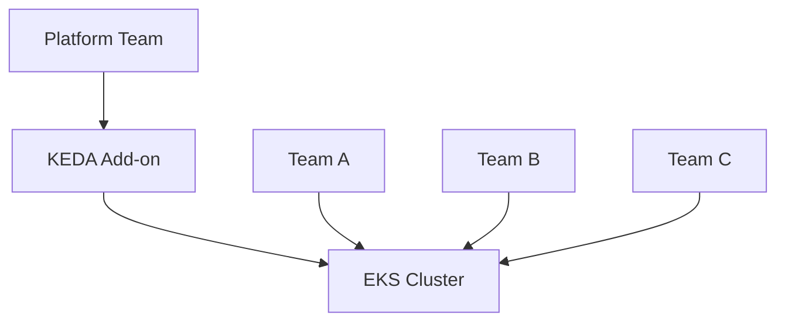

---

Benefits:

- Standardized Versioning
- Central Governance
- Security Reviews
- Easier Upgrades

---

# AWS CDK Cluster Add-on Pattern

Example Enterprise Construct

```typescript
export interface KedaAddonProps {
  cluster: eks.Cluster;
}

export class KedaAddon extends Construct {

  constructor(
    scope: Construct,
    id: string,
    props: KedaAddonProps
  ) {

    super(scope, id);

    props.cluster.addHelmChart("keda", {
      repository: "https://kedacore.github.io/charts",
      chart: "keda",
      namespace: "keda",
      release: "keda",
      version: "2.16.1"
    });
  }
}
```

---

# Enterprise Cluster Construct

```typescript
new EnterpriseEksCluster(this, "cluster", {

  addons: [
    "coredns",
    "vpc-cni",
    "kube-proxy",
    "metrics-server",
    "keda",
    "karpenter",
    "aws-load-balancer-controller",
    "external-dns",
    "cert-manager"
  ]
});
```

---

# KEDA Installation Flow

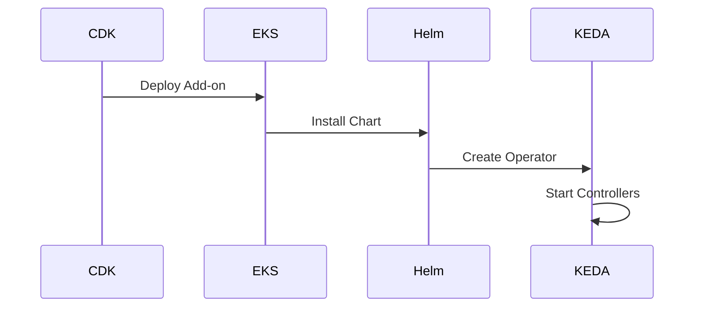

---

# Example Scaling Scenario

Kafka Consumer

---

Traffic

```text
1 Million Messages
```

---

KEDA Trigger

```yaml
triggers:
- type: kafka
```

---

Scaled Object

```yaml
apiVersion: keda.sh/v1alpha1
kind: ScaledObject

metadata:
  name: order-consumer

spec:

  scaleTargetRef:
    name: order-consumer

  minReplicaCount: 1

  maxReplicaCount: 50

  triggers:

  - type: kafka

    metadata:
      bootstrapServers: kafka:9092
      topic: orders
      consumerGroup: order-group

      lagThreshold: "1000"
```

---

# Scaling Flow

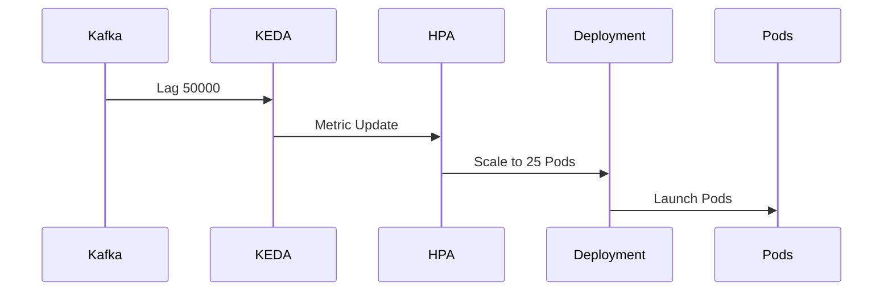

---

# Scale to Zero

One major KEDA advantage.

Traditional HPA:

```text
Minimum 1 Pod
```

KEDA:

```text
0 Pods
```

Possible.

---

Example

```yaml
minReplicaCount: 0
```

Useful for:

- Batch Jobs
- Workers
- Event Consumers

---

# Enterprise Production Best Practices

## KEDA

Use:

```yaml
pollingInterval: 30
cooldownPeriod: 300
```

Avoid aggressive scaling.

---

## HPA

Always define:

```yaml
minReplicas
maxReplicas
```

Never unlimited.

---

## VPA

Use:

```yaml
updateMode: Off
```

Recommendation only.

---

## Karpenter

Combine with:

```yaml
NodePools
Disruption Budgets
Consolidation
```

---

# Recommended Enterprise Architecture

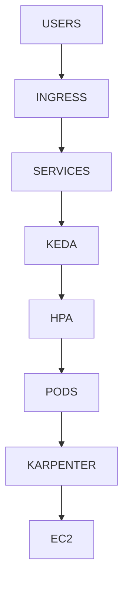

---

# Common Pitfalls

## Missing Metrics Server

KEDA requires:

```text
metrics-server
```

---

## Unlimited Scaling

Bad:

```yaml
maxReplicaCount: 1000
```

---

## Aggressive Polling

Bad:

```yaml
pollingInterval: 1
```

Can overload metric sources.

---

## Ignoring Node Capacity

HPA without Karpenter causes:

```text
Pending Pods
```

---

# Interview Questions

## Why use KEDA instead of HPA?

KEDA supports event-driven metrics such as Kafka lag, SQS depth, Prometheus metrics, and CloudWatch metrics, whereas traditional HPA primarily relies on CPU and memory.

---

## Does KEDA replace HPA?

No.

KEDA dynamically creates and manages HPA resources.

---

## Why deploy KEDA as a Cluster Add-on?

To centralize governance, security, version management, and operational ownership within the Platform Engineering team.

---

## How does KEDA work with Karpenter?

KEDA scales Pods.

Karpenter scales Nodes.

Together they provide complete workload elasticity.

---

## Why avoid automatic VPA updates?

Automatic VPA updates can restart workloads and may conflict with HPA, creating unstable scaling behavior.

---

# Executive Summary

```text
KEDA
  ↓
Creates HPA
  ↓
Scales Pods
  ↓
Karpenter Adds Nodes
  ↓
Applications Handle Traffic
```

Enterprise Recommendation:

- KEDA for workload scaling
- HPA managed by KEDA
- VPA in recommendation mode only
- Karpenter for node scaling
- Managed as Platform Cluster Add-ons through AWS CDK Constructs

This architecture provides cost-efficient, highly elastic, event-driven autoscaling suitable for large-scale EKS platforms operating across multiple markets, environments, and thousands of microservices.