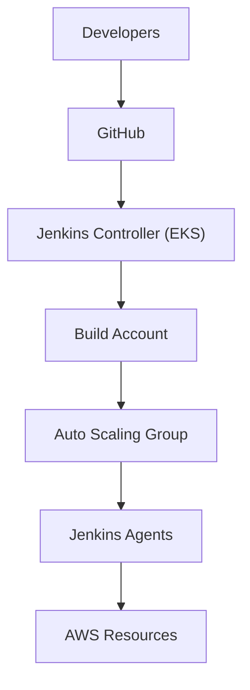
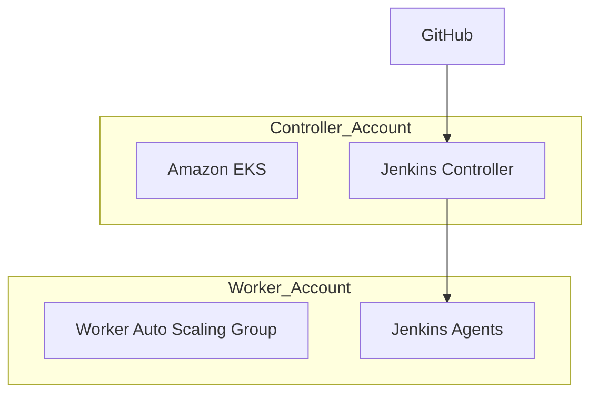
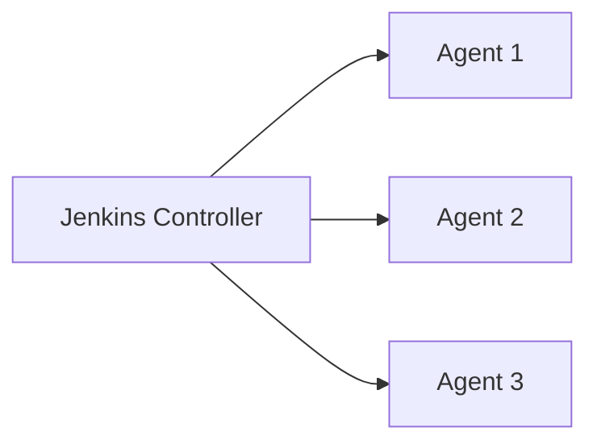
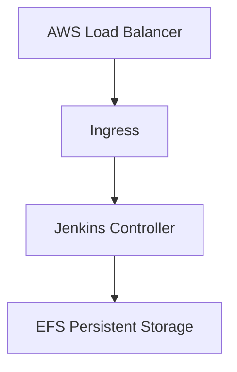
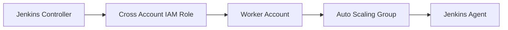
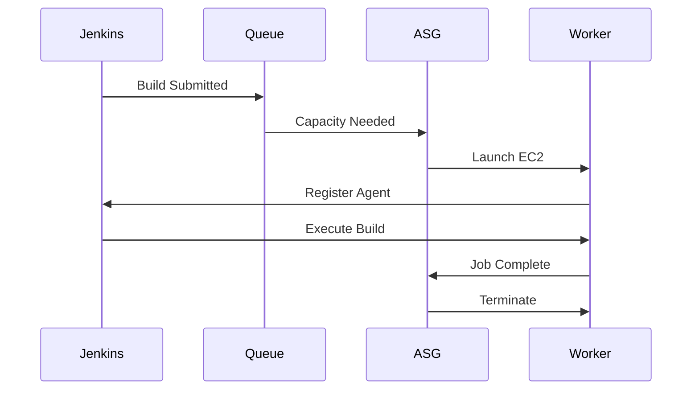
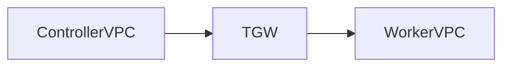
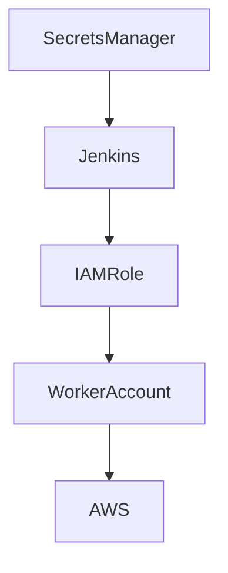
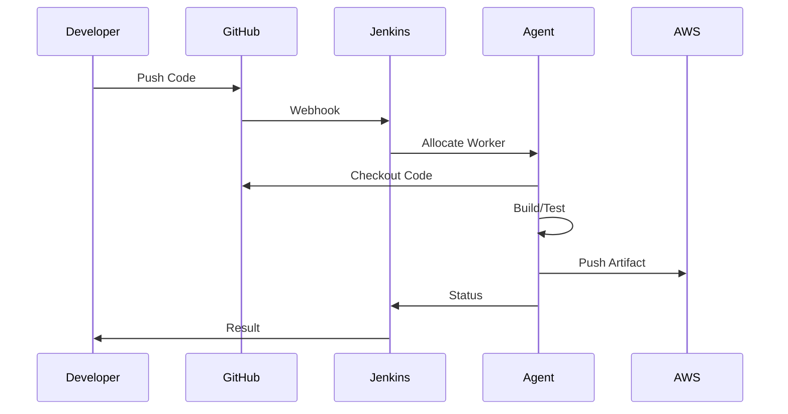
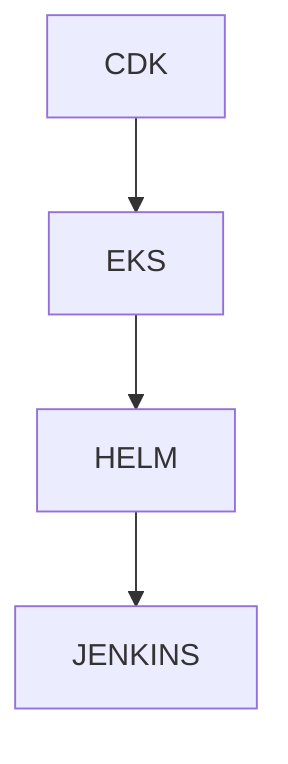

# Enterprise Jenkins Platform Architecture
## Jenkins Master-Agent Architecture on AWS EKS with Cross-Account Dynamic Worker Provisioning

---

# Table of Contents

1. Executive Overview
2. Business Requirements
3. Why Jenkins Still Exists
4. Enterprise Jenkins Challenges
5. Architecture Overview
6. Master-Agent Architecture
7. EKS-Based Jenkins Deployment
8. Cross-Account Worker Provisioning
9. Dynamic Worker Scaling
10. Network Architecture
11. Security Architecture
12. CI/CD Workflow
13. AWS Components Used
14. Infrastructure as Code Design
15. Operational Considerations
16. High Availability Design
17. Lessons Learned
18. Interview Questions
19. Executive Summary

---

# Executive Overview

One of the enterprise Jenkins platforms I designed was built around:

- Jenkins Controller running on EKS
- Dynamic Jenkins Agents
- Cross-Account Worker Provisioning
- AWS Auto Scaling
- IAM Role Delegation
- Multi-Account AWS Architecture
- Kubernetes-Based Operations

The goal was to provide:

- Elastic build capacity
- Cost optimization
- Multi-team support
- Secure account isolation
- Centralized platform management

while supporting hundreds of CI/CD pipelines across multiple application teams.

---

# Business Requirements

The platform needed to solve:

### Problem 1

Thousands of builds per day

---

### Problem 2

Unpredictable build demand

Example:

```text
Morning:
20 builds

Release Window:
1000 builds
```

---

### Problem 3

Expensive Always-On Build Infrastructure

Static worker pools caused:

- Underutilized EC2
- High AWS Costs
- Resource Fragmentation

---

### Problem 4

Account Isolation Requirements

Platform Account

```text
Hosts Jenkins
```

Build Account

```text
Runs Worker Nodes
```

---

### Problem 5

Enterprise Security Controls

Required:

- Least Privilege
- Cross Account Access
- Auditability
- Segregation of Duties

---

# Why Jenkins Still Exists

Even in cloud-native organizations:

Jenkins remains popular because:

- Massive Plugin Ecosystem
- Mature Pipelines
- Custom Build Workflows
- Hybrid Cloud Support
- Existing Enterprise Investments

---

# Architecture Overview



---

# High Level Architecture



---

# Why Separate Accounts?

Benefits:

### Security

Controller does not directly host builds.

---

### Cost Allocation

Worker costs isolated.

---

### Compliance

Separation of duties.

---

### Operational Isolation

Build failures do not impact Jenkins control plane.

---

# Master-Agent Architecture

## Controller Responsibilities

```text
Job Scheduling
Pipeline Execution Logic
Credential Management
Plugin Management
User Authentication
```

Controller should NOT perform builds.

---

## Agent Responsibilities

```text
Source Checkout
Compilation
Testing
Docker Build
Artifact Packaging
Deployment Tasks
```

---

# Enterprise Design Principle

```text
Controller = Lightweight

Agents = Heavy Workloads
```

---

# Architecture Diagram



---

# Jenkins on EKS

The Jenkins Controller runs inside EKS.

Benefits:

- Self-Healing
- Kubernetes Scheduling
- Easier Upgrades
- HA Storage Options
- Standardized Operations

---

# Jenkins EKS Architecture



---

# Persistent Storage

Jenkins requires persistence.

Common choice:

```text
Amazon EFS
```

Stores:

- Job History
- Build Metadata
- Plugin Data
- Configurations
- Credentials

---

# Cross Account Worker Provisioning

One of the more interesting platform engineering patterns.

---

# Why Cross Account Workers?

Controller Account:

```text
Platform Managed
```

Worker Account:

```text
Build Execution
```

---

# Architecture



---

# Build Scaling Model

Traditional Jenkins

```text
Controller
+
50 Static Workers
```

Problems:

- Expensive
- Idle Resources

---

# Dynamic Worker Model

```text
Build Queue
      ↓
Provision Worker
      ↓
Execute Build
      ↓
Terminate Worker
```

---

# Event Driven Scaling



---

# Scaling Strategy

Example:

| Queue Length | Workers |
|--------------|----------|
| 0-10 | 2 |
| 10-50 | 10 |
| 50-100 | 25 |
| 100+ | 50 |

---

# Network Architecture

Important interview discussion.

---

# Controller Account

```text
Private Subnets
```

---

# Worker Account

```text
Private Subnets
```

---

# Connectivity Options

### VPC Peering

```text
Simple
```

---

### Transit Gateway

```text
Enterprise Scale
```

Preferred.

---

# Network Flow



---

# Security Groups

Controller

Allows:

```text
Agent Communication
HTTPS
```

---

Workers

Allows:

```text
Outbound Builds
Controller Connectivity
```

---

# Security Architecture



---

# IAM Design

Controller assumes:

```text
Cross Account Role
```

inside Worker Account.

---

Example

```text
Platform Account
    ↓
AssumeRole
    ↓
Worker Account
```

---

# Build Execution Flow



---

# Typical Enterprise Pipeline

```text
Checkout
 ↓

Build
 ↓

Unit Test
 ↓

Security Scan
 ↓

Docker Build
 ↓

Push ECR
 ↓

Deploy
```

---

# AWS Components Used

## Compute

```text
EKS
EC2
Auto Scaling Groups
```

---

## Storage

```text
EFS
S3
```

---

## Security

```text
IAM
Secrets Manager
KMS
```

---

## Networking

```text
Transit Gateway
VPC Peering
Route Tables
```

---

# Infrastructure as Code

Enterprise implementation normally provisions:

```text
EKS Cluster
Jenkins Helm Chart
EFS
ALB
IAM Roles
Worker ASGs
Security Groups
```

using:

```text
AWS CDK
```

---

# Jenkins Deployment Pattern



---

# Jenkins Helm Deployment

Typical deployment:

```yaml
controller:

  admin:

    createSecret: true

  persistence:

    enabled: true

    storageClass: efs-sc

  ingress:

    enabled: true
```

---

# High Availability Considerations

Controller is still a critical component.

Protect via:

- Multi-AZ EKS
- EFS
- Automated Backups
- Configuration as Code
- Helm-Based Recovery

---

# Operational Best Practices

## Controller

Keep lightweight.

Never run builds.

---

## Agents

Ephemeral.

Disposable.

Immutable.

---

## Credentials

Use:

```text
AWS Secrets Manager
```

Never hardcode.

---

## Plugins

Strict governance.

Avoid plugin sprawl.

---

## Images

Pre-build agent AMIs.

Include:

- Docker
- Java
- Maven
- NodeJS
- AWS CLI
- kubectl

---

# Lessons Learned

## Static Workers Don't Scale

Dynamic provisioning significantly reduces cost.

---

## Separate Control Plane and Build Plane

Improves security and reliability.

---

## Cross Account Architecture Works Well

Supports:

- Isolation
- Governance
- Cost Visibility

---

## Kubernetes Simplifies Operations

Jenkins becomes:

```text
Application on EKS
```

rather than:

```text
Manually Managed Server
```

---

# Interview Questions

## Why deploy Jenkins on EKS?

Benefits:

- High Availability
- Self-Healing
- Simplified Upgrades
- Better Resource Management

---

## Why use Master-Agent architecture?

To separate scheduling responsibilities from build execution workloads.

---

## Why use dynamic workers?

To reduce infrastructure cost and support elastic build demand.

---

## Why provision workers in another AWS account?

To achieve account isolation, security separation, governance, and cost allocation.

---

## How does Jenkins scale?

Controller remains stable while worker capacity dynamically scales based on build demand.

---

## How is network connectivity handled?

Using VPC Peering or Transit Gateway with controlled security group rules and cross-account IAM access.

---

# Executive Summary

```text
GitHub
   ↓
Jenkins Controller (EKS)
   ↓
Cross Account IAM Role
   ↓
Worker Account
   ↓
Auto Scaling Group
   ↓
Ephemeral Jenkins Agents
   ↓
Build & Deploy
```

Key Platform Engineering Principles Demonstrated:

- Control Plane vs Data Plane Separation
- Cross-Account AWS Architecture
- Elastic Build Infrastructure
- Kubernetes-Based Operations
- Event-Driven Worker Provisioning
- Enterprise Security and Governance

This architecture provides a scalable, secure, and cost-efficient Jenkins platform capable of supporting hundreds of teams and thousands of builds per day across a large AWS enterprise environment.