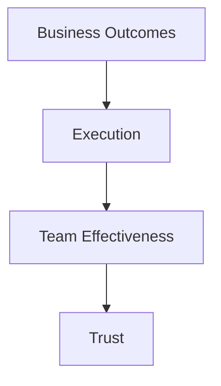

# Engineering Management Fundamentals

## Management Preparation – File 01

---

# Purpose

Engineering Management is fundamentally different from Software Engineering.

As engineers, we are responsible for delivering solutions.

As engineering managers, we are responsible for creating an environment where teams consistently deliver solutions.

The transition from Senior Engineer to Engineering Manager requires a shift from:

```text
Building Systems

to

Building Teams

and

Building Organizations
```

This chapter provides a foundation for understanding Engineering Management principles, leadership responsibilities, organizational effectiveness, and decision-making frameworks.

---

# What Does an Engineering Manager Actually Do?

Many first-time managers believe their primary responsibility is:

* Reviewing code
* Solving technical problems
* Making architectural decisions

These activities may still occur, but they are no longer the primary responsibility.

---

## The Real Job

An Engineering Manager exists to maximize:

```text
Team Effectiveness
        +
Engineering Excellence
        +
Business Outcomes
```

---

# Engineering Manager Responsibilities

| Area                 | Responsibility                  |
| -------------------- | ------------------------------- |
| People               | Hiring, Coaching, Career Growth |
| Delivery             | Execution and Predictability    |
| Technical Leadership | Technical Direction             |
| Organization         | Process and Structure           |
| Stakeholders         | Alignment and Communication     |
| Culture              | Team Health and Engagement      |

---

# Engineering Manager vs Tech Lead

One of the most common interview topics.

---

## Tech Lead

Primary focus:

```text
Technical Success
```

Responsibilities:

* Architecture
* Design Reviews
* Technical Decisions
* Engineering Standards

---

## Engineering Manager

Primary focus:

```text
Team Success
```

Responsibilities:

* Hiring
* Coaching
* Stakeholder Management
* Team Effectiveness
* Delivery Outcomes

---

## Comparison

| Area              | Tech Lead      | Engineering Manager |
| ----------------- | -------------- | ------------------- |
| Architecture      | High Ownership | Advisory            |
| People Management | Low            | High                |
| Hiring            | Support        | Own                 |
| Career Growth     | Support        | Own                 |
| Stakeholders      | Medium         | High                |
| Delivery          | Shared         | Accountable         |

---

# The Four Core Responsibilities

A useful framework for interviews.

---

## Responsibility #1

## People

People are the highest leverage investment for a manager.

---

### Key Activities

* Hiring
* Coaching
* Mentoring
* Performance Management
* Career Development

---

### Success Metric

```text
Team Growth
```

---

# Responsibility #2

# Execution

Managers are accountable for predictable delivery.

---

### Key Activities

* Prioritization
* Planning
* Risk Management
* Dependency Management
* Communication

---

### Success Metric

```text
Reliable Delivery
```

---

# Responsibility #3

# Technical Direction

Managers should understand technical strategy even when not making every technical decision.

---

### Responsibilities

* Technology Roadmaps
* Architectural Alignment
* Technical Debt Management
* Platform Strategy

---

### Success Metric

```text
Sustainable Technical Growth
```

---

# Responsibility #4

# Organizational Health

Healthy organizations consistently outperform heroic individuals.

---

### Areas

* Culture
* Collaboration
* Psychological Safety
* Team Structure
* Communication

---

### Success Metric

```text
Long-Term Sustainability
```

---

# The Manager's Leverage Model

As an engineer:

```text
Your Output
```

determines impact.

---

As a manager:

```text
Team Output
```

determines impact.

---

Example:

Engineer:

```text
10 units
```

Manager:

```text
10 Engineers × 10 Units

= 100 Units
```

---

# The Engineering Management Pyramid



---

## Key Insight

Everything starts with trust.

Without trust:

* Feedback fails
* Collaboration fails
* Execution fails

---

# First Principles of Engineering Management

---

## Principle #1

## Clarity

People perform better when expectations are clear.

Managers should continuously answer:

* What are we doing?
* Why are we doing it?
* What does success look like?

---

## Principle #2

## Alignment

Teams move faster when priorities are aligned.

Misalignment creates:

* Rework
* Friction
* Delays

---

## Principle #3

## Accountability

Ownership must be explicit.

Good managers avoid:

```text
Everybody owns it
```

because it usually means:

```text
Nobody owns it
```

---

## Principle #4

## Transparency

Bad news should travel faster than good news.

Teams should surface:

* Risks
* Dependencies
* Failures

early.

---

# Management Decision Framework

Interviewers often ask:

> How do you make decisions?

---

Use this framework.

---

## Step 1

## Understand Context

Questions:

* What problem are we solving?
* Why does it matter?

---

## Step 2

## Evaluate Options

Compare:

* Cost
* Risk
* Complexity
* Impact

---

## Step 3

## Decide

Avoid analysis paralysis.

---

## Step 4

## Communicate

Explain:

* Why
* Expected Outcome
* Tradeoffs

---

## Step 5

## Inspect Results

Measure outcomes.

Adjust if needed.

---

# Balancing Speed vs Quality

Classic management question.

---

## Wrong Approach

Always prioritize speed.

or

Always prioritize quality.

---

## Better Approach

Determine business context.

---

### High-Risk Systems

Prioritize:

* Reliability
* Security
* Quality

---

### Innovation Projects

Prioritize:

* Learning
* Speed
* Experimentation

---

# The Manager's Operating System

Great managers establish operating rhythms.

---

## Weekly

* Team Meeting
* 1:1s
* Stakeholder Syncs

---

## Monthly

* Goal Reviews
* Roadmap Reviews
* Retrospectives

---

## Quarterly

* Planning
* Strategy
* Performance Reviews

---

# Common Engineering Management Metrics

---

## Delivery Metrics

Examples:

* DORA Metrics
* Predictability
* Throughput

---

## Quality Metrics

Examples:

* Defects
* Availability
* MTTR

---

## People Metrics

Examples:

* Retention
* Engagement
* Internal Mobility

---

## Platform Metrics

Examples:

* Adoption
* Developer Satisfaction
* Platform Reliability

---

# Common Engineering Manager Interview Questions

---

## What is the role of an Engineering Manager?

Strong Answer:

> An Engineering Manager's responsibility is to create an environment where teams can consistently deliver business value. This includes hiring, coaching, execution management, stakeholder alignment, technical direction, and organizational development.

---

## How do you balance technical and management responsibilities?

Strong Answer:

> I stay close enough to understand technical tradeoffs while empowering technical leaders to own implementation details. My focus is ensuring alignment, execution, and long-term organizational success.

---

## What makes a great engineering team?

Strong Answer:

A great engineering team demonstrates:

* Trust
* Ownership
* Accountability
* Technical Excellence
* Continuous Learning

while consistently delivering business outcomes.

---

## What is your management philosophy?

Strong Answer:

> My philosophy is to create clarity, remove obstacles, empower ownership, and help individuals grow while ensuring the team delivers meaningful business outcomes.

---

# Common Mistakes New Managers Make

| Mistake                            | Impact                   |
| ---------------------------------- | ------------------------ |
| Micromanagement                    | Reduced trust            |
| Avoiding difficult conversations   | Poor performance culture |
| Doing all technical work           | Team dependency          |
| Lack of prioritization             | Burnout                  |
| Overcommitting                     | Delivery failures        |
| Ignoring stakeholder communication | Misalignment             |

---

# Real-World Example

## AWS Graviton Migration Program

As an engineer:

Focus:

```text
Migrating Workloads
```

---

As a manager:

Focus:

```text
Stakeholder Alignment

Risk Management

Migration Planning

Communication

Execution Tracking

Business Outcome
```

---

This illustrates the shift from technical execution to organizational leadership.

---

# Revision Notes

| Topic            | Key Takeaway                                |
| ---------------- | ------------------------------------------- |
| EM Role          | Enable team success                         |
| Primary Goal     | Deliver business outcomes                   |
| Core Areas       | People, Execution, Technology, Organization |
| Leadership Focus | Influence over control                      |
| Success Metric   | Team effectiveness                          |
| Key Skill        | Decision making                             |
| Operating Model  | Regular management cadence                  |

---

# Final Takeaways

1. Engineering Managers are responsible for outcomes, not individual tasks.

2. Team effectiveness is the highest leverage activity available to a manager.

3. Great managers create clarity, alignment, accountability, and trust.

4. Technical knowledge remains important, but people leadership becomes the primary responsibility.

5. Sustainable execution always outperforms heroics.

6. The best managers build systems that allow teams to succeed without constant intervention.

7. Management success is measured through the success of the team, not the manager's individual contribution.
