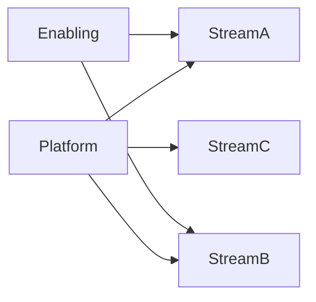

# Organizational Design & Scaling Teams

## Management Preparation – File 05

---

# Purpose

As organizations grow, engineering challenges shift.

Early-stage companies struggle with:

* Building products
* Hiring engineers
* Delivering quickly

Larger organizations struggle with:

* Coordination
* Communication
* Dependencies
* Complexity
* Organizational Scale

Engineering Managers must understand how organizational structure impacts engineering effectiveness.

This chapter covers:

* Organizational Design
* Team Topologies
* Conway's Law
* Platform Engineering Organizations
* Cognitive Load
* Team Scaling
* Organizational Anti-Patterns
* Internal Developer Platforms

---

# Why Organizational Design Matters

Most engineering problems eventually become organizational problems.

Example:

A startup with:

```text id="h9q1ax"
10 Engineers
```

can operate successfully with informal communication.

---

An organization with:

```text id="3c5yvu"
500 Engineers
```

cannot.

---

As scale increases:

```text id="a4pxl2"
Communication Cost

↓

Coordination Complexity

↓

Dependency Management

↓

Organizational Design
```

become critical.

---

# Conway's Law

One of the most important concepts for Engineering Managers.

---

## Definition

Conway's Law states:

> Organizations design systems that mirror their communication structures.

---

## Example

If four teams build a system:

```text id="w7jq8n"
Team A

Team B

Team C

Team D
```

the resulting architecture often contains:

```text id="p9u7vh"
Component A

Component B

Component C

Component D
```

with similar boundaries.

---

## Interview Insight

Strong managers intentionally design organizations to encourage desired architectures.

---

# Organizational Scaling Problem

As organizations grow:

```text id="v8frl0"
More Teams

↓

More Communication

↓

More Dependencies

↓

Slower Delivery
```

---

The goal of organizational design is reducing unnecessary coordination.

---

# Team Topologies

One of the most influential modern organizational frameworks.

Frequently discussed in Platform Engineering interviews.

---

# Core Principle

Optimize for:

```text id="q5k7me"
Fast Flow Of Change
```

through the organization.

---

# Four Team Types

---

## Stream-Aligned Teams

The primary delivery teams.

---

### Responsibility

Deliver business value.

Examples:

* Payments Team
* Customer Support Team
* Search Team

---

### Characteristics

* End-to-End Ownership
* Customer Focus
* Product Focus

---

# Platform Teams

One of the most important concepts for Developer Productivity organizations.

---

### Responsibility

Provide reusable capabilities.

Examples:

* Kubernetes Platform
* CI/CD Platform
* Developer Portal
* Observability Platform

---

### Goal

Reduce cognitive load for stream-aligned teams.

---

### Real Example

Your NextGen Platform Team provides:

* EKS
* GitOps
* CI/CD
* CDK Constructs
* Observability

to application teams.

---

# Enabling Teams

---

### Responsibility

Help teams adopt capabilities.

Examples:

* Security Enablement
* Cloud Adoption
* Kubernetes Enablement

---

### Goal

Transfer knowledge.

---

# Complicated Subsystem Teams

---

### Responsibility

Own highly specialized domains.

Examples:

* Machine Learning Platform
* Search Infrastructure
* Recommendation Engines

---

### Goal

Encapsulate complexity.

---

# Team Topology Diagram



---

# Platform Engineering as an Organizational Strategy

Platform Engineering is not simply a technical initiative.

It is an organizational scaling strategy.

---

Without Platform Teams:

```text id="3f5z0k"
Every Team Solves
The Same Problems
```

---

With Platform Teams:

```text id="7r8zmn"
Build Once

Reuse Everywhere
```

---

# Internal Developer Platforms

An Internal Developer Platform (IDP) exists to improve:

* Developer Experience
* Reliability
* Consistency
* Productivity

---

# Typical IDP Capabilities

Examples:

* Environment Provisioning
* Deployment Automation
* Observability
* Security Controls
* CI/CD Pipelines
* Self-Service Workflows

---

# Cognitive Load

One of the most important Platform Engineering concepts.

---

# Definition

Cognitive load is the amount of mental effort required to perform work.

---

# High Cognitive Load Example

Application Team Must Understand:

* Kubernetes
* Networking
* IAM
* CI/CD
* Observability
* Security
* Infrastructure

---

Result:

```text id="g7z5e9"
Slow Delivery
```

---

# Reduced Cognitive Load Example

Platform abstracts complexity.

Application Team focuses on:

```text id="z4w6yx"
Business Logic
```

---

Result:

```text id="m5a2ku"
Faster Delivery
```

---

# Types of Cognitive Load

---

## Intrinsic

Required for the domain.

Cannot be removed.

Example:

Business logic.

---

## Extraneous

Created by poor systems.

Should be reduced.

Example:

Complex deployment processes.

---

## Germane

Learning-related.

Can create future benefits.

Example:

Learning Kubernetes concepts.

---

# Measuring Team Effectiveness

Strong managers measure outcomes.

---

# Team Health Indicators

Examples:

* Delivery Predictability
* Quality
* Retention
* Engagement
* Customer Satisfaction

---

# Platform Team Metrics

Examples:

* Platform Adoption
* Deployment Frequency
* Lead Time
* Self-Service Usage
* Developer Satisfaction

---

# Team Ownership Models

Ownership should be clear.

---

# Strong Ownership

```text id="y7n5s2"
You Build It

You Run It
```

---

Benefits:

* Accountability
* Faster Feedback
* Better Reliability

---

# Weak Ownership

```text id="q2r8wa"
Build Team

↓

Operations Team

↓

Support Team
```

---

Result:

Ownership confusion.

---

# Organizational Anti-Patterns

Interviewers often ask:

> What organizational problems have you seen?

---

# Anti-Pattern #1

## Shared Ownership

Everyone owns it.

Therefore:

Nobody owns it.

---

# Anti-Pattern #2

## Platform Team As Ticket Factory

Application Teams:

```text id="m9r5yb"
Need Deployment
```

↓

Platform Team Ticket

↓

Wait

↓

Delay

---

Platform Teams should enable self-service.

---

# Anti-Pattern #3

## Excessive Dependencies

Too many teams involved.

Result:

Slower execution.

---

# Anti-Pattern #4

## Platform Dictatorship

Platform Teams forcing solutions.

Result:

Low adoption.

---

# Better Approach

Treat platform as a product.

---

# Platform as a Product

One of the most important modern engineering concepts.

---

# Traditional Thinking

```text id="f6s3lu"
Platform Team

Builds Tools
```

---

# Modern Thinking

```text id="w2n4pt"
Platform Team

Builds Products

For Internal Customers
```

---

# Internal Customers

Examples:

* Developers
* SRE Teams
* Product Teams

---

# Product Thinking Includes

* User Research
* Adoption Metrics
* Feedback Loops
* Continuous Improvement

---

# Scaling Engineering Organizations

As organizations grow:

---

## Stage 1

Small Team

Focus:

Speed

---

## Stage 2

Multiple Teams

Focus:

Coordination

---

## Stage 3

Platform Era

Focus:

Standardization

---

## Stage 4

Enterprise Scale

Focus:

Autonomy + Governance

---

# Example Organizational Evolution

```text id="k3r9xn"
Startup

↓

Product Teams

↓

Platform Team

↓

Developer Platform

↓

Engineering Ecosystem
```

---

# Real-World Example

## NextGen Platform

Problem:

Application teams repeatedly solved:

* CI/CD
* EKS Configuration
* IAM
* Monitoring

independently.

---

Solution:

Platform Engineering Organization created:

* Shared CDK Constructs
* Standardized Pipelines
* GitOps Workflows
* Platform Governance

---

Outcome:

* Faster Onboarding
* Reduced Cognitive Load
* Improved Consistency
* Better Reliability

---

# Common Interview Questions

---

## What is Conway's Law?

Strong Answer:

> Conway's Law states that system architecture tends to mirror organizational communication structures. Therefore, organizational design directly influences software architecture.

---

## What is a Platform Team?

Strong Answer:

> A Platform Team provides reusable capabilities that reduce cognitive load and enable application teams to deliver value faster while maintaining governance and reliability.

---

## Why Do Platform Teams Exist?

Strong Answer:

> Platform Teams exist to solve common engineering problems once and provide standardized capabilities that improve productivity, consistency, and scalability.

---

## What is Cognitive Load?

Strong Answer:

> Cognitive load represents the mental effort required to perform work. Platform Engineering seeks to reduce unnecessary cognitive load so teams can focus on delivering business value.

---

## What Does Platform as a Product Mean?

Strong Answer:

> Platform as a Product means treating developers as customers and continuously improving platform capabilities based on adoption, feedback, and measurable outcomes.

---

## How Would You Scale an Engineering Organization?

Strong Answer:

> I would create clear ownership boundaries, reduce dependencies, invest in platform capabilities, standardize common workflows, and design team structures that optimize flow rather than control.

---

# Common Organizational Mistakes

| Mistake                 | Impact                |
| ----------------------- | --------------------- |
| Shared Ownership        | Confusion             |
| Excessive Dependencies  | Slow Delivery         |
| Platform Ticket Queues  | Bottlenecks           |
| No Standards            | Inconsistency         |
| Over-Standardization    | Reduced Innovation    |
| Ignoring Cognitive Load | Developer Frustration |

---

# Revision Notes

| Topic               | Key Takeaway                     |
| ------------------- | -------------------------------- |
| Conway's Law        | Organization shapes architecture |
| Team Topologies     | Four team types                  |
| Platform Teams      | Reduce cognitive load            |
| IDPs                | Self-service platforms           |
| Cognitive Load      | Key productivity metric          |
| Platform as Product | Developers are customers         |
| Ownership           | Must be explicit                 |
| Scaling             | Optimize for flow                |

---

# Engineering Manager Organizational Principles

1. Organizational structure influences system architecture.

2. Platform Teams exist to enable, not control.

3. Cognitive load is a critical productivity constraint.

4. Platform capabilities should be self-service.

5. Ownership should be explicit.

6. Developers should be treated as platform customers.

7. Great organizations optimize for flow of value rather than hierarchy.

---

# Final Takeaways

As organizations scale, success becomes increasingly dependent on organizational design rather than technical brilliance.

The most effective Engineering Managers understand how team structures, ownership boundaries, platform capabilities, and communication patterns influence delivery outcomes.

Platform Engineering is ultimately an organizational strategy for scaling software development by reducing cognitive load, enabling self-service, and creating reusable capabilities that allow teams to focus on delivering customer value.
